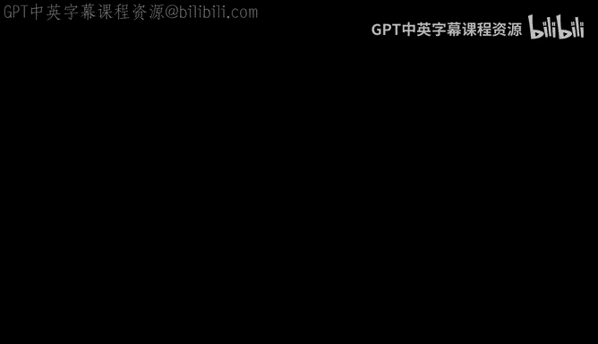
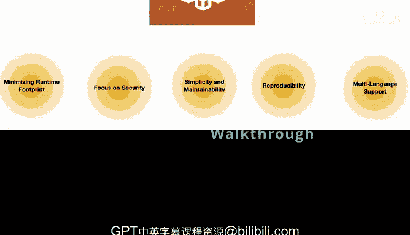
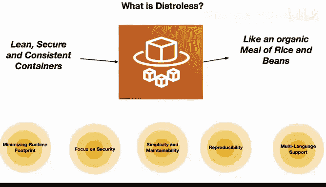

构建大规模云计算解决方案：1-2：Distroless镜像解析

在本节课中，我们将要学习什么是Distroless容器镜像。我们将通过一个简单的类比来理解其核心概念、优势以及它如何为应用程序提供一个安全、高效的运行环境。

---

### 什么是Distroless容器？🍚

Distroless是一种精简、安全且一致的容器镜像。理解它的一种方式是将其类比为一顿有机餐，这顿饭只由米饭和豆子组成。米饭和豆子结合在一起时，能提供完整的蛋白质，同时非常健康，因为它包含了简单的成分，如纤维和完整蛋白质。

接下来，我们将逐一剖析这个类比，以理解Distroless容器的核心特性。

---

### 核心特性剖析

以下是Distroless容器的主要特性，我们将结合“米饭和豆子”的类比进行说明。

**最小化运行时占用**
就像一顿米饭豆子餐只包含最基本的营养元素一样，Distroless容器只包含运行应用程序所必需的最核心组件。它不需要花哨的“配料”，从而保持镜像的精简和高效。

**聚焦安全性**
一顿简单的米饭豆子餐降低了食物过敏的风险。类似地，Distroless容器通过剔除非必要的软件，减少了可能被利用的安全漏洞，从而提升了容器的安全性。

**简单性与可维护性**
烹饪和清理一顿米饭豆子餐非常简单直接。同样，Distroless容器因为组件少，所以更易于管理。出现问题时也更容易追踪根源，确保了运行的顺畅。

**可重现性**
复制一顿米饭豆子餐非常容易。Distroless容器因其简单性而具备高度的可重现性。这种一致性确保了所有开发者都在相同的运行时环境下工作，最大限度地减少了差异和混淆。

**多语言支持**
就像米饭豆子餐能为不同饮食偏好的人提供完整的蛋白质来源一样，Distroless容器可以托管用各种编程语言编写的应用程序，为开发者提供了一个多功能的平台。

---

### 总结

本节课中，我们一起学习了Distroless容器镜像。总而言之，Google的Distroless容器就像一顿简单而完整的米饭豆子餐，只提供所需，别无他物。它们为部署应用程序提供了一个安全、可维护、可重现且包容性强的环境，是您软件“食谱”中既营养又经济的选择。😊