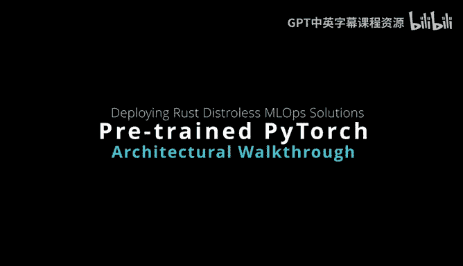
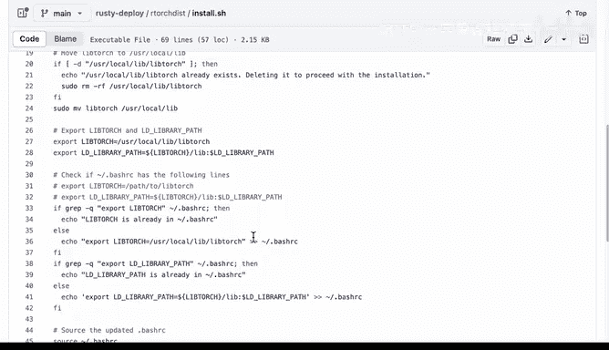

# 088：Rust Distroless PyTorch 项目详解 🚀

在本节课中，我们将学习如何结合 Rust 编程语言与预训练的 PyTorch 模型，来构建一个高效、安全且易于部署的机器学习微服务。我们将探讨其架构优势、关键组件以及从本地开发到生产部署的完整工作流程。

## 架构概述

上一节我们介绍了课程背景，本节中我们来看看一个具体的架构图。这里展示的是一个使用 Rust 和预训练 PyTorch 模型的架构示意图。

该架构的核心优势在于，它将 Rust 语言的关键优点与预训练模型相结合，为机器学习运维（MLOps）构建了一个极具吸引力的解决方案。

## 核心组件与优势

以下是构成此解决方案的几个关键组件及其优势。

*   **Actix Web 框架**：这是一个 Web 微服务框架，曾一度被评为全球最快的框架。可以说，它实际上是世界上最快的 Web 服务之一。
*   **tch-rs（PyTorch Rust 绑定）**：这些绑定非常完整，让你能够访问底层的 PyTorch C++ 基础设施。因此，你拥有一个真正底层的 PyTorch 库接口。
*   **预训练模型**：我们可以直接使用优秀的、为计算机视觉或自然语言处理任务准备好的预训练模型。

## 生产环境考量

在考虑生产环境时，还需要关注一些其他方面，例如日志记录。如果你要运行一个每月处理数百万请求的服务，并且可能涉及准确性、业务逻辑或其他需要监控的方面，那么信息级别、调试级别和异常级别的日志记录都将帮助你维护部署到生产环境的模型。

在处理微服务时，另外两个值得考虑的有趣方面是冒烟测试和单元测试。

*   **单元测试**：其理念是捕获业务逻辑问题。在开发应用程序时，我可能希望为应用程序中我担心的关键组件编写单元测试，并开发几个不同的单元测试。我甚至可能想构建一个测试 PyTorch 绑定本身的单元测试，以确保安装成功。
*   **冒烟测试**：这非常有趣，因为其理念是你可以自己调用 API 端点。例如，你可以调用 4、5、10 或 20 个不同的 API 端点，发送一张图片，并确保返回的预测符合预期且没有错误。当你构建一个端到端的模型（例如要投入生产的机器学习模型）时，这些都是非常好的实践。

## 本地环境与 Rust 优势

这就是本地环境。Rust 的另一个巨大优势是，与 Python 等脚本语言不同，你只需要二进制文件本身（除了需要访问底层的 PyTorch 动态链接库之外）。

一旦你设置好了 PyTorch 二进制文件，接下来为了使其更高效，你可以使用 Distroless Docker 镜像。Distroless 的优点是，这些镜像只包含应用程序及其运行时依赖。

这里至少有两个关键优势。

*   **安全性更高**：你只包含你的应用程序。在 Rust 的情况下，你只包含二进制文件，可能还有 PyTorch 和预训练模型。仅此而已。这减少了安全漏洞。
*   **部署简便**：你可以保持一个非常小的容器镜像，这使得在生产环境中部署到许多不同的云服务变得非常简单。

因此，这是一个非常理想的工作流程。让我们看一下这里的 Google 容器工具。你可以看到这被称为 Distroless 容器镜像，它可以从 Google 容器工具获取。

我们来看看这个。为什么要使用它？其理念在于它们只包含应用程序和运行时依赖。一些很酷的特点是这些镜像非常小。例如，对于一个基于 Rust 的命令行工具，你可以制作一个只有 3 或 4 MB 的镜像交给别人。同时，你也不必那么担心容器常见的一些问题，因为你只以非常精简的方式包含了二进制文件。

因此，这是在 Rust 中嵌入预训练模型的理想方案。

## 项目代码结构

现在让我们快速浏览一下代码。我们来看看这个 `rusty-deploy` 项目和这里的 `rtorch-disk`。

项目中包含的一些内容如下。

*   **Cargo.toml 文件**：这里列出了所有的依赖项。
*   **Dockerfile 文件**：你可以看到，与一些 Dockerfile 不同，这个非常小。它只是使用 Rust 作为构建环境，下载 PyTorch，在这里设置一些路径，复制二进制文件，然后将其放入 Distroless 镜像中。我这里只复制了预训练模型和一些用于测试的图片，然后设置了环境路径，就完成了。
*   **代码量**：这是 30.6 行代码。这是一个计算机视觉模型。这就是使用像 Rust 这样的语言的好处：当你将其部署到生产环境时，它非常小巧。

另外，如果我们看一下这里的源代码，我们有一个库，我们有逻辑代码。所以这些实际上是库类型的文件。我们有一个调用所有内容的主文件。在本例中，这将是 Actix Web 服务，每个路由都被注册。最后，我们还有路由本身，你可以看到它们在单元测试方面的实际作用。

在测试方面，我这里有一个测试目录，然后我有不同种类的测试。我还有一些夹具，也许是一张用于预测的图片。我可以再次包含我正在使用的库的绑定，以验证在部署时安装是否正确。

当你设置好这种结构时，安装就变得非常简单。在安装步骤中，我喜欢做的另一件事是，如果我点击这个，我实际上创建了一个小的安装脚本，允许我引导环境，这样设置新的生产部署也变得非常简单。

它只是执行一些设置命令，移动 PyTorch 文件。这样做的原因是，如果我在这个特定的代码仓库中创建许多不同版本的 PyTorch，我不必一遍又一遍地复制庞大的 PyTorch 库。我可以设置一次，然后就不用管了。

## 总结与适用场景

因此，这就是我们在考虑用 Rust 构建预训练模型时所关心的结构。许多需要部署大型语言模型的公司都应该认真考虑这个工作流程。

当然，我已经为你做了很多繁重的工作。你可以直接查看这个项目，访问 `rusty-deploy` 并尝试自己进行这种部署。

本节课中我们一起学习了如何利用 Rust 的高性能与安全性，结合 Distroless 容器和预训练的 PyTorch 模型，构建一个精简、高效且易于维护的机器学习微服务。这种架构特别适合对性能、安全性和资源效率有高要求的生产环境部署。