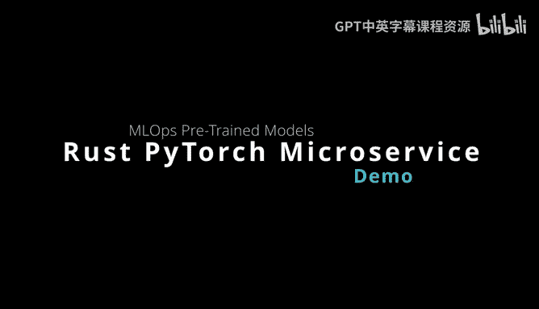
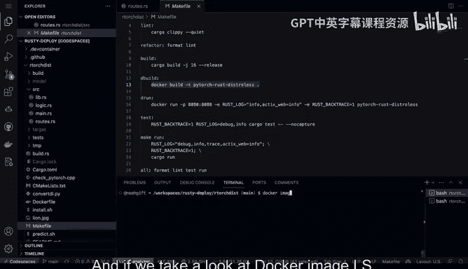

# 089：Rust Distroless PyTorch 运行演示 🚀



## 概述
在本节课中，我们将学习如何将一个预训练的 PyTorch 模型与一个 Rust Actix 微服务结合，并演示其构建、测试和容器化部署的全过程。我们将重点关注如何创建高效的微服务、添加日志记录、进行健康检查，以及利用 Distroless 容器镜像来优化部署大小。

---

## 代码结构与构建过程

首先，我们有一个包含预训练 PyTorch 模型的 Rust Actix 微服务项目。项目运行在 GitHub Codespaces 环境中，目录名为 `R_torch_disk`。

进入该目录后，我们使用 `Makefile` 来管理构建流程。`Makefile` 中定义了多个命令来简化操作。

以下是项目构建的关键步骤：

1.  **构建 Docker 容器**：执行 `make de-build` 命令。
2.  **构建项目发布版本**：执行 `make build` 命令。

现在，让我们执行 `make build` 来编译项目。该命令会显示具体的构建指令。

```bash
cargo build --release
```

由于之前已经构建过，所以这里主要是检查二进制文件是否已存在。如果想直接运行项目，可以使用 `cargo run` 命令。`build` 负责编译，`run` 负责运行。这种基于本地二进制文件的运行方式便于我们进行测试。

---

## 微服务测试与日志记录

在项目运行的同时，我们可以查看其“冒烟测试”（smoke test）。这个测试脚本会遍历并调用微服务的各个路由端点。

以下是测试涵盖的端点示例：

*   第一个路由端点。
*   第二个路由端点。
*   第三个路由端点。
*   第四个路由端点。

冒烟测试的强大之处在于，它会自动上传图像，从而允许我们使用不同的端点进行图像预测。

让我们打开一个新的终端，进入 `R_torch_disk` 目录并运行冒烟测试。

```bash
./smoke_test.sh
```

可以看到，测试脚本逐一调用了所有端点并执行了预测。在构建微服务时，创建一个便于测试不同预测功能并附带良好日志记录的工具是非常有价值的。

接下来，我们看看日志记录是如何设置的。查看 `src/main.rs` 源代码，可以发现我们使用了一个日志记录器（logger），并将其集成到了微服务中。

在业务逻辑代码中，我们添加了许多 `info` 级别的日志消息。这些消息帮助我们监控不同环节的操作，便于在生产环境中进行调试和问题排查。因此，在构建微服务时添加日志记录至关重要，它能让你清楚地了解系统内部的实际运行情况。

---

## 路由设计与健康检查

关于路由设计，有一个重要点需要指出：在生产环境中，可能只会暴露其中一个路由供外部使用。但在本例中，我设置了多个不同的路由用于内部检查。

例如：

*   一个路由用于检查 PyTorch 是否正常工作。
*   一个路由用于检查图像上传功能是否正常。
*   一个路由用于检查能否对本地磁盘上的图像进行预测。

通过将功能分解到不同的子路由，我们可以逐一验证微服务的各个组件是否正常工作。这构成了一套良好的健康检查（Health Check）系统。在生产环境中，我们可能只公开最后一个路由（用于实际预测），而其他路由则作为内部自检的监控点，用于验证安装、图像上传和图像预测等各个组件的状态。这是一个非常实用的小策略。

---

## 容器化部署与镜像优化

现在，让我们看看容器是如何工作的。首先停止当前运行的服务。查看项目中的 `Dockerfile`，其结构非常清晰。

Dockerfile 主要步骤包括：

1.  使用基础镜像。
2.  下载 PyTorch。
3.  设置环境变量。
4.  复制所有构建产物（包括 LibTorch 和预训练模型）。
5.  运行编译好的二进制文件。

在 `Makefile` 中，`docker-build` 过程对应 `docker build` 命令，而运行则对应 `docker run`。我将执行 `make run` 命令来运行 Docker 镜像。

```bash
make run
```

我喜欢使用 `Makefile` 是因为 Docker 命令通常较长且容易输错，而 `Makefile` 可以将其简化。运行后，我们可以看到之前的所有功能在容器内同样正常工作，冒烟测试也能成功执行。这表明我们的应用程序可以轻松部署。

另一个值得关注的点是镜像的大小，这是本方法的一大优势。通过执行 `docker image ls` 命令，我们可以看到这个镜像大约有 3 GB。

对于这个特定的 PyTorch 安装来说，PyTorch 库本身就有数 GB 大小。因此，镜像中的绝大部分空间都被 PyTorch 占用。预训练模型本身很小（小于 100 MB），Rust 代码编译后的二进制文件大约只有 20 MB。所以，镜像体积主要来自 PyTorch 及其依赖。

尽管如此，这个镜像仍然比常规的、可能达到 6GB、8GB 或 10GB 的完整系统镜像要小得多。通过使用 Distroless 类型的精简基础镜像，我们有效地减小了最终镜像的体积。

---



## 项目测试与模型管理

在这个项目结构中，我还设置了多种测试。

例如：

*   **模型测试** (`model_tests`)：运行一些针对模型本身的测试。
*   **视觉测试** (`vision_tests`)：运行绑定库安装的测试。
*   **Web 功能测试** (`web_tests`)：例如，验证索引页面是否正常工作的功能测试。

了解这些测试步骤非常重要。此外，如果我们想查看模型本身，项目目录下实际存放着模型文件。在本例中，我使用了一个 ResNet 模型，但你可以替换成任何类型的预训练模型。项目支持放入多个不同的模型供构建过程选择。

---

## 总结

本节课我们一起学习了如何构建和部署一个结合了 PyTorch 与 Rust 的微服务。我们演示了从代码构建、本地测试（包括冒烟测试和日志记录）、到设计包含健康检查的路由，最后将其容器化并利用 Distroless 镜像优化部署大小的完整流程。

你看到了既可以使用本地二进制文件进行部署，也可以使用 Docker Distroless 镜像进行部署。一旦完成此设置，就可以轻松地将此服务部署到任何支持容器的云服务平台。