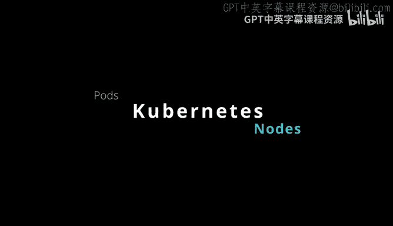
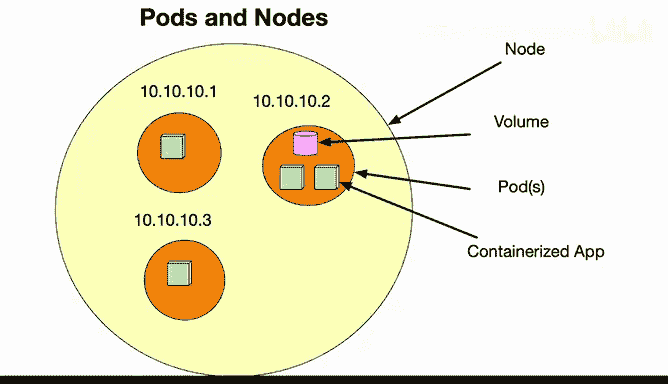

# 093：Kubernetes Pod与Node

在本节课中，我们将学习Kubernetes中的两个核心概念：Pod（容器组）和Node（节点）。理解它们之间的关系是掌握Kubernetes如何编排和管理容器化应用的基础。

## 概述

Kubernetes Pod和Node是重要的基础概念。通过理解它们，你将明白Kubernetes如何将你的应用部署到计算资源上。

## Pod与Node的关系

上一节我们介绍了Kubernetes的基本架构，本节中我们来看看Pod和Node的具体定义及其关系。

从图中可以看到，一个节点（Node）可以包含多个Pod。节点可以运行在虚拟机、数据中心或云环境中。在这个节点内部，可以运行许多不同的Pod，而每个Pod又可以包含多个容器化的应用、存储卷和IP地址。通常，一个节点内部会运行多个Pod。

以下是关于Pod的几个关键点：
*   Pod是一个应用的**逻辑主机**。
*   它可以包含多个紧密耦合的应用容器。例如，一个前端应用和一个后端应用可以配置在同一个Pod中。

## Node的定义与类型

了解了Pod之后，我们来看看它运行的环境——Node。

一个Pod总是运行在一个节点上。在Kubernetes中，节点是工作机器，也称为Worker Machine。

以下是节点的两种类型：
*   它可以是**物理机器**。
*   也可以是**虚拟机**。具体类型取决于你所配置的集群类型。

## 总结

本节课中我们一起学习了Kubernetes的Pod和Node。我们了解到，Pod是容纳一个或多个紧密耦合容器的逻辑单元，而Node是运行Pod的物理或虚拟机。一个Node可以托管多个Pod，这是Kubernetes实现高效资源调度和应用部署的基础。理解这一关系是后续学习更高级Kubernetes概念的关键。