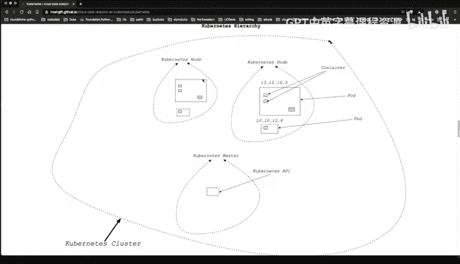
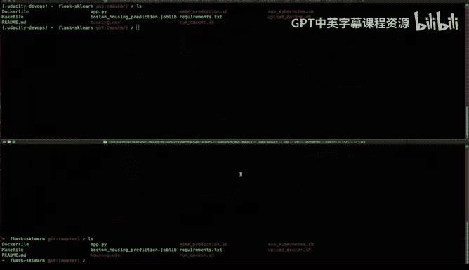
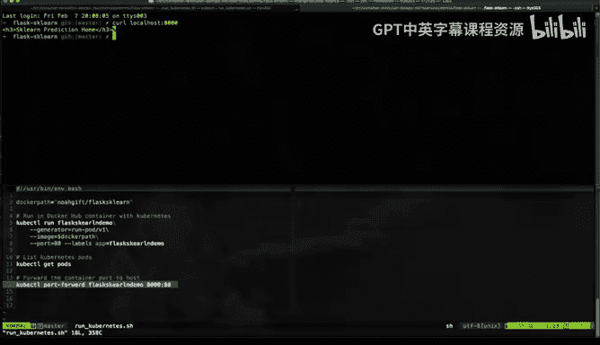
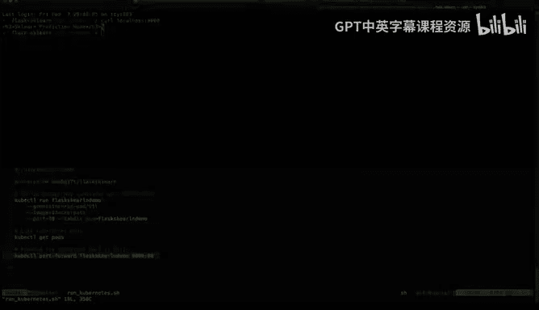

# 096：Kubernetes 演示 🚢

在本节课中，我们将要学习 Kubernetes 的核心概念，并通过一个本地演示来理解其基本工作原理。我们将探讨 Kubernetes 的强大能力与复杂性，并动手运行一个简单的 Kubernetes 应用。

Kubernetes 功能强大，本质上是一个可以运行在“盒子”里的云。例如，在 Google，它每周可以运行数十亿个实例。然而，这种强大的能力也带来了相应的复杂性。接下来，我们来看看一个 Kubernetes 集群究竟是什么。

## 理解 Kubernetes 集群架构 🏗️

上一节我们介绍了 Kubernetes 的强大与复杂，本节中我们来看看它的基本架构。

一个 Kubernetes 集群可以运行在各种环境中。如果你安装了 Docker Desktop 并启用了 Kubernetes 功能，这便是在本地运行 Kubernetes 集群最简单的方式之一。

集群的核心是 **Kubernetes 主节点**，它包含了 **Kubernetes API**。所有操作都通过这个 API 进行，这也是 `kubectl` 命令行工具能与集群通信的原因。

在集群中，应用的基本调度单元是 **Pod**。一个集群中通常会有许多 Pod。更复杂的是，**每个 Pod 可以包含多个不同的容器**。到目前为止，我们主要与单个 Docker 容器打交道，但在大规模系统中，一个 Pod 内部经常会有多个容器协同工作。

以下是 Kubernetes 架构的层级关系：
*   **容器**：封装应用及其依赖。
*   **Pod**：Kubernetes 中最小的可部署单元，包含一个或多个容器。
*   **节点**：一个物理机或虚拟机，可以运行多个 Pod。
*   **集群**：由多个节点组成的集合。

那么，为什么要设计如此复杂的结构？其意义何在？其中一个原因是为了实现职责分离和灵活伸缩。例如，在一个节点上，你可以有独立的 Pod：
*   一个 Pod 运行你的 Web 应用，可以根据其特定的 CPU 或内存需求进行独立伸缩。
*   另一个 Pod 可能专门负责监控，将数据发送到 Prometheus 或 Stackdriver 等监控系统。
*   还可以有一个 Pod 运行关系型数据库或专门的消息队列系统。



这实际上是一种根据功能或资源需求，将自然关联的组件组合在一起的方式。为了降低理解难度，让我们暂时抛开部分复杂性，直接看看如何在桌面上实际使用 Kubernetes。

## 动手运行本地 Kubernetes 集群 💻

上一节我们了解了集群的理论架构，本节中我们通过一个具体项目来实践。



我将展示一个最终项目的样子。以下是项目结构，包含了我们熟悉的部分：
*   `Dockerfile`
*   `Makefile`
*   `app.py`

当涉及一系列复杂命令时，我通常的做法是创建一个脚本文件。让我们查看其中一个脚本，例如 `run_kubernetes.sh`。

这个脚本用于在本地 Kubernetes 集群中运行应用。它的核心步骤如下：
1.  设置 Docker 镜像路径。
2.  使用 `kubectl` 命令（即与 Kubernetes API 交互）部署应用。这里需要指定应用运行的端口和应用名称标签。
3.  运行 `kubectl get pods` 来列出正在运行的 Pod 及其内容。
4.  最后，将容器端口转发到宿主机，以便我们能够访问和测试应用。

首先，让我们检查当前是否有 Pod 在运行。执行命令：
```bash
kubectl get pods
```
这个命令允许我们查询集群状态。如果看到有 Pod 在运行（本例中只包含一个容器），说明环境正常。

接下来，我们知道应用最终会监听端口 8000。让我们尝试用 `curl` 命令访问它，看看当前是否有服务运行。
```bash
curl localhost:8000
```
你会发现没有任何响应，因为端口尚未被转发。现在，让我们运行整个 `run_kubernetes.sh` 脚本。

脚本执行后，你可能会看到一些提示（例如，Pod 已存在），但关键的是它执行了端口转发命令。现在，我可以让这个转发进程在前台运行，然后打开一个新的终端标签页。

在这个新标签页中，再次尝试运行 `curl` 命令：
```bash
curl localhost:8000
```
这次，你将看到应用成功响应，端口已被正确暴露。在我看来，这是实验 Kubernetes 的最佳方式之一：将命令逐步写入 Shell 脚本，然后进行调试和把玩。

无法回避的是，Kubernetes 极其复杂，是一项不断发展的技术。掌握它需要技巧，需要一步一步地理解发生的事情。而最佳的学习环境就是尽可能小的本地环境，这样可以限制操作的整体复杂度。

## 总结 📝

本节课中我们一起学习了 Kubernetes 的基本概念和本地实践。我们了解到 Kubernetes 集群由主节点、节点、Pod 和容器等多个层级构成，其设计允许灵活的资源管理和应用编排。通过一个本地演示脚本，我们实践了如何使用 `kubectl` 部署应用、查看 Pod 状态以及进行端口转发，从而在最小化的复杂环境中体验 Kubernetes 的核心工作流程。记住，面对复杂技术时，从简单的本地环境开始实验是有效的学习路径。






现在，请尝试在你自己的环境中完成这个实践。