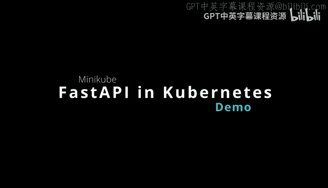
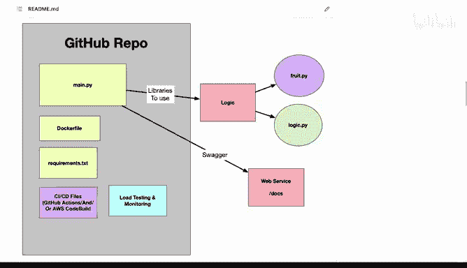
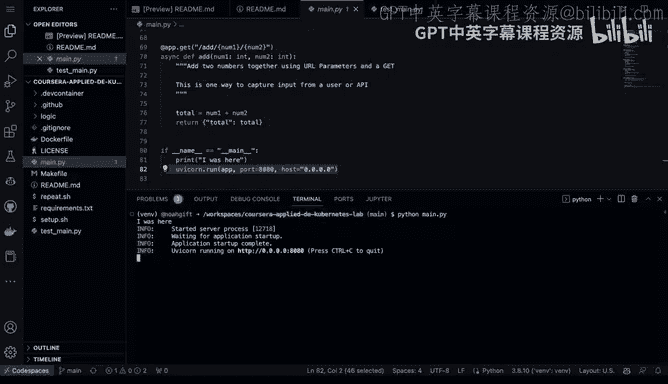
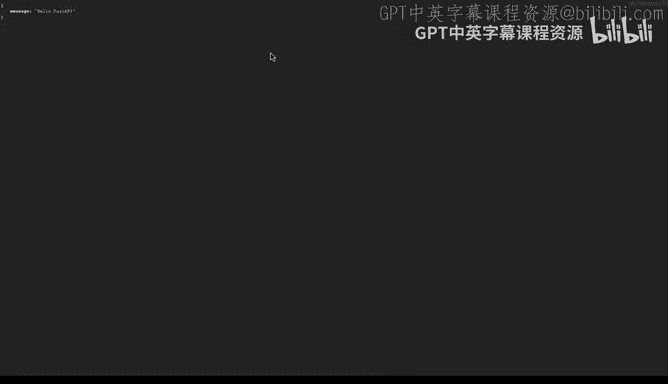
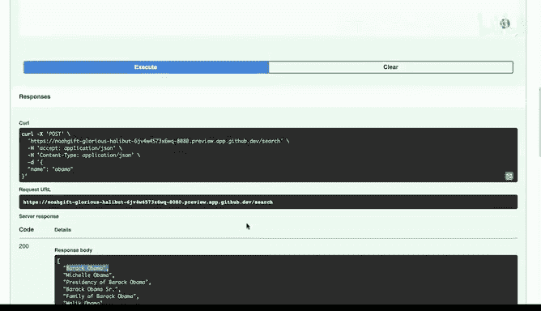
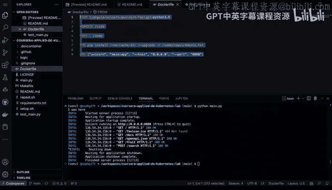
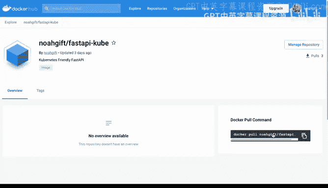
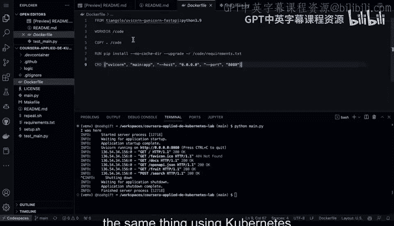
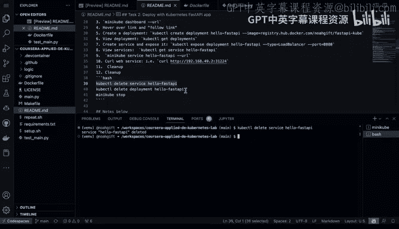

# 098：Minikube FastAPI 演示 🚀



在本节课中，我们将学习如何将一个使用 FastAPI 构建的微服务容器化，并在本地 Kubernetes 环境（Minikube）中部署和运行。我们将从代码结构开始，逐步完成本地运行、容器构建、推送到镜像仓库，最终在 Minikube 集群中部署和访问服务的全过程。

## 项目结构概述

首先，我们有一个包含 FastAPI 微服务的 GitHub 代码库。该项目包含一个 Dockerfile，用于将应用容器化。



以下是项目的主要组成部分：
*   **`main.py`**：这是微服务的主代码文件。
*   **`logic` 目录**：该目录包含一些业务逻辑函数。
*   **`Dockerfile`**：用于构建应用容器镜像的文件。

## 深入代码与本地运行

上一节我们介绍了项目的整体结构，本节中我们来看看具体的代码实现，并学习如何在本地运行这个 FastAPI 应用。



在 `main.py` 文件中，我们首先进行了一些基本的导入和设置。代码定义了一个基础模型，用于端点请求。应用包含几个路由：
*   一个默认路由，返回“Hello World”。
*   一个获取随机水果的路由。
*   一个搜索维基百科的端点，允许通过 POST 请求查询关键词。
*   一个计算器功能，用于展示应用的可能性。



使用以下命令即可在本地运行此应用：
```bash
python main.py
```
应用启动后，将在本地 8080 端口运行。访问根路径 `/` 会看到“Hello World”。FastAPI 自动提供了 `/docs` 路径，这是一个 Swagger UI 界面，可用于查看和测试所有 API 端点，无需额外构建前端界面。



## 容器化应用

现在我们已经能在本地运行应用，接下来看看如何将其容器化，以便在任何支持容器的环境中运行。

项目中的 `Dockerfile` 使得将应用容器化变得简单。容器化后，我们可以：
1.  将镜像推送到容器镜像仓库（如 Docker Hub）。
2.  在本地使用 Kubernetes 运行。
3.  推送到云端的构建系统，在云环境中运行。





例如，我们可以将构建好的镜像推送到 Docker Hub。之后，任何人都可以通过一条命令拉取并运行这个容器，而无需关心本地环境依赖。
```bash
docker run -p 8080:8080 <你的DockerHub用户名>/hello-fastapi
```



## 在 Minikube 中部署

虽然容器本身可以独立运行，但在生产环境中，我们通常使用 Kubernetes 来编排和管理容器。本节我们将学习如何在本地 Minikube 集群中部署这个应用。

首先，启动 Minikube 集群并启用指标服务器，以便获取运行指标。
```bash
minikube start
minikube addons enable metrics-server
```
启动 Minikube 仪表盘，可以直观地查看集群状态和应用运行情况。
```bash
minikube dashboard
```
接下来，使用 `kubectl` 命令基于 Docker Hub 中的镜像创建一个部署。
```bash
kubectl create deployment hello-fastapi --image=<你的DockerHub用户名>/hello-fastapi
```
创建部署后，需要将服务暴露出来，以便从集群外部访问。
```bash
kubectl expose deployment hello-fastapi --type=LoadBalancer --port=8080
```
最后，获取服务的访问 URL。
```bash
minikube service hello-fastapi --url
```
使用此 URL，即可在浏览器中访问运行在 Minikube 集群中的 FastAPI 应用。你也可以使用 `curl` 命令测试服务是否正常运行。
```bash
curl <服务URL>
```

## 清理资源

实验完成后，需要清理所创建的资源，这是一个好习惯。

以下是清理步骤：
1.  删除服务。
    ```bash
    kubectl delete service hello-fastapi
    ```
2.  删除部署。
    ```bash
    kubectl delete deployment hello-fastapi
    ```
3.  停止 Minikube 集群。
    ```bash
    minikube stop
    ```


## 总结



本节课中我们一起学习了微服务从开发到部署的完整流程。我们首先查看了 FastAPI 微服务的代码结构，并在本地成功运行。接着，我们使用 Dockerfile 将应用容器化，并推送到 Docker Hub 镜像仓库。最后，我们重点演示了如何在本地 Minikube Kubernetes 环境中部署这个容器化应用，包括创建部署、暴露服务以及访问应用。这个过程展示了现代云原生应用开发与部署的基本工作流。