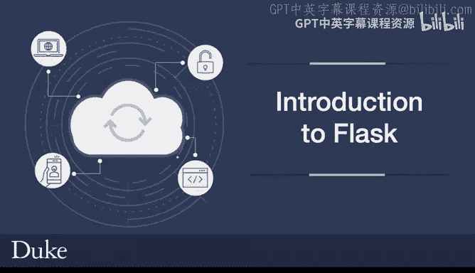
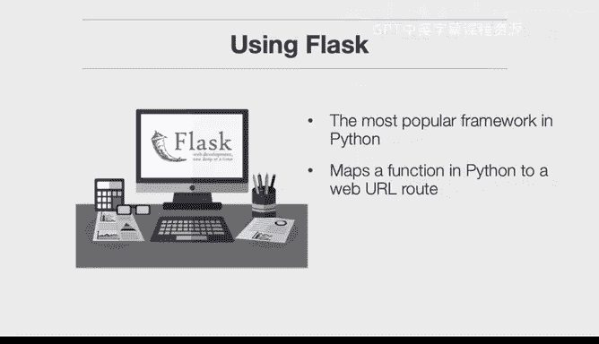
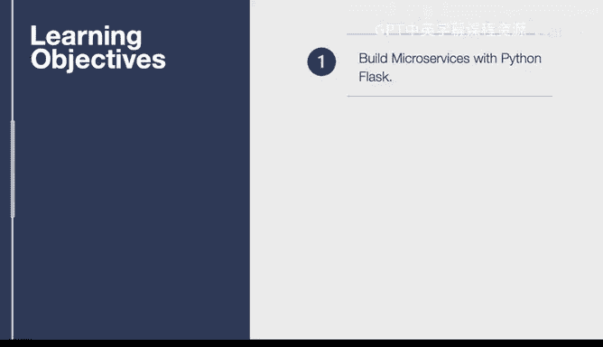
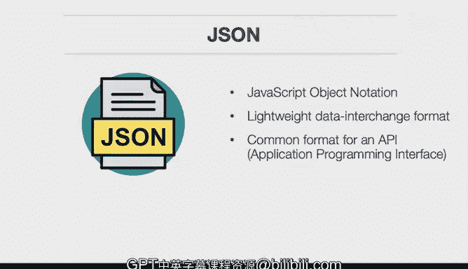

构建大规模云计算解决方案：P102：Flask框架入门 🚀

在本节课中，我们将学习如何使用Flask框架。Flask是一个轻量级的Web框架，也是目前Python中最流行的框架之一。它之所以受欢迎，是因为它专注于一件事并将其做得很好。在云环境中，Flask常用于构建微服务。其核心机制是将一段Python代码（一个函数）映射到一个Web URL路由上。例如，一个HTTP请求到 `My domain/name` 的路径，会被映射到一个名为 `name` 的路由，并执行与之关联的代码。

接下来，我们先明确本课的学习目标。我们将使用Python Flask构建微服务，并讨论相关的最佳实践。



同时，我们还需要了解什么是API，因为它在本次课程中会频繁出现。API是定义服务之间交互的一种方式，通常与JSON结合使用。你会经常听到JSON这个术语，它代表JavaScript对象表示法。

现在，让我们深入了解JSON。JSON是一种轻量级的数据交换格式，是API的常用格式。因此，构建微服务的核心组件将包括一个Flask应用程序、API以及JSON数据格式，这些元素共同构成了一个微服务。

---

### 核心概念与组件

上一节我们介绍了Flask和微服务的基本概念，本节中我们来看看构建微服务所需的核心组件。

**Flask应用**：一个Flask应用是Web服务的核心，它负责处理HTTP请求和响应。创建一个基本的Flask应用非常简单，只需几行代码。

```python
from flask import Flask
app = Flask(__name__)

@app.route('/')
def hello_world():
    return 'Hello, World!'
```

**API（应用程序编程接口）**：API定义了不同软件组件之间相互通信的规则。在Web开发中，它通常指一组允许客户端（如浏览器或其他服务）与服务器交互的端点。

**JSON（JavaScript对象表示法）**：JSON是一种用于传输结构化数据的文本格式。它易于人阅读和编写，也易于机器解析和生成。在Flask微服务中，我们经常以JSON格式发送和接收数据。

```json
{
  "name": "John Doe",
  "age": 30,
  "city": "New York"
}
```

---

### 构建你的第一个Flask微服务



了解了核心组件后，本节我们将动手构建一个简单的Flask微服务。

首先，确保你已经安装了Flask。可以通过以下命令安装：

```bash
pip install flask
```

以下是创建一个返回JSON数据的简单微服务的步骤：

1.  **导入Flask并创建应用实例**：这是启动任何Flask项目的第一步。
2.  **定义路由和视图函数**：路由决定了哪个URL会触发哪个函数。视图函数则处理请求并返回响应。
3.  **运行应用**：启动开发服务器，使应用可以在本地访问。



以下是实现上述步骤的完整代码示例：

```python
from flask import Flask, jsonify

app = Flask(__name__)

@app.route('/api/user', methods=['GET'])
def get_user():
    # 模拟用户数据
    user_data = {
        "id": 1,
        "name": "Alice",
        "email": "alice@example.com"
    }
    # 使用jsonify将Python字典转换为JSON响应
    return jsonify(user_data)

if __name__ == '__main__':
    app.run(debug=True)
```

保存代码后运行它，访问 `http://127.0.0.1:5000/api/user`，你将看到返回的JSON格式的用户信息。

---

### 微服务最佳实践

构建出可运行的微服务只是第一步。为了确保服务的健壮性、可维护性和安全性，我们需要遵循一些最佳实践。以下是几个关键点：

**1. 使用蓝图（Blueprints）组织代码**
当应用规模增长时，将所有路由放在一个文件中会变得难以管理。Flask的蓝图功能允许你将应用模块化。

**2. 配置管理**
将配置（如数据库连接字符串、密钥）与代码分离，通常使用环境变量或配置文件来管理。

**3. 错误处理**
为应用添加适当的错误处理，例如捕获404（页面未找到）或500（服务器内部错误），并向客户端返回清晰的JSON错误信息。

**4. 输入验证与序列化**
对于接收数据的API端点，务必验证输入数据的有效性和安全性。可以使用库如 `marshmallow` 或 `Pydantic` 来简化此过程。

**5. 日志记录**
添加日志记录有助于调试和监控应用的运行状态。

---



### 总结

本节课中我们一起学习了Flask框架的基础知识及其在构建云原生微服务中的应用。我们从Flask的核心概念讲起，介绍了API和JSON的作用，然后一步步构建了一个简单的返回JSON数据的微服务。最后，我们探讨了组织代码、管理配置、处理错误等关键的最佳实践，这些是开发高质量、可扩展微服务的重要基础。掌握这些内容，你就迈出了使用Python和Flask构建大规模云计算解决方案的第一步。