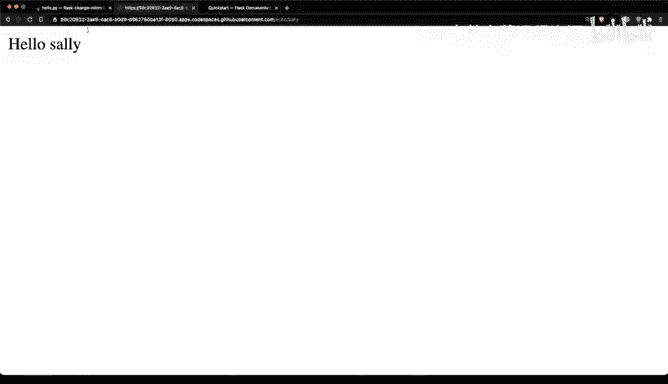

# 103：Flask框架解析 🐍


在本节课中，我们将学习Flask框架的基础知识。Flask是一个轻量级的Python Web框架，它允许开发者快速构建Web应用和服务。我们将通过分析一个简单的示例应用，了解Flask的核心概念和基本用法。

## 什么是Flask以及如何使用它？

Flask是一个微框架，其核心设计理念是简洁和灵活。它不强制使用特定的项目结构或库，让开发者可以自由选择组件。

让我们查看官方文档中的一个最小化Flask应用示例。这个示例非常简短。

**代码示例：一个最小的Flask应用**
```python
from flask import Flask
app = Flask(__name__)

@app.route('/')
def hello_world():
    return 'Hello, World!'
```
在这个应用中，我们首先从`flask`模块导入`Flask`类，然后定义一个应用实例。`@app.route()`装饰器用于创建URL路由，其内部封装的函数包含了该路由的逻辑。

## 分析一个真实的Flask应用

上一节我们介绍了Flask的基本结构，本节中我们来看看一个更具体的真实世界Flask应用。这里有一个GitHub Codespace中的代码。

**代码示例：一个包含更多功能的Flask应用**
```python
from flask import Flask
app = Flask(__name__)

@app.route('/')
def hello_world():
    print(‘Debugging message’)
    return ‘Hello, World!’

@app.route('/echo/<name>')
def echo_name(name):
    return f‘Hello, {name}!’

if __name__ == '__main__':
    app.run(host='127.0.0.1', port=8080, debug=True)
```
这段代码包含了Flask应用的样板代码。我们定义了两个路由：根路由`‘/’`和`‘/echo/<name>’`。在根路由中，我们可以打印调试信息并返回一条消息。

如果我想实现更复杂的功能（这在现实世界中很常见），比如接受参数，Flask可以轻松做到。

以下是Flask中处理参数的方法：在路由路径中使用尖括号`< >`包裹参数名，然后在对应的函数中捕获它。函数参数名必须与路由中的参数名匹配。

**代码示例：带参数的路由**
```python
@app.route('/echo/<name>')
def echo_name(name):
    return f‘Hello, {name}!’
```
当我在这里输出时，返回的字符串会回显我输入的任何名字。

## 应用启动与调试

另一个需要了解的重要部分是代码末尾的`if __name__ == ‘__main__’:`块（第16-17行）。这是一个快捷方式，它告诉你的Python代码：如果它作为脚本直接运行，则执行以下操作。

在这个块内部，我们调用`app.run()`。这指向第2行定义的应用实例。我们告诉它在本地主机（127.0.0.1）的8080端口上运行，并设置调试模式。

那么，我们如何运行这个应用呢？很简单，只需在命令行执行`python hello.py`（假设文件名为hello.py）。如果已经安装了Flask，它就会在本地运行。

在这个GitHub Codespace环境中，我可以在浏览器中打开它并进行测试。首先，我会测试根路由`‘/’`，然后测试`‘/echo’`路由。

第一步，访问根路径。很好，“Hello, World!”显示正常，说明它正在工作。

现在，如果我访问`/echo`路径，并在URL中输入一个名字，比如Bob。看，它返回了“Hello, Bob!”。我们再试试Sally，同样成功返回“Hello, Sally!”。

通过这个基于路由的方法，我可以快速构建功能完整的Web服务，而且非常简单。整个应用不到20行代码，结构清晰，易于理解。这就是使用像Flask这样的微框架的主要优势。

## 总结




本节课中我们一起学习了Flask框架的基础。我们了解了Flask是一个轻量级的Web框架，通过定义应用实例和使用`@app.route()`装饰器来创建路由。我们学习了如何构建一个简单的“Hello, World!”应用，以及如何创建能接受URL参数的路由。最后，我们掌握了使用`app.run()`方法在本地启动和调试Flask应用的基本流程。Flask的简洁性使得构建Web服务变得快速而高效。