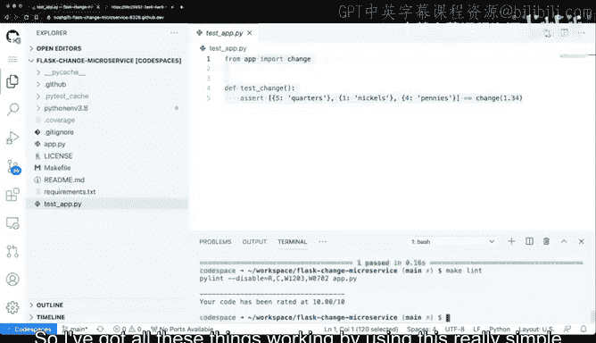
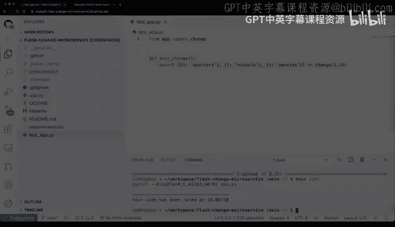

# 104：Flask微服务改造 🛠️

在本节课中，我们将逐步剖析一个现实的微服务项目。我们将学习如何理解、设置、测试并运行一个基于Flask框架的简单微服务应用。

## 概述

我们将分析一个名为“flask-change-microservice”的项目。该项目包含一个Flask应用文件、一个测试文件、一个依赖清单和一个Makefile。我们将在一个云端开发环境（GitHub Codespaces）中设置并运行它，但请注意，这些步骤同样适用于任何云平台或本地计算机。

## 项目结构与设置

首先，我们来看看项目的核心文件。项目根目录下包含以下关键文件：
*   `app.py`: Flask应用的主文件。
*   `test_app.py`: 用于测试应用逻辑的单元测试文件。
*   `requirements.txt`: 列出项目所需的Python包依赖。
*   `Makefile`: 包含用于安装、测试和代码检查的便捷命令。

为了运行此项目，我们将使用GitHub Codespaces。这是一个基于Docker容器的云端开发环境，类似于VS Code Online、AWS Cloud9或Google Cloud Shell。我们将在其中创建一个新的代码空间来执行后续操作。

## 核心应用逻辑解析

上一节我们介绍了项目结构，本节中我们来看看微服务的核心功能代码。

打开`app.py`文件，我们可以看到它执行一个非常具体的任务：计算找零。以下是核心代码片段：

```python
from flask import Flask, jsonify

app = Flask(__name__)

def change(amount):
    # 计算各种面额纸币和硬币的数量
    result = {}
    # ... (具体的找零计算逻辑)
    return result
```

`change`函数接收一个金额（浮点数），并返回一个字典，其中包含组成该金额所需的各种纸币和硬币数量。这是一个典型微服务的特征：**只做好一件事**。

为了验证这个函数的逻辑，我们可以使用交互式Python环境（如IPython）进行测试。首先激活项目创建的虚拟环境，然后安装IPython并导入函数进行测试：

```bash
source .venv/bin/activate
pip install ipython
ipython
```

```python
from app import change
print(change(5.13))
# 输出：{'quarters': 20, 'dimes': 1, 'nickels': 0, 'pennies': 3}
```

通过这种方式，我们可以快速验证核心业务逻辑是否正确。

## 构建Flask API端点

理解了核心函数后，我们需要将其包装成一个可以通过HTTP访问的API。Flask框架让这一切变得非常简单。

在`app.py`中，我们定义了两个路由：

1.  **根路由 (`/`)**：一个简单的“Hello World”端点，用于验证服务是否运行。
    ```python
    @app.route('/')
    def hello():
        return “Change”
    ```

2.  **找零路由 (`/change/<dollar>/<cent>`)**：这是主要的API端点。它从URL路径中捕获`dollar`（美元）和`cent`（美分）参数，将它们组合成金额，调用`change`函数，并将结果以JSON格式返回。
    ```python
    @app.route('/change/<int:dollar>/<int:cent>')
    def make_change(dollar, cent):
        amount = dollar + cent / 100.0
        result = change(amount)
        return jsonify(result)
    ```

**公式**：URL中的参数被组合为最终金额：`amount = dollar + cent / 100`。

现在，我们可以运行这个Flask应用。在终端中执行：
```bash
python app.py
```
应用将在本地8080端口启动。在Codespaces环境中，我们可以使用“在浏览器中打开”功能来访问它。

访问根URL（例如`https://your-codespace-url-8080.app.github.dev/`）会看到“Change”。要测试找零功能，可以访问类似`/change/5/89`的URL，它将返回5.89美元的找零组合。API会返回一个JSON响应，例如：
```json
{"quarters": 23, "dimes": 1, "nickels": 0, "pennies": 4}
```

## 测试与质量保证

一个健壮的微服务需要包含自动化测试。本项目提供了一个简单的单元测试文件`test_app.py`，用于验证`change`函数在不同输入下的行为是否符合预期。

此外，`Makefile`封装了常用的开发命令，使得执行测试和代码风格检查变得非常方便。以下是几个关键命令：

*   `make install`: 根据`requirements.txt`安装所有项目依赖。
*   `make test`: 运行单元测试，并显示测试覆盖率报告。
*   `make lint`: 运行代码风格检查工具（如Flake8），确保代码符合规范。

通过运行`make test`和`make lint`，我们可以快速确认代码逻辑正确且风格良好，这是持续集成和交付中的重要环节。



## 总结




本节课中我们一起学习了如何构建一个简单的Flask微服务。我们从分析项目结构开始，然后深入理解了核心业务逻辑（找零计算），接着将其封装成RESTful API端点，并通过交互式方式和浏览器进行了测试。最后，我们探讨了如何通过单元测试和代码检查来保证微服务的质量。这个不足50行代码的示例清晰地展示了微服务“单一职责”和“独立部署”的核心思想，为构建更复杂的大型云解决方案奠定了基础。