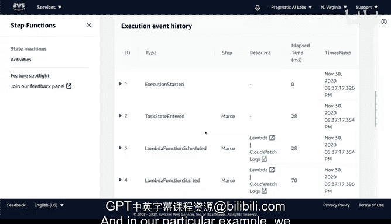

# 109：构建Marco Polo状态机 🚀

在本节课中，我们将学习AWS Step Functions，这是一种编排不同Lambda函数以协同工作的服务。我们将通过一个简单的“Hello World”示例和一个更复杂的“Marco Polo”示例，来理解如何构建、运行和调试状态机。

## 概述

AWS Step Functions 是一种用于协调多个AWS服务（尤其是Lambda函数）的工作流服务。它允许您以可视化的方式设计复杂的工作流程，其中包含顺序执行、条件分支、错误处理等逻辑。本节将引导您创建并运行两个Step Functions示例，以掌握其核心概念。

## 理解Step Functions

上一节我们介绍了云计算的宏观概念，本节中我们来看看具体的编排工具。AWS Step Functions的核心是**状态机**。一个状态机由多个**状态**（步骤）组成，定义了工作流的执行逻辑。

您可以将它理解为一个流程图。例如，一个工作流可能先获取数据，然后根据不同的操作类型，选择不同的处理路径。这就是Step Functions的本质。

## 构建“Hello World”示例

现在，让我们通过一个“Hello World”示例来具体了解如何操作。我们将创建一个简单的状态机，并观察其逐步执行的过程。

首先，在AWS控制台中创建一个新的状态机。我们将其命名为“HelloWorld”，并创建一个新的执行角色。状态机的定义使用**Amazon States Language (ASL)**，这是一种基于JSON的格式。

以下是一个简化的状态机定义代码示例，它包含一个等待状态和一个成功结束状态：

```json
{
  "Comment": "一个简单的Hello World示例",
  "StartAt": "Hello",
  "States": {
    "Hello": {
      "Type": "Task",
      "Resource": "arn:aws:lambda:REGION:ACCOUNT_ID:function:HelloFunction",
      "Next": "Wait"
    },
    "Wait": {
      "Type": "Wait",
      "Seconds": 3,
      "Next": "World"
    },
    "World": {
      "Type": "Succeed"
    }
  }
}
```

创建完成后，我们启动一个执行。初始输入载荷（payload）可以是简单的JSON，例如 `{"message": "Hello World"}`。启动执行后，您可以直观地看到每个步骤的状态变化（例如，“正在运行”、“成功”）。

Step Functions的一个强大功能是提供了详细的执行历史记录。对于每个步骤，您可以：

以下是您可以查看的调试信息：
*   **输入**：查看进入该步骤的确切数据。
*   **输出**：查看该步骤执行后产生的数据。
*   **错误信息**：如果步骤失败，可以查看具体的错误原因。

例如，在“Hello”步骤中，您可以看到输入的 `{"message": "Hello World"}`，这为调试提供了极大的便利。

## 构建“Marco Polo”状态机

理解了基础示例后，我们来构建一个更复杂、能体现状态间数据传递的“Marco Polo”状态机。这个状态机将串联两个Lambda函数，实现一个简单的“喊话-回应”逻辑。

在AWS控制台中，我们找到名为“MarcoSimple”的状态机模板并编辑它。其工作流非常直观：

以下是“Marco Polo”状态机的步骤：
1.  **Marco函数**：第一个Lambda函数。它接收输入，检查其中是否包含特定的关键词。
2.  **Polo函数**：第二个Lambda函数。它接收上一个函数的输出作为输入，并进行处理。
3.  **结束**：成功完成整个工作流。

现在，让我们运行它。首先，我们直接启动执行，但使用一个空的或无效的输入（例如 `{}`）。不出所料，执行在“Marco”函数处失败了。通过可视化界面，我们可以清晰地看到失败发生在哪一步，并查看该步骤的输入。

为了深入排查，我们可以点击失败的Lambda函数链接，直接查看其代码。代码逻辑很简单：它检查输入事件中的 `name` 字段，如果值是 `"marco"`，则返回 `"polo"`；否则会抛出错误。

```python
# Marco Lambda函数示例代码
def lambda_handler(event, context):
    # 检查输入中是否有‘name’字段且值为‘marco’
    if event.get('name') == 'marco':
        return {'response': 'polo'}
    else:
        raise ValueError('Name must be "marco"')
```

了解了逻辑后，我们重新执行，这次提供正确的输入：`{"name": "marco"}`。启动执行后，我们可以看到流程成功运行：

以下是成功的执行流程：
*   **步骤1**：输入 `{"name": "marco"}` 传递给Marco函数。函数识别出 `"marco"`，并输出 `{"response": "polo"}`。
*   **步骤2**：上一步的输出 `{"response": "polo"}` 作为输入传递给Polo函数。一个对应的Polo函数会接收 `"polo"` 并返回 `"marco"`，完成一次“对话”。
*   **步骤3**：状态机成功结束。

这个例子展示了如何将多个无服务器函数组合在一起，并让数据在它们之间流动。

## 总结

本节课中我们一起学习了AWS Step Functions的核心用法。我们了解到，Step Functions是编排Lambda函数构建复杂工作流的强大工具。通过“Hello World”示例，我们学会了创建、执行和调试状态机的基本方法。通过“Marco Polo”示例，我们进一步掌握了如何设计让数据在不同状态间传递的工作流，并利用可视化工具进行高效的故障排查。总之，Step Functions是学习Lambda函数组合和构建健壮无服务器应用的重要途径。




