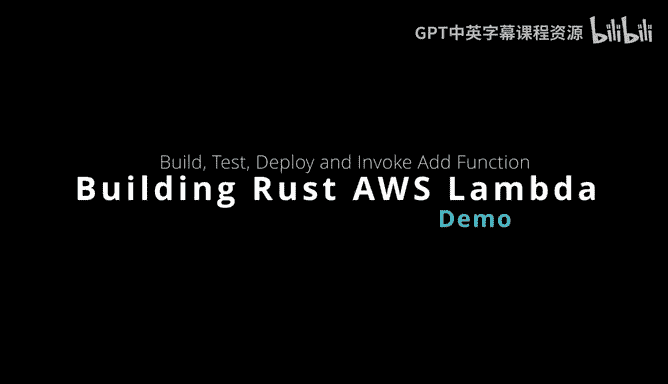
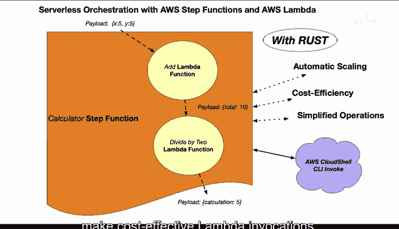
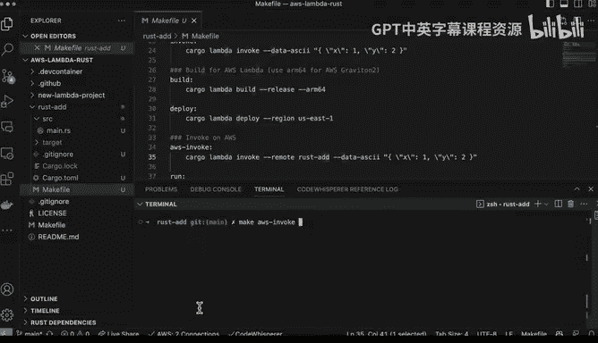
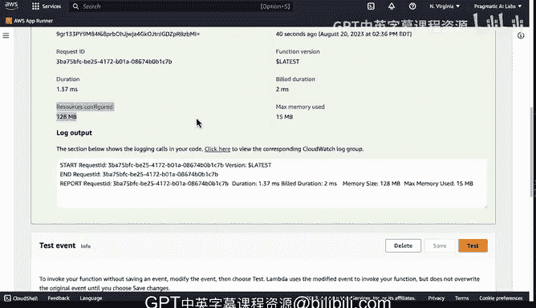

# 116：构建Rust AWS Lambda加法函数 🦀

在本节课中，我们将学习如何使用Rust语言构建一个简单的AWS Lambda函数。这个函数将实现两个数字相加的功能。我们将从项目创建开始，逐步完成本地开发、构建、部署和远程测试的全过程。

## 项目架构概述

这是一个非常简单的Lambda函数系列架构的起点，这些函数最终将被包装在一个Step Function中。首先，我们从Rust开始，构建一个加法函数。

这个函数接收一个x和一个y，然后返回它们的总和。选择Rust的原因是，它可能是构建高性价比Lambda函数最简单的方式之一。

## 创建Rust Lambda项目

以下是创建项目的步骤。我们使用`cargo-lambda`工具来初始化项目。

*   使用命令 `cargo lambda new` 创建一个新项目。
*   项目生成后，其目录结构非常简单，主要包含一个 `main.rs` 文件和一个 `Cargo.toml` 配置文件。
*   `Cargo.toml` 文件已经预先配置好了所需的依赖项，如序列化、异步运行时和日志追踪库。

## 函数逻辑解析

现在，让我们深入查看Lambda函数内部的逻辑。以下是函数代码的详细说明。

*   **请求与响应结构体**：我们定义了两个结构体。`Request` 结构体代表传入的请求，包含 `x` 和 `y` 两个字段。`Response` 结构体代表返回的响应，包含 `total` 字段。
*   **主处理函数**：核心逻辑是一个异步的Rust函数 `function_handler`。它接收一个 `Request` 对象，将 `x` 和 `y` 相加得到 `total`，然后将其包装在 `Response` 对象中返回。
*   **入口点**：`main` 函数已经自动设置好，它会调用我们定义的 `function_handler`。

## 本地开发与测试

为了高效开发，我们可以创建一个Makefile来简化常用命令。以下是本地开发和测试的流程。

*   **本地监听**：通过命令 `make watch`（对应 `cargo lambda watch`）启动本地开发服务器，可以实时编译和测试。
*   **本地调用**：通过命令 `make invoke` 可以调用本地构建的函数二进制文件进行测试。与Python等脚本语言不同，Rust Lambda的本地开发环境无需复杂配置。

## 构建与部署

完成本地测试后，下一步是构建并部署函数到AWS。以下是具体步骤。

*   **构建发布版本**：使用命令 `make build`（对应 `cargo lambda build --release`）构建优化后的二进制文件。为了获得最佳成本效益，我们可以选择构建ARM64架构的版本。
*   **部署到AWS**：使用命令 `make deploy`（对应 `cargo lambda deploy`）即可轻松将函数部署到指定的AWS区域。得益于Rust生成的精简二进制文件，部署过程非常快速。

## 远程调用与监控

函数部署后，我们可以在AWS控制台中进行测试和监控。以下是验证函数运行情况的方法。

*   **远程调用**：使用命令 `make aws-invoke`（对应 `cargo lambda invoke --remote`）可以直接远程调用已部署的Lambda函数。
*   **控制台测试**：在AWS Lambda控制台的测试界面，可以创建测试事件并查看执行结果和详细指标。
*   **性能优势**：从监控数据可以看到，Rust Lambda函数的执行时间通常在毫秒级别，内存占用极低（例如15MB）。由于AWS Lambda按计算资源（内存和运行时间）计费，这种高效性使得用Rust实现复杂操作在成本上更具优势。

## 课程总结

本节课中，我们一起学习了使用Rust构建和部署AWS Lambda函数的完整流程。我们从创建项目开始，编写了简单的加法函数逻辑，并进行了本地测试。接着，我们构建了ARM64版本以优化成本，并将其部署到云端。最后，我们通过远程调用和控制台监控验证了函数的正确性与高性能表现。掌握这些步骤，你就具备了使用Rust开发高效、低成本云函数的基础能力。