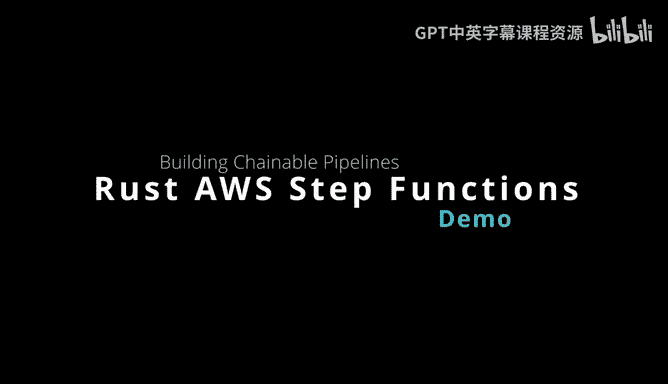
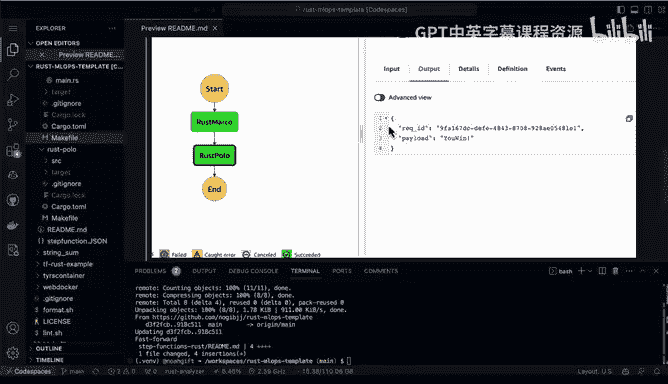
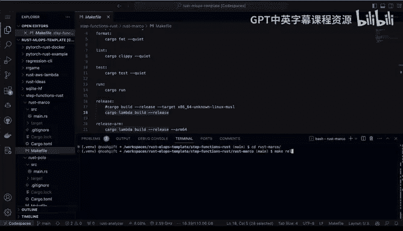
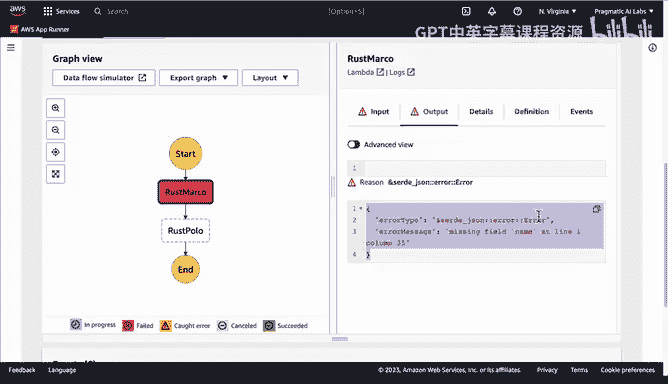

# 119：使用 Rust 构建 AWS Step Functions 实践 🦀



在本节课中，我们将学习如何使用 Rust 语言来构建和部署 AWS Step Functions。Step Functions 是一种强大的无服务器工作流服务，它允许你将多个 AWS Lambda 函数像乐高积木一样串联起来，构建复杂的业务流程。我们将通过一个简单的“Marco Polo”游戏示例，演示从创建 Lambda 函数到组装工作流的完整过程。

## 概述

AWS Step Functions 的核心优势在于其可视化的编排能力和强大的调试支持。你可以轻松地将一个 Lambda 函数的输出作为另一个 Lambda 函数的输入，并在控制台中直观地追踪每个步骤的执行详情。本教程将展示如何利用 Rust 和 `cargo-lambda` 工具链来实现这一流程。

## 创建 Rust Lambda 函数



首先，我们需要创建两个独立的 Rust Lambda 函数，它们将作为工作流中的两个步骤。

以下是创建第一个函数 `rust-marco` 的步骤：

1.  使用 `cargo-lambda` 工具初始化新项目。
    ```bash
    cargo lambda new rust-marco
    ```
2.  编写函数逻辑。函数接收一个包含 `name` 字段的 JSON 输入。
3.  在处理器（handler）中，判断输入的名字是否为 “Marco”。
4.  根据判断结果，构造不同的响应体。

让我们查看 `rust-marco` 函数的核心代码逻辑：

```rust
// 定义输入数据结构
#[derive(Deserialize)]
struct Request {
    name: String,
}

// 定义输出数据结构
#[derive(Serialize)]
struct Response {
    body: String,
}

// Lambda 函数处理器
async fn function_handler(event: LambdaEvent<Request>) -> Result<Response, Error> {
    // 从事件中提取 name 字段
    let name = event.payload.name;

    // 核心逻辑：判断并生成响应
    let body = if name == "Marco" {
        "Polo".to_string()
    } else {
        "Nobody".to_string()
    };

    // 记录日志用于调试
    tracing::info!("Processed name: {}", name);

    // 返回响应
    Ok(Response { body })
}
```

接下来，我们以同样的方式创建第二个函数 `rust-polo`。

上一节我们创建了第一个 Lambda 函数，本节中我们来看看第二个函数 `rust-polo` 的实现。它的作用是接收第一个函数的输出，并做出响应。

`rust-polo` 函数的逻辑如下：

```rust
async fn function_handler(event: LambdaEvent<Request>) -> Result<Response, Error> {
    // 从事件中提取上一个函数返回的 body 字段
    let body = event.payload.body;

    // 核心逻辑：判断 body 内容
    let result = if body.contains("Polo") {
        "You win".to_string()
    } else {
        "You lose".to_string()
    };

    tracing::info!("Received body: {}, Result: {}", body, result);

    Ok(Response { body: result })
}
```



## 构建与部署函数

为了简化构建和部署流程，我们可以使用 `Makefile` 来定义常用命令。

以下是 `Makefile` 的示例内容：

```makefile
release:
    cargo lambda build --release

deploy:
    cargo lambda deploy

invoke:
    cargo lambda invoke --remote --data-ascii '{"name": "Marco"}' rust-marco-function
```

运行 `make release` 会编译 Rust 代码为 Lambda 可用的二进制文件。运行 `make deploy` 会将函数部署到 AWS 云端。运行 `make invoke` 可以远程测试已部署的函数。

## 在 AWS 控制台组装 Step Functions

函数部署完成后，我们可以在 AWS 管理控制台中像搭积木一样创建 Step Functions 工作流。

以下是创建状态机的步骤：

1.  进入 Step Functions 控制台，点击“创建状态机”。
2.  在可视化编辑器中，从左侧拖入一个“Lambda 调用”状态块。
3.  将其配置为调用我们部署的 `rust-marco` 函数。
4.  再拖入第二个“Lambda 调用”状态块，将其配置为调用 `rust-polo` 函数。
5.  用箭头连接两个状态块，定义执行顺序。
6.  为状态机命名（例如 `rust-marco-polo-chain`）并创建。

工作流的定义（ASL）本质上是一个 JSON 文件，它描述了状态的顺序和转换逻辑。

## 执行与调试工作流

状态机创建后，我们可以立即执行它并观察其运行过程。

执行工作流并观察结果的步骤如下：

1.  在状态机详情页，点击“开始执行”。
2.  为本次执行提供一个输入，例如：`{"name": "Marco"}`。
3.  点击“开始执行”后，控制台会进入可视化执行界面。
4.  你可以看到执行流经 `rust-marco` 和 `rust-polo` 两个步骤。
5.  点击每个步骤，可以展开查看其详细的输入和输出，这对于调试至关重要。

如果输入 `name` 不是 “Marco”，第一个函数将返回 “Nobody”，导致第二个函数判断为 “You lose”，整个工作流会成功完成但结果不同。如果函数配置或权限有误，工作流会失败并显示清晰的错误信息，方便定位问题。

## 总结



本节课中我们一起学习了使用 Rust 构建 AWS Step Functions 的完整流程。我们首先利用 `cargo-lambda` 创建并部署了两个简单的 Lambda 函数，然后在 AWS 控制台中将它们组装成一个顺序执行的工作流。这个过程展示了 Step Functions 在编排无服务器任务、可视化流程和简化调试方面的强大能力。通过结合 Rust 的性能与安全性，以及 AWS 无服务器服务的弹性，你可以构建出高效、可靠且易于维护的大规模云解决方案。