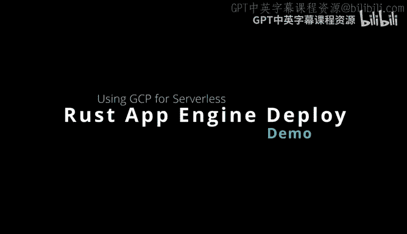
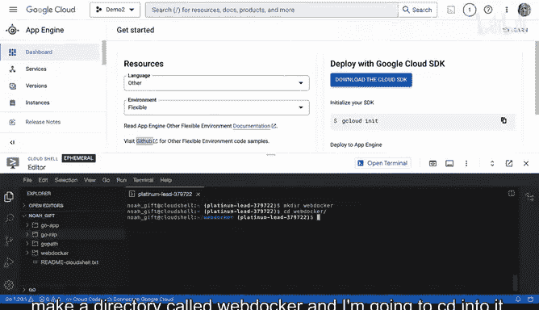
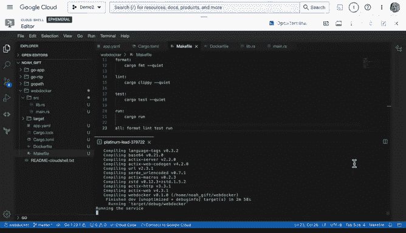
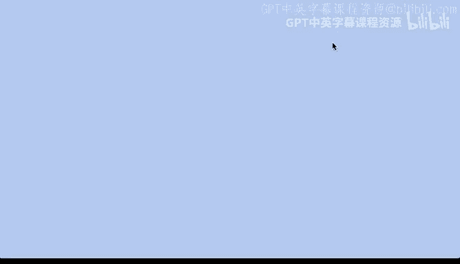
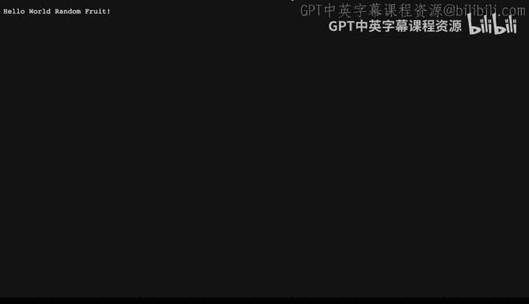
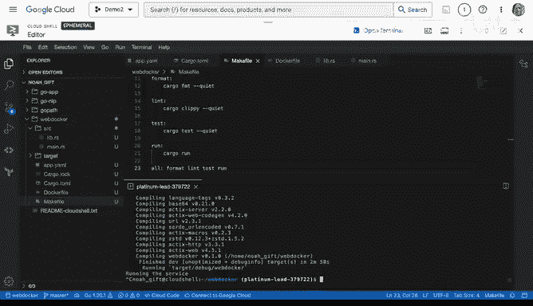
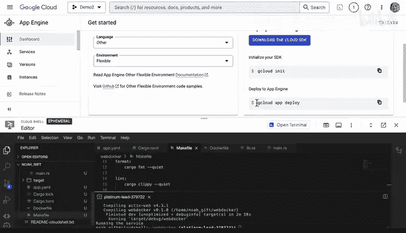
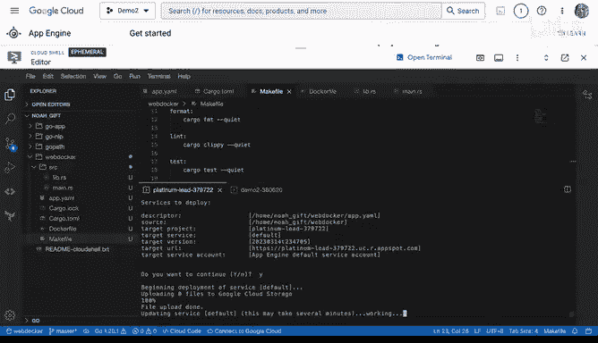
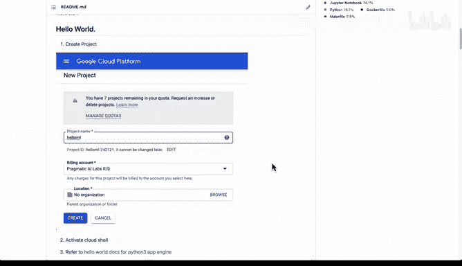

# 120：App Engine Rust应用部署演示 🚀

在本节课中，我们将学习如何在Google App Engine的灵活环境中，使用Rust语言部署一个微服务应用。我们将从创建项目目录开始，逐步配置必要的文件，并最终将应用部署到生产环境。



---

## 配置App Engine环境

首先，我们有一个App Engine环境。我已将其配置为灵活环境，以便演示如何使用Rust语言和App Engine框架部署微服务。

以下是部署Rust应用到App Engine的具体步骤。

### 1. 创建项目目录与配置文件

首先，创建一个名为 `web_docker` 的目录并进入。

```bash
mkdir web_docker
cd web_docker
```

接下来，需要为App Engine创建配置文件。创建一个名为 `app.yaml` 的文件。



```bash
touch app.yaml
```

`app.yaml` 文件至关重要，它用于告知App Engine我们的部署配置。其基本内容如下：

```yaml
runtime: custom
env: flex
```

这表示我们使用自定义运行时，并选择灵活环境。

### 2. 初始化Rust项目

现在，我们需要初始化一个Rust项目。使用 `cargo init` 命令。

```bash
cargo init
```

在提示中输入项目名称，例如 `web_docker`。此命令会生成 `Cargo.toml` 等文件。

接着，我们需要添加项目依赖。将以下内容添加到 `Cargo.toml` 文件的 `[dependencies]` 部分：

```toml
actix-web = "4"
rand = "0.8"
serde = { version = "1", features = ["derive"] }
```

### 3. 创建Dockerfile

由于我们使用自定义运行时，需要提供一个 `Dockerfile` 来定义构建和运行环境。

```bash
touch Dockerfile
```

`Dockerfile` 内容示例如下。它使用Rust构建器，并采用多阶段构建以生成更小的最终镜像。

```dockerfile
FROM rust:1.68 as builder
WORKDIR /usr/src/app
COPY . .
RUN cargo build --release

FROM debian:buster-slim
COPY --from=builder /usr/src/app/target/release/web_docker /usr/local/bin/web_docker
CMD ["web_docker"]
```

### 4. 编写应用源代码

现在，我们来编写应用的核心代码。首先创建 `src/lib.rs` 文件。

```rust
// src/lib.rs
use actix_web::{get, web, App, HttpResponse, HttpServer, Responder};
use rand::Rng;
use serde::Serialize;

#[derive(Serialize)]
struct Fruit {
    name: String,
}

#[get("/")]
async fn index() -> impl Responder {
    let fruits = vec!["Apple", "Banana", "Cherry", "Date", "Elderberry"];
    let mut rng = rand::thread_rng();
    let random_fruit = fruits[rng.gen_range(0..fruits.len())];
    HttpResponse::Ok().body(format!("Welcome! Random fruit: {}", random_fruit))
}

#[get("/health")]
async fn health() -> impl Responder {
    HttpResponse::Ok().body("OK")
}

pub fn init_app(config: &mut web::ServiceConfig) {
    config.service(index);
    config.service(health);
}
```

然后，创建 `src/main.rs` 文件作为应用入口。

```rust
// src/main.rs
use actix_web::{web, App, HttpServer};
use web_docker;

#[actix_web::main]
async fn main() -> std::io::Result<()> {
    HttpServer::new(|| {
        App::new().configure(web_docker::init_app)
    })
    .bind(("0.0.0.0", 8080))?
    .run()
    .await
}
```

### 5. 添加Makefile（可选）

为了便于管理和记录构建步骤，可以添加一个 `Makefile`。

```makefile
.PHONY: run build deploy clean





run:
    cargo run

build:
    cargo build --release

deploy:
    gcloud app deploy

clean:
    cargo clean
    rm -rf target
```

### 6. 本地测试应用

在部署之前，先在本地运行应用以确保一切正常。





```bash
cargo run
```



应用启动后，可以通过Web预览功能访问 `http://localhost:8080`。页面应显示“Welcome! Random fruit: [随机水果名]”。访问 `/health` 路由应返回“OK”。

### 7. 部署到App Engine

确认应用在本地运行无误后，即可开始部署。首先，建议删除 `target` 目录以避免上传不必要的构建文件。

```bash
rm -rf target
```

由于Rust编译可能耗时较长，需要设置更长的构建超时时间。

```bash
gcloud config set app/cloud_build_timeout 1600
```

最后，执行部署命令。

```bash
gcloud app deploy
```



此过程需要一些时间。部署完成后，应用将在App Engine的生产环境中运行。

---

## 灵活环境的优势

通过以上步骤，我们成功在App Engine灵活环境中部署了一个Rust应用。App Engine的灵活性不仅限于Rust，它支持多种语言和部署方式。

例如，对于Python应用，你可以直接在 `app.yaml` 中指定官方运行时。

```yaml
runtime: python37
```

若想实现自动化部署，可以添加 `cloudbuild.yaml` 文件来定义Cloud Build的各个构建步骤。

这种灵活性使得开发者可以轻松地在不同语言（如Rust、Python、Go）之间切换，并选择适合的部署策略。整个过程可以从简单的命令行开始，根据需求演变为一个完整的持续交付流程。

---



## 总结


本节课中，我们一起学习了如何将Rust应用部署到Google App Engine的灵活环境。我们从创建项目、编写配置文件（`app.yaml` 和 `Dockerfile`）、编写应用代码，到本地测试和最终部署，完成了完整的流程。App Engine提供了高度灵活的环境，支持多种编程语言和部署方式，是构建和扩展云应用的强大平台。