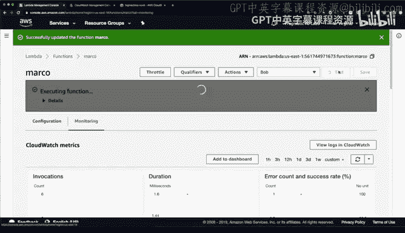
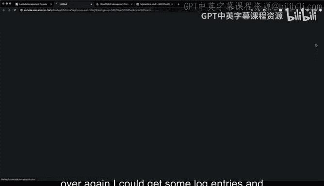
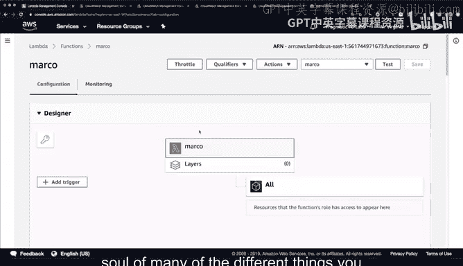
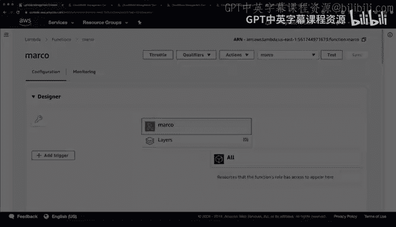

# 123：使用AWS CloudWatch实现监控触发与告警 📊

在本节课中，我们将学习AWS CloudWatch的核心功能。CloudWatch是一个强大的服务，可以帮助你监控在AWS上运行的几乎所有资源和应用程序。我们将通过一个Lambda函数的例子，探索如何设置监控、查看日志、配置告警以及创建定时触发器。

---

## 探索CloudWatch控制台

首先，我们进入AWS管理控制台，找到并打开CloudWatch服务。CloudWatch允许我们监控资源和应用程序。其功能主要分为几个大类：**告警**、**事件**、**日志**和**指标**。

为了全面了解这些功能，我们将回到之前创建的“Marco” Lambda函数，并以其为例进行演示。

---

## 查看CloudWatch日志 📝

上一节我们介绍了CloudWatch的概览，本节中我们来看看如何查看和分析日志。

Lambda函数每次被调用时，都会生成日志。在Lambda控制台的“监控”选项卡下，我们可以查看与函数相关的CloudWatch监控信息。

以下是查看日志的步骤：
1.  确保Lambda函数的执行角色具有写入CloudWatch Logs的权限。如果之前修改过角色，可能需要将其恢复为默认角色或附加一个包含`CloudWatchLogsFullAccess`策略的开发角色。
2.  保存角色更改并刷新页面。
3.  在“监控”选项卡下，点击“查看CloudWatch中的日志”。
4.  在打开的CloudWatch Logs界面中，可以根据时间戳查看最新的日志流，这是调试Lambda函数的有效方法。







---

## 在代码中添加调试信息

除了查看自动生成的日志，我们还可以在Lambda函数代码中主动输出调试信息，这是一种常见的调试手段。

例如，在Python编写的Lambda函数中，我们可以使用`print`语句输出事件内容：

```python
print(f"This is my event: {event}")
```

这段代码使用了Python的f-string格式化方法，将事件对象的内容打印到日志中。保存并多次测试函数后，这些自定义的“Bob”消息和函数原有的“Marco”消息都会出现在CloudWatch日志中。

回到CloudWatch监控界面，我们不仅可以查看调用次数、持续时间等指标，还可以深入查看具体的日志输出来排查问题。

---

## 配置CloudWatch事件触发器 ⏰

上一节我们学习了如何查看日志，本节中我们来看看如何配置自动触发器。

CloudWatch Events（现称为EventBridge）可以按计划或响应事件来触发Lambda函数。例如，如果我们希望“Marco”函数每分钟自动运行一次，可以设置一个规则。

以下是创建定时触发器的步骤：
1.  在Lambda函数配置页面的“触发器”部分，点击“添加触发器”。
2.  选择“CloudWatch Events/EventBridge”。
3.  创建新规则，例如命名为“noisy-one-minute”。
4.  选择“计划表达式”，并输入速率表达式：`rate(1 minute)`
5.  保存后，规则将每分钟触发一次Lambda函数。

设置完成后，我们可以通过查看CloudWatch日志来验证函数是否被周期性调用。在CloudWatch控制台的“规则”部分，也可以管理已创建的事件规则。

> **注意**：对于不执行实际任务的函数，应移除此类触发器以避免不必要的运行和成本。演示后，我们移除了这个“noisy-one-minute”触发器。






---

## 总结

本节课中我们一起学习了AWS CloudWatch的几个核心功能。我们通过一个Lambda函数实例，实践了如何查看和分析CloudWatch日志，如何在函数代码中添加调试信息，以及如何配置CloudWatch事件规则来定时触发函数。


总而言之，CloudWatch是AWS生态中监控和可观察性的核心，它集告警、事件、日志和指标于一体，从调试应用程序到构建自动化数据管道，都发挥着重要作用。确保资源配置正确的权限并及时清理不必要的资源，是使用CloudWatch时的最佳实践。