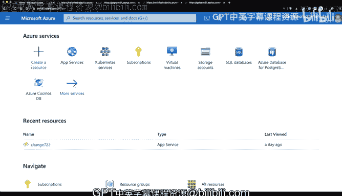
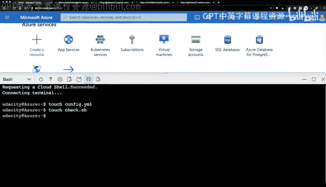
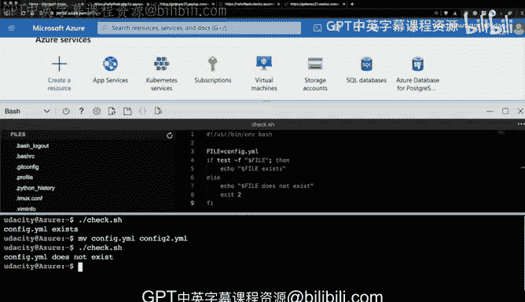

# 124：从零构建告警系统 🚨



在本节课中，我们将学习如何从零开始构建一个简单的告警系统。我们将通过编写一个Bash脚本来检查特定文件是否存在，并根据检查结果输出相应信息或返回错误状态码。这个过程模拟了在基础设施中验证关键组件是否按预期工作的基本方法。

---

上一节我们介绍了告警系统的基本概念，本节中我们来看看如何具体实现一个文件检查脚本。

首先，我们需要在Azure Cloud Shell环境中进行操作。打开Cloud Shell编辑器可以方便地创建和编辑文件。

以下是创建测试文件和检查脚本的步骤：



1.  创建一个名为 `config` 的测试文件，这个文件代表我们需要确保存在的目标文件。
    ```bash
    touch config
    ```
2.  创建一个名为 `check.sh` 的Bash脚本文件，用于执行检查逻辑。

现在，让我们开始编辑 `check.sh` 脚本文件。

脚本的第一行是“shebang”行，它指定了脚本的解释器。
```bash
#!/usr/bin/env bash
```
接下来，我们定义要检查的文件路径，并使用 `if` 语句和 `test -f` 命令来检查文件是否存在。
```bash
FILE="./config"

if test -f "$FILE"; then
    echo "Config file exists."
else
    echo "Config file doesn‘t exist."
    exit 2
fi
```
这段代码的逻辑是：如果文件存在，则打印成功信息；如果文件不存在，则打印错误信息并以状态码 `2` 退出，这通常用于表示“文件未找到”的错误。

脚本编写完成后，需要使其可执行。
```bash
chmod +x check.sh
```
现在，我们可以运行脚本来测试其功能。
```bash
./check.sh
```
如果 `config` 文件存在，脚本将输出“Config file exists.”。为了测试告警功能，我们可以重命名或删除 `config` 文件，然后再次运行脚本。
```bash
mv config config2
./check.sh
```
此时，脚本将输出“Config file doesn‘t exist.”并以状态码 `2` 退出。

---




本节课中我们一起学习了如何构建一个基础的告警检查脚本。我们创建了一个Bash脚本，用于检查关键文件是否存在，并在文件缺失时返回错误状态码。虽然这是一个简单的例子，但它展示了如何将验证逻辑嵌入基础设施中，以确保系统按预期运行，并在需要人工干预时触发告警。