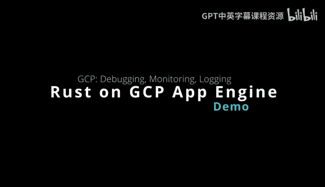
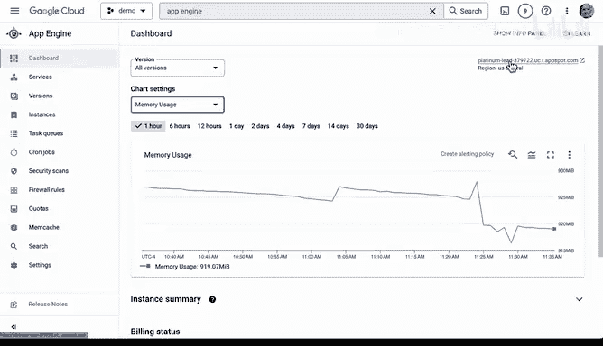
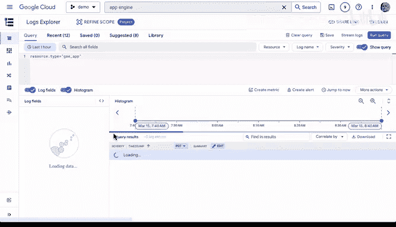

# 125：Google App Engine Rust微服务监控与日志 📊

在本节课中，我们将学习如何为部署在Google App Engine上的Rust微服务进行监控与日志分析。我们将从查看一个实际部署的微服务仪表盘开始，了解其提供的各项监控指标，然后深入探讨如何使用日志查询功能进行更细致的调试。

## 微服务与仪表盘概览

我们有一个使用Actix Web框架的Rust微服务。该服务包含一个名为`/fruit`的路由，以及一个返回“Hello World”的函数。我们可以通过代码了解其部署到生产环境后的行为。该应用已容器化，非常适合在App Engine上运行。

上一节我们介绍了微服务的基本构成，本节中我们来看看其部署后的监控界面。

如果我们访问该服务在App Engine上的已部署版本，可以看到一个仪表盘。该仪表盘展示了此部分所有重要的摘要信息。

以下是仪表盘提供的主要监控视图：

*   **请求**：可以查看请求数量。
*   **计费状态**：查看服务的计费情况。
*   **错误**：查看是否存在任何错误。
*   **按类型查看请求**：例如，可以切换查看延迟情况。
*   **流量**：查看接收和发送的流量数据。
*   **利用率**：查看资源利用率。
*   **实例**：查看已部署的实例数量（例如，当前有两个）。
*   **内存使用情况**：这对微服务非常重要，甚至可以基于此创建警报策略。
*   **缓存查询**：查看各种不同的缓存查询情况。

访问应用本身非常简单。我们再次看到这个基于Rust的随机水果微服务，访问`/fruit`路由，并可以反复运行它。

因此，仅从这个仪表盘就能获得非常直观和全面的监控服务。我们还可以在这里查看版本，甚至了解哪些版本正在提供流量（当前是100%的流量）。我们也可以从这个仪表盘停止或启动服务。

所以，如果你有一个容器化的Rust微服务运行在Google App Engine上，这里就是一个一站式的监控管理平台。

## 深入日志分析

除了仪表盘，另一项非常实用的功能是日志分析。

我们可以进一步深入查看细节。其中一种方法是创建自定义查询。我们可以在这里切换，仅按资源类型筛选，从而很好地了解发生的一切。我们可以创建指标、创建警报，甚至执行SQL查询。

接下来，我将演示一个非常简单的操作：查询我们已知会被调用的`/fruit`这个URL。让我们运行一个查询。

查询结果应该会显示出来。我们可以看到应用延迟（以秒为单位）、项目名称以及调用发生的时间戳。

如果需要，我也可以基于此创建某种警报。例如，如果调用次数过多，我们可以据此采取一些行动。我们还可以切换查看不同的日志名称和严重级别。

因此，结合Google App Engine的仪表盘和日志显示功能，你便拥有了调试基于Rust的App Engine微服务所需的一切工具，足以应对生产环境中的应用调试。

## 课程总结

本节课中我们一起学习了如何利用Google App Engine的内置工具监控和调试Rust微服务。我们首先探索了App Engine仪表盘，它提供了从请求、错误、实例状态到内存使用率等全方位的运行概览。接着，我们深入使用了日志查询功能，通过自定义查询来追踪特定请求（如`/fruit`）的详细执行情况，包括延迟和时间戳，并了解了如何基于日志数据创建警报。这些工具共同为生产环境中的微服务提供了强大的可观测性支持。