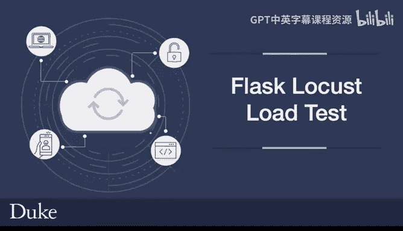
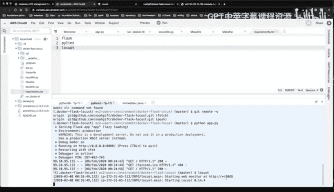
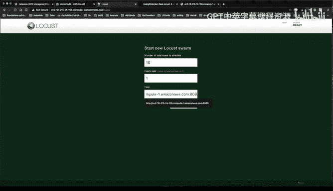
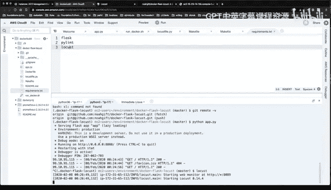
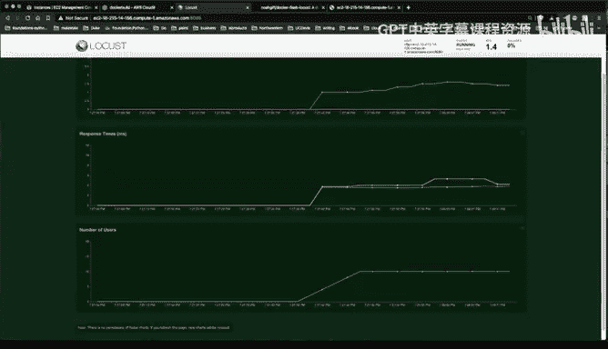

# 128：使用Flask与Locust进行负载测试 🚀



在本节课中，我们将学习如何对一个简单的Flask Web应用进行负载测试。我们将使用Locust工具来模拟多个并发用户访问我们的服务，并观察其性能表现。整个过程将在AWS Cloud9开发环境中完成。

## 概述

我们将创建一个基础的“Hello World” Flask应用，然后使用Locust编写一个负载测试脚本。通过配置安全组开放必要的端口，我们可以在本地浏览器中访问Flask应用和Locust的Web界面，从而实时监控测试结果。

## 准备Flask应用

首先，我们需要构建一个简单的Flask应用作为测试目标。

以下是一个基础的Flask应用代码，它只包含一个返回“Hello World”的路由：

```python
from flask import Flask
app = Flask(__name__)

@app.route('/')
def hello_world():
    return 'Hello World!'

if __name__ == '__main__':
    app.run(host='0.0.0.0', port=8080)
```

在Cloud9终端中，我们可以使用命令 `python app.py` 来运行这个应用。应用将在端口8080上启动。

## 配置安全组

由于Cloud9环境运行在EC2实例上，我们需要确保测试所需的端口在安全组中是开放的。

以下是需要开放的端口及其用途：
*   **端口 8080**: Flask应用运行在此端口。
*   **端口 8089**: Locust的Web管理界面运行在此端口。
*   **端口 9090**: 可能用于其他开发用途。

配置完成后，我们可以通过EC2实例的公共DNS地址和相应端口（例如 `http://<公共DNS>:8080`）在浏览器中访问Flask应用，以验证其运行正常。

## 编写Locust负载测试脚本

上一节我们准备好了待测试的Flask应用，本节中我们来看看如何编写Locust测试脚本。

Locust测试脚本定义了模拟用户的行为。以下是一个针对我们Flask应用的简单测试脚本：

```python
from locust import HttpUser, task, between

class WebsiteUser(HttpUser):
    wait_time = between(1, 5) # 模拟用户等待1到5秒

    @task
    def hello_world(self):
        self.client.get("/") # 访问Flask应用的根路径
```

这段代码创建了一个名为 `WebsiteUser` 的用户类，它会在每次任务执行后等待1到5秒，然后重复访问我们Flask应用的首页。

## 运行与监控负载测试

现在，我们已经有了待测应用和测试脚本，接下来让我们启动测试并观察结果。



首先，确保Flask应用正在运行（`python app.py`）。然后，在另一个终端标签页中，导航到项目目录并运行命令 `locust`。这将启动Locust，并默认在端口8089上提供Web界面。

在浏览器中访问Locust的Web界面（`http://<公共DNS>:8089`），我们需要配置测试参数。

以下是启动测试前需要填写的参数：
*   **Number of users (peak concurrency)**: 要模拟的最大并发用户数，例如10。
*   **Spawn rate (users started/second)**: 每秒启动的用户数，例如1。
*   **Host**: 目标应用的地址，格式为 `http://<公共DNS>:8080`。

填写参数并点击“Start swarming”后，Locust将开始模拟用户请求。我们可以在Web界面上实时查看各种统计数据。

Locust的Web界面提供了多个监控视图，帮助我们分析应用性能：
*   **Statistics**: 显示请求数、失败率、响应时间（平均、中位数、最小/最大值）等关键指标。
*   **Charts**: 以图表形式实时展示每秒请求数（RPS）和响应时间的变化趋势。
*   **Failures**: 列出所有失败的请求及其原因。
*   **Exceptions**: 显示测试过程中抛出的异常。

## 总结







本节课中我们一起学习了如何使用Locust对Flask应用进行负载测试。我们首先创建了一个简单的Flask服务，然后编写了Locust测试脚本以定义用户行为。通过配置AWS安全组开放端口，我们能够在浏览器中访问并操作Locust的Web界面，从而轻松地启动测试并实时监控应用的性能表现，如吞吐量和响应时间。这套方法可以进一步扩展，用于测试容器化或部署在Kubernetes中的微服务。