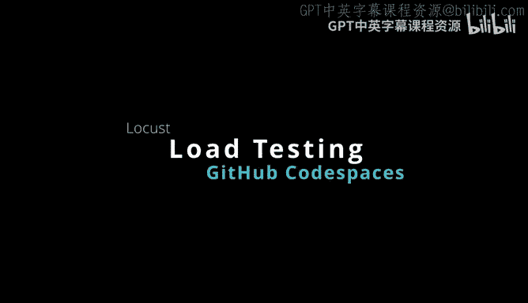
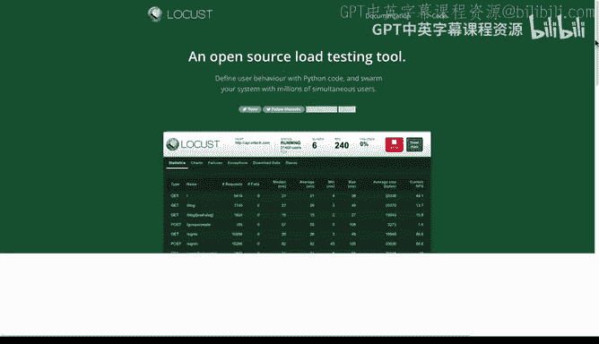
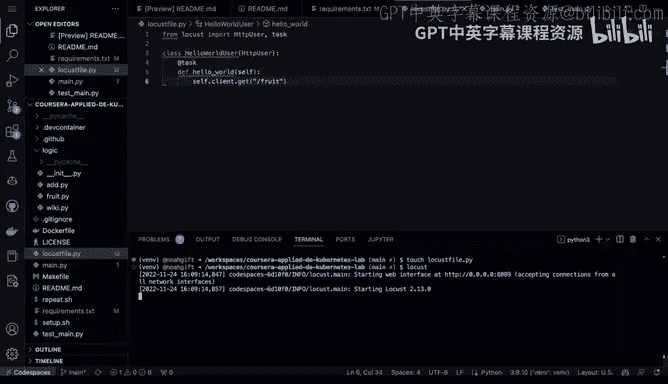
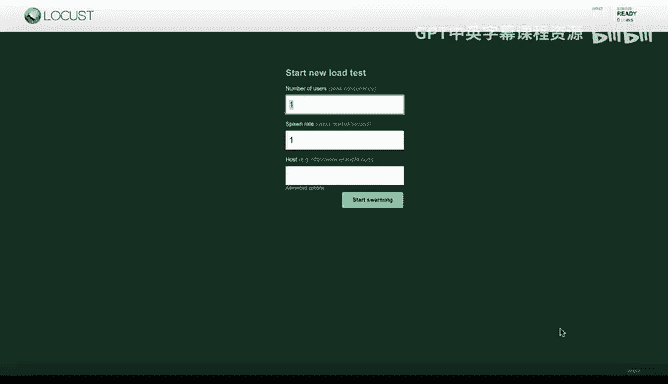
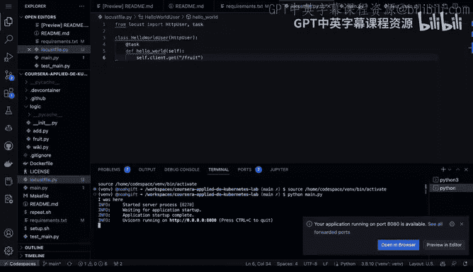
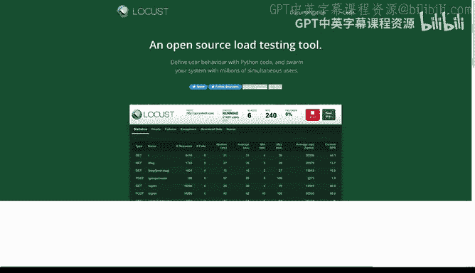
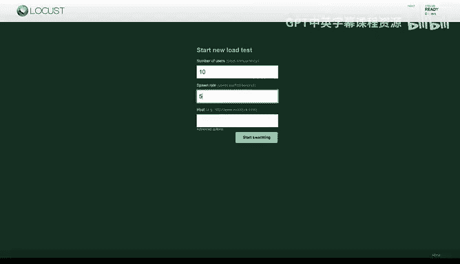
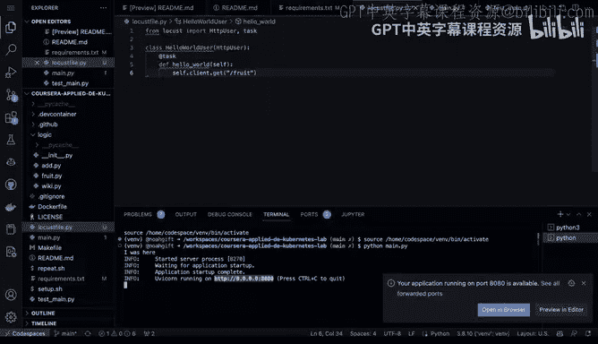
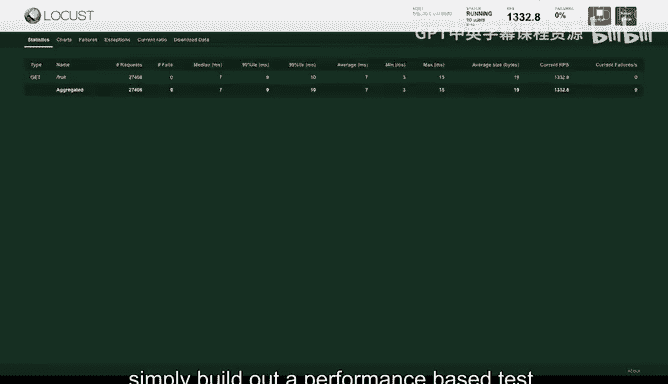
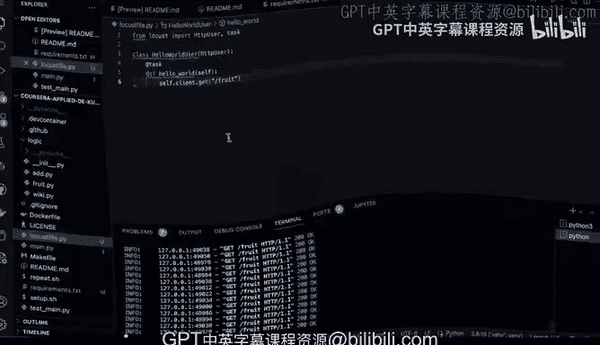

# 129：在GitHub Codespaces中使用Locust进行负载测试 🚀



## 概述
在本节课中，我们将学习如何使用Locust这一开源负载测试工具。负载测试是验证生产系统行为的重要环节。我们将在一个GitHub Codespaces环境中，对一个简单的微服务应用进行负载测试，模拟多用户并发访问，并观察其性能表现。

## 准备工作
首先，我们有一个可以运行在Kubernetes上的简单微服务。为了演示，我们暂时在本地运行它。通过执行 `python main.py` 命令可以启动这个应用。

## 创建Locust测试文件
接下来，我们需要创建一个Locust测试文件。使用 `touch` 命令创建一个名为 `locustfile.py` 的文件。我们将在这个文件中编写负载测试代码。

以下是创建Locust测试文件的基本步骤：



1.  导入必要的Locust模块。
2.  定义一个继承自 `HttpUser` 的用户类。
3.  在该类中，使用 `@task` 装饰器定义要测试的具体任务。

## 编写测试任务
我们的微服务有一个 `/fruit` 路由，它会随机返回一种水果。因此，我们的负载测试任务就是模拟用户访问这个端点。

我们编写的测试代码如下：
```python
from locust import HttpUser, task

class WebsiteUser(HttpUser):
    @task
    def get_fruit(self):
        self.client.get("/fruit")
```
这段代码定义了一个用户行为：反复向 `/fruit` 路径发起GET请求。



## 运行负载测试
编写好测试文件后，我们就可以运行Locust了。在终端中直接输入 `locust` 命令。Locust会启动一个Web管理界面。



为了进行测试，我们需要同时运行被测试的微服务。因此，我们打开一个新的终端，并执行 `python main.py` 来启动我们的应用。

## 配置并执行测试
在Locust的Web界面中，我们可以配置测试参数：





*   **Number of users**：要模拟的用户总数。
*   **Spawn rate**：每秒启动的用户数。
*   **Host**：被测试应用的地址（例如 `http://127.0.0.1:8080`）。





配置完成后，点击“Start swarming”开始测试。

## 分析测试结果
测试开始后，Locust的仪表盘会实时显示关键指标：

*   **Requests/s**：每秒处理的请求数，反映系统吞吐量。
*   **Response Time**：响应时间，包括平均值、中位数和特定百分位数（如P95）。
*   **Failures**：失败的请求数量及原因。

通过这些图表和数据，我们可以清晰地了解应用在负载下的性能表现，例如是否存在性能瓶颈或错误。

## 集成到开发流程
Locust测试可以非常方便地集成到持续集成/持续部署（CI/CD）流程中。我们可以在每次部署到生产环境之前自动运行负载测试，并设定性能指标阈值（例如，响应时间必须低于200毫秒）。只有测试通过，才能继续进行部署，这有助于保障生产系统的稳定性。





## 总结
本节课我们一起学习了如何使用Locust进行负载测试。我们完成了从创建测试文件、编写测试任务、运行测试到分析结果的全过程。Locust是一个强大且易用的工具，能够帮助我们模拟高并发场景，验证应用的性能与可靠性。将负载测试纳入自动化流程，是构建健壮生产系统的重要实践。