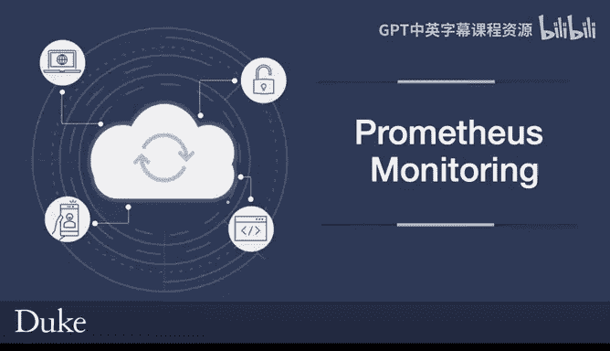
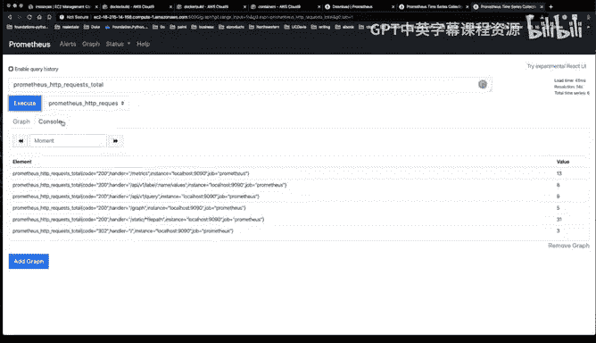

# 130：Prometheus监控系统入门 🚀



在本节课中，我们将学习如何设置和运行Prometheus，这是一个非常流行的指标收集与告警解决方案，常与容器和Kubernetes一起使用。我们将使用AWS Cloud9环境来快速搭建一个原型。

## 概述

我们将从下载Prometheus开始，配置它，并在AWS环境中运行，最后通过Web界面查看其收集的指标数据。整个过程将展示Prometheus的基本工作原理。

## 环境准备与Prometheus下载

首先，我们使用AWS Cloud9环境。Cloud9能简化环境配置，特别适合在云中进行原型开发。

以下是启动步骤：

1.  在AWS控制台中找到并点击Cloud9服务。
2.  选择一个已有的Cloud9环境（本例中使用了一个之前用于Docker工作的环境）。
3.  在Cloud9的终端中，我们将下载Prometheus客户端。

接下来，我们访问Prometheus官方网站的下载页面，找到适用于Linux的可执行文件。使用 `wget` 命令下载它。

```bash
wget https://github.com/prometheus/prometheus/releases/download/v2.37.0/prometheus-2.37.0.linux-amd64.tar.gz
```

下载完成后，使用 `tar` 命令解压文件包。

```bash
tar xvzf prometheus-2.37.0.linux-amd64.tar.gz
```

## 配置Prometheus

解压后，我们进入Prometheus的目录。目录中已有一个默认的配置文件 `prometheus.yml`。

```bash
cd prometheus-2.37.0.linux-amd64
```

我们可以用文本编辑器查看这个默认配置。但为了演示，我们将创建一个自定义配置。Prometheus不仅能收集其他系统的指标，也会生成关于自身的指标。默认情况下，它的Web界面运行在端口 **9090**。

由于Cloud9环境默认有安全限制，我们需要在AWS EC2的安全组中手动开放9090端口。

以下是配置安全组的步骤：

1.  回到AWS控制台，导航到EC2服务。
2.  在左侧导航栏中找到“安全组”。
3.  找到与你的Cloud9实例关联的安全组（名称中通常包含“cloud9”或本例中的“docker”）。
4.  在“入站规则”标签页中，点击“编辑入站规则”。
5.  添加一条新规则：类型选择“自定义TCP”，端口范围填写 **9090**，来源设置为“0.0.0.0/0”（或根据你的安全需求调整）。
6.  保存规则。

## 运行Prometheus并访问界面

端口开放后，我们就可以运行Prometheus了。使用 `--config.file` 参数指定我们的配置文件。

```bash
./prometheus --config.file=prometheus.yml
```

服务器将在前台运行，我们可以在终端中看到它的日志输出。

要访问Prometheus的Web界面，我们需要知道Cloud9实例的公共IP地址或公共DNS。

查找地址的步骤如下：

1.  在EC2控制台的“实例”页面，找到你的Cloud9实例。
2.  复制“公共IPv4 DNS”或“公共IPv4地址”。
3.  在浏览器中访问 `http://<你的公共DNS>:9090`。

## 查看与理解指标

成功访问Web界面后，我们可以探索Prometheus的功能。

首先，Prometheus会自动生成关于自身的指标。我们可以通过访问 `http://<你的公共DNS>:9090/metrics` 来查看这些原始的指标数据。每次刷新这个页面，都会产生新的指标数据点。

回到主界面（`http://<你的公共DNS>:9090`），我们可以使用“Graph”标签页下的表达式浏览器来查询和可视化指标。

例如，我们可以输入 `prometheus_http_requests_total` 来查看Prometheus服务处理的HTTP请求总数。点击“Execute”执行查询，结果会以表格形式展示。切换到“Graph”视图，可以看到该指标随时间变化的曲线图。

## 总结




本节课我们一起学习了Prometheus监控系统的基础操作。我们从在AWS Cloud9环境中下载和安装Prometheus开始，然后学习了如何配置安全组以开放必要的网络端口。接着，我们启动了Prometheus服务并通过Web界面访问它。最后，我们探索了如何查看Prometheus自动生成的指标，并使用表达式浏览器对指标进行简单的查询和图表展示。这为后续深入使用Prometheus进行应用监控打下了基础。