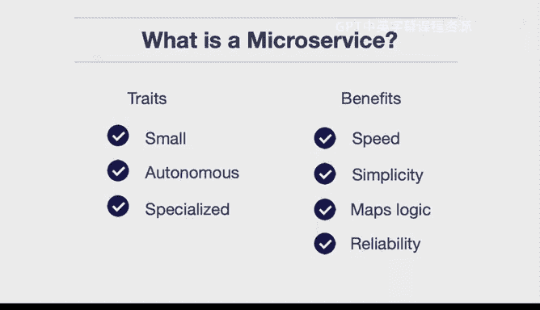

# 构建大规模云计算解决方案：1-2：什么是微服务 🧩

在本节课中，我们将要学习微服务的核心概念、关键特征及其带来的主要优势。微服务是一种软件架构风格，它将应用程序构建为一套小型、独立的服务。

---

## 微服务的特征

微服务具备几个不同的特征，我们可以从其特征角度来审视它。

以下是微服务的关键特征：

*   **小型化**：一个微服务只做一件事，并且做得非常好。
*   **自治性**：微服务不会同时连接数据库、连接其他服务并将所有东西捆绑在一起。它执行一个特定任务，并且只专注于做好这一件事。例如，每个微服务可以独立地与认证系统通信，或独立地与数据库系统通信。
*   **专门化**：这些微服务以特定方式执行特定任务，即使与其他服务之间的连接失败，它们也不会因此崩溃，而是能够优雅地处理该错误。

---

## 微服务的优势

上一节我们介绍了微服务的特征，本节中我们来看看采用微服务架构能带来哪些好处。

以下是微服务的主要优势：

*   **开发速度**：很多时候，如果你在处理一个大型应用程序，你必须回溯大量代码，找出某个部分如何与另一部分交互。但如果是一个小型微服务，你可以立即查看它。假设它只有100或200行代码，你就能清楚地知道它的功能。
*   **简单性**：同样地，由于服务非常小，你能够确切地知道它在运行时发生了什么，并且可以将功能隔离到特定的服务中，例如认证服务、数据库服务或业务逻辑服务。

---

## 微服务的本质

简而言之，微服务所做的是将其逻辑映射到一个特定的URL上。因此，在其最简形式下，**一个微服务就是一个函数**。

这个函数可以用Python、Go或其他语言编写，并映射到一个URL或一个事件上。

---

## 微服务的意义

那么，这对我们实际意味着什么呢？这意味着系统具有高度的可靠性，因为每个微服务只做一件事并且做得很好。

总而言之，由于这些特征和优势，微服务是软件工程架构领域的一项巨大进步。

---

在本节课中，我们一起学习了微服务的定义、核心特征（小型化、自治性、专门化）以及它带来的主要优势（提升开发速度、增强简单性和可靠性）。微服务通过将应用拆分为映射到特定URL或事件的独立函数，实现了软件架构的重要演进。