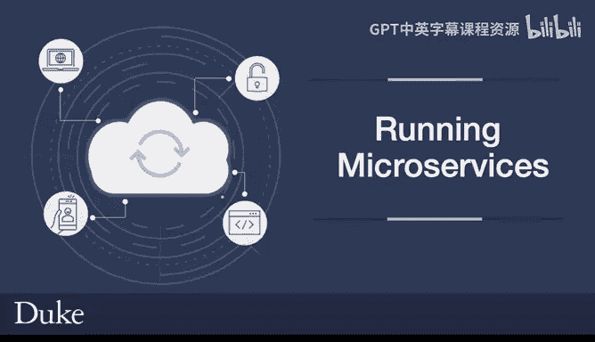
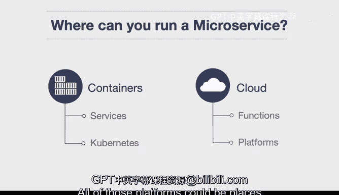
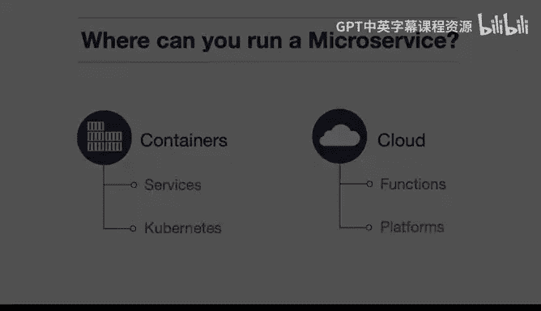

# 构建大规模云计算解决方案：P101：微服务运行实践 🚀

在本节课中，我们将要学习微服务架构中一个核心的实践问题：在哪里运行微服务。这对于设计系统的架构师而言是一个关键决策。

## 概述

微服务架构将应用程序分解为一系列小型、独立的服务。每个服务都围绕特定业务能力构建，并可以独立开发、部署和扩展。然而，这种架构模式带来了一个新的挑战：如何高效地部署和运行这些分散的服务。本节将探讨几种主流的微服务运行环境。

## 运行环境的主要类别

微服务的运行环境主要可以分为几个大类。以下是几种常见的选择。

### 1. 容器环境 🐳

上一节我们介绍了微服务的基本概念，本节中我们来看看第一种运行方式：容器。容器为微服务提供了一个轻量级、可移植的运行环境。

*   **容器即服务**：你可以将微服务部署到云平台提供的容器托管服务中。例如，在Google Cloud中，有 **Cloud Run** 服务。这是一种“容器即服务”产品，你可以将微服务推送上去，而无需管理底层基础设施。
    *   **示例代码**：部署命令可能类似于 `gcloud run deploy SERVICE_NAME --image gcr.io/PROJECT_ID/IMAGE_NAME`。
*   **容器编排平台**：另一种选择是将微服务部署到更复杂的容器编排系统中，例如 **Kubernetes**。在这种环境下，微服务可以运行在由Kubernetes管理的容器集群内，获得强大的自动化部署、扩展和管理能力。

### 2. 云原生函数 🌩️

除了容器，云平台本身也提供了原生的事件驱动计算能力，这为运行特定类型的微服务提供了另一种思路。

*   **函数即服务**：目前所有主流云平台都支持编写一个函数来响应特定事件。这种模式通常被称为“函数即服务”或“无服务器函数”。
    *   **示例服务**：例如，AWS的 **Lambda**、Google Cloud的 **Cloud Functions** 或 Azure的 **Functions**。你只需上传代码，平台会处理运行和扩展。

### 3. 一体化应用平台 🏗️

最后，我们来看一种更为一体化的部署方式，它简化了从开发到运行的许多环节。

另一种开发微服务的替代方案是使用更全面的平台。例如，**Elastic Beanstalk**，或者 **Google App Engine**，亦或是集成了身份验证等功能的更复杂的服务。所有这些平台都可以作为运行微服务的地方。

*   **平台即服务**：这类服务属于“平台即服务”范畴。它们抽象了基础设施和中间件的管理，让开发者可以更专注于代码本身。

## 总结

本节课中我们一起学习了微服务部署的几种主要实践路径。我们探讨了在**容器环境**（如Cloud Run或Kubernetes）中运行微服务，利用**云原生函数**（如Lambda或Cloud Functions）实现事件驱动架构，以及使用**一体化应用平台**（如App Engine或Elastic Beanstalk）来简化运维。每种选择都有其适用的场景，架构师需要根据服务的具体需求、团队的技术栈和运维成本来做出决策。