# 杜克大学《构建大规模云计算解决方案（基础、虚拟化，1-2课／共4课Building Cloud Computing Solutions at Scale》 - P105：38_03_05_Flask Azure微服务部署.zh_en - GPT中英字幕课程资源 - BV1oT421k7YQ

Let's go ahead and create a Azure microservice using Flask and Python It's very straightforward with Azure to build microservices and we can do it all from the command line interface First I'll select this Azure Cloud shell environment。

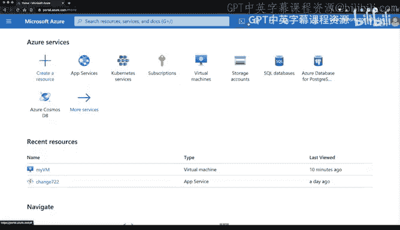

Next。From here， I'll make this a little bit bigger。

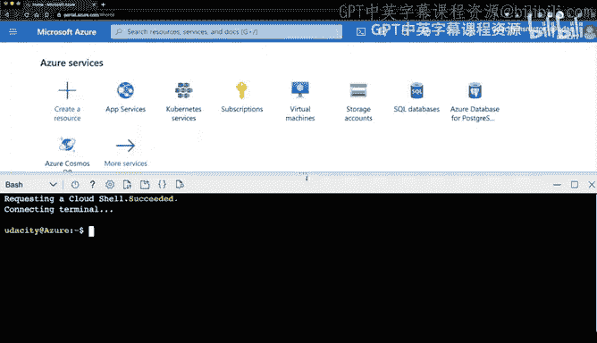

And I'll go through here in clonena Repo that has some code that will get me started。Perfect。

 and then typically， as I've mentioned in previous demonstrations。

We'll always want to start with a virtual environment， so'll type in Python 3， M， V E and V。

 and we'll go ahead and call this V E and V for now。I'll source that， so source。V， and V。

Then activate。And then next up， I will CDd into that repo。

There we go and you can see that the structure is there。

 the scaffolding right we have an application file and a requirements file。

 if I look inside of that requirements file， you can see it's got very specific versions of flask and other things pinned here now if I want to be a little bit ambitious what I could do is maybe make it so that I can upgrade to a very specific version。

 but in this case I'm going to leave it at the pinned number so how do I go ahead and do the installation。

 we know that you can do a Pip installs R requirements。There we go。

 this installs the latest packages and even though those are a couple errors it looks like we're good to go and then next up what I will do is just run Python application and from here you notice that didn't actually execute the file so how would we fix this well flask has a neat trick where you can actually export the FlaskG ID。

As a variable so here we go， export flask gap and then I can type in the word flask run and this will now run it in foreground mode inside of this environment。

 What's great about this step is that it's almost like it's my own local machine and I can preview it by going to this icon where there's the magnifying glass and the document and click web preview and notice it's running up port 5000 so I'll need to match that so I'll say configure。

😊，We'll go to port 5000 and then I'll say open and browse and there we go。

 We can see that this is running a hellello world application。 Okay， great。

 what's the next thing that'll do is I will go through and deploy this application and how do I do that Well I can use my existing Azure command line tool skills so I'll type in Azure web app remember again Azure itself is able to control all of the Azure environment in this case though。

 I'll say web app right so I'll go ahead and configure this and I'll say up Sku F1 So what does F1 mean this is free tier and then how many do I want to create well I want to just create one and we'll just call this hellello flask。

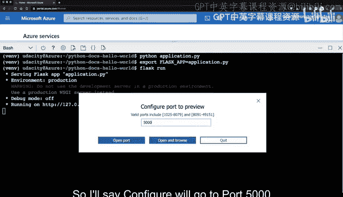

All right， let's go ahead and run this。

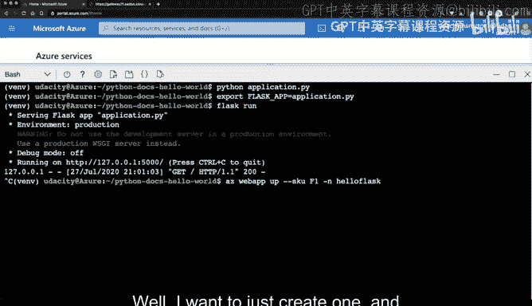

Oh， look， it looks like it's already existed， so I have to use a unique name。

 so let let's go ahead and sayHo flask Udacity。Great， it didn't exist。

 So now it's going to go through and create this。 So this is a key thing to remember is that it does need to be a unique name。

It'll take a second for us behind the scenes to have Azure go through the resource groups。

 create this scaffolding so that later my application can get deployed and automatically run in this platform as a service environment。

Okay， so the application has launched and what's great is this is a publicly available website so I can go to this URL here and literally type it into a browser。

 I can either click on it， that might be the easiest way and this will just open this up in another browser。

It'll take a second for it to load。And this will give us our first publicly deployed application using Azure app services。

 So this by itself is really， really useful， but let's do something a little more sophisticated here and let's make a change and then test how we can auto deploy updates。

 So the next thing that I'm going to do。

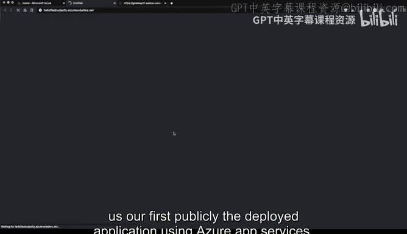

I I'm going to open up this editor icon here and this editor will allow me to make changes to my flask app and we see that this is the application and here's the application file and it's incredibly simple right it just says from flask so let's go ahead and create a new route here。

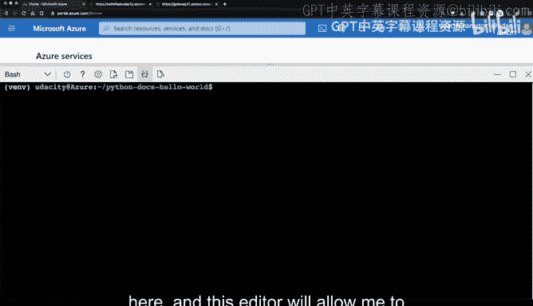

And we'll make it take some parameters， so I'll type in app dot route。And I like to do Marco Polo。

 so we'll say Marco， and then inside of here we'll accept any kind of message。

 so I'll just type in Polo。And then say Marco， maybe。And we know that this will accept again。

 a parameter inside of our function here， so this will be the parameter that's passed in。

So this will be the polo。And what I will say is。Return。What was passed in with？Or in fact。

 we can even make this really simple and I can just put in the string that's passed in。

Here as a percent as and then go back and put in the word polo。

 So if we put in the word polo it'll return polo， if I put in the word John it'll return John， okay。

Let's go ahead and do that That looks good and I could test out locally potentially to make sure that I don't blow things up。

 that's always a good idea， so let's go ahead and do that。

 let's see Fask run and I will scroll up a little bit here to give us some more room and then I can again click on this icon and say preview port 5000。

 that looks like it's working。

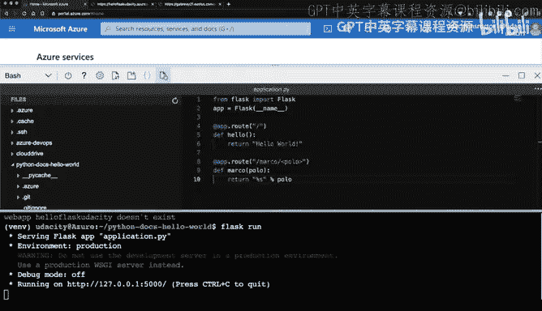

And then if I type in the word Marco polo， does it return back Polo， There we go， Re back polo。

 If I type in the word John， it'll return back the word John。 there we go。

 So we've got this crude web application that does something somewhat useful go ahead and stop this And then from here I can do an update。

 So let's go ahead and do that。 So how how would I do a deploy， how would type an AZ。

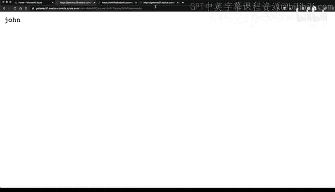

Web app。U。And this will grab the latest changes and it will update any changes that I made locally in my remote environment。

Okay， so the application has been deployed。And I can again go back to that public URL here。

 and I can even find it inside and click on it and in this case， they'll want to put。

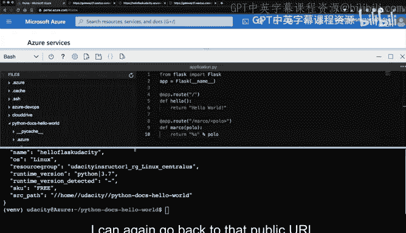

Go back here， take this out， first make sure that the original application works great now let's test the new route and the new route I will go through here and type in the word Marco。

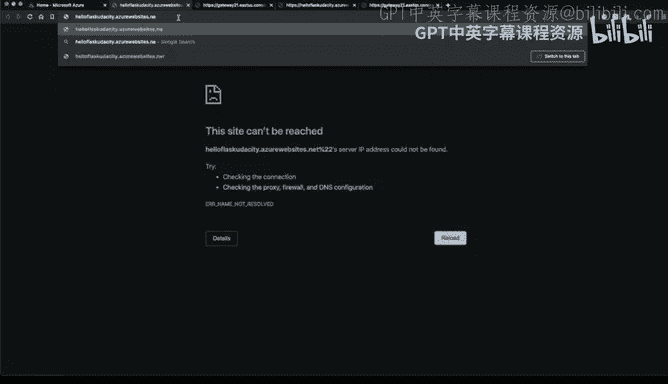

In the word polo。There we go， and we can see make this a little bit bigger that I can put in other names as well。

 and maybe we'll put this in here Bill。You know， Sally。

Right so all this does is take a string and return it back so in a nutshell the big takeaway here is that by using the Azure app services。

 it's trivial to deploy microservices and it also makes it trivial to integrate this into the cloud native build environments like Azure pipelines。

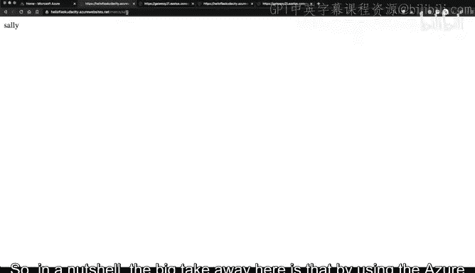

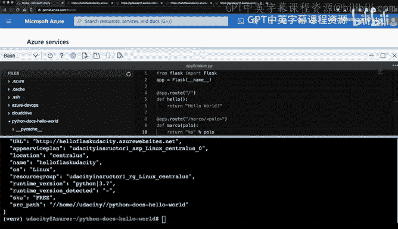

