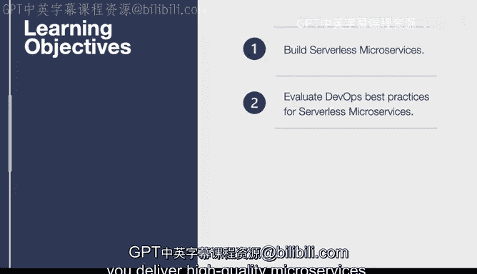

# 杜克大学《构建大规模云计算解决方案（基础、虚拟化，1-2课／共4课Building Cloud Computing Solutions at Scale》 - P106：39_03_02_无服务器微服务简介.zh_en - GPT中英字幕课程资源 - BV1oT421k7YQ

In this lesson we dive into how to develop a serverless microservice。

 This is one of the newest technologies that people are using and developing microservices and it goes very well with cloud computing in the fact that you don't have to provision servers so let's go through the learning objectives。

First up， we learn to build serverless microservices and we talk about some of the best practices involved。

 including continuous delivery。We also evaluate the DevOs best practices for serverless。

 so this includes things like how to include the correct amount of code when you should split up a repository and other key learnings that will help you deliver high quality microservices。

