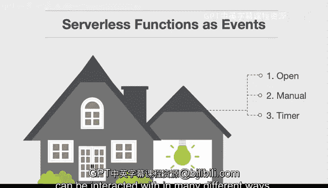
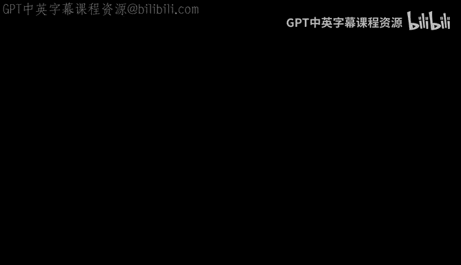

# 杜克大学《构建大规模云计算解决方案（基础、虚拟化，1-2课／共4课Building Cloud Computing Solutions at Scale》 - P107：40_03_03_无服务器函数概述.zh_en - GPT中英字幕课程资源 - BV1oT421k7YQ

Let's talk through how functions can serve as events in a serverless architecture。

And it's a lot like a house， so in this example here we have a house and there's a garage attached to it and right here there's a light。

And that light in the garage can turn on many different ways。

 The first way that a light can turn on is if the door is open right so there's an event where if you're driving into your garage and you push the button。

 it'll open up the garage door and then the light turns on as well。

 So that's one of the events that would basically initiate this light turning on Another event that could occur is that you could actually go over to the switch and flip it on so this would be a manual event here where you would go through here。

And manually turn on that light， a third method would be that you could also have a timer and so maybe at midnight let's say that at 12 pm every night the light goes on in the garage so that it deters burglars so there's three totally different kinds of events that occur all within the same unit of work。

 which is this light bulb so serverless functions really work the same way。

 and that's one of the best intuitions that I can give you about building serverless functions is it's one piece of code and that code can be interacted with in many different ways。

