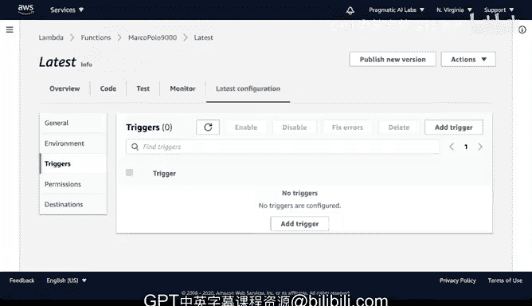

# 杜克大学《构建大规模云计算解决方案（基础、虚拟化，1-2课／共4课Building Cloud Computing Solutions at Scale》 - P108：41_03_04_构建AWS Lambda Marco Polo函数.zh_en - GPT中英字幕课程资源 - BV1oT421k7YQ

嗯。Let's get started with AWS Lambda， I'm going to do a search here in the AWS Management console for Lambda。

And it will pop up this service Now to create a function。

 it's fairly straightforward what you need to do is in the console。

 say create function and you have a few options you can create one from scratch。

 you can use a blueprint， which is a good way to learn how to build Lambda functions or you could even look at serverless app repositories where there's more complex examples。

 We're going go through a basic Marco Polo application。

 So I'm going to start with a simple Ho example， and I'll type in Marco Polo9000。And for the runtime。

 I'm going to select Python 38。And in terms of the permissions here。

 I don't need to set anything because I won't be doing anything beyond just running some Python code if later I wanted to call。

 let's say the AWS comprehend API or maybe the image recognition API。

 I would need to have a different execution role， so let's go ahead and say create function。

And once the functions is created， the process to test it out is fairly straightforward and that I can build it locally inside of the AWS Lambda console。

 so let's go down here and scroll down a little bit and take a look at it， here we go。

 here's the latest version I'm going to click on it。And notice in this overview here。

 we have this function visualization and here's the name of my function， if I scroll down。

 I can actually go and edit the code。So this is the default that they give you。

 and I'm going to tweak it a little bit to make it run a Marco Polo application。

 so I will take this out。And scroll through here and put in my own code and what I'm going to say。

Is I'm going to say if the event and this event here is where you would accept an event from some kind of a trigger。

 the trigger could be， for example， just calling it from this test interface or it could be an S3 event or it could be a web service。

 but this is really the key for triggering Lambda does is to listen to an event。

 So I'm going to go through here and say if the event itself。Has the word。Marco。

 the name is equal to。Marco。Let's go ahead and return back polo。So we'll turn back polo。

 But what if it doesn't give me the name Marco， why don't I do a different return。

 So I'll put a return statement here that says no。So I have some kind of a notification of what's happening and it might be helpful too。

 to just print this out so we can take a look at what's happening and I can say， this was the event。

And I can put in what that event actually is。There we go。 So this is a Python F string。 perfect。

 So now I've got a really small function here。 And what I'm going to do is I'm going to deploy。

So let's go ahead and deploy this change and then let's go ahead and test this thing out。

 So how do I test it， I'm going to click on test and I'm going to call this Marco。

And I'll put in that name。Pararameter， so name。And then， I will put in。Marco， there we go。Perfect。

And now that I've got that， I'm going to invoke it。

And notice that when we invoke it the word polo shows back up。 so great。

 I've got this full thing working and in fact I even can see that print statement that I did earlier。

 So what we can do is actually do another test event here。

And why don't we build another one and we'll call this one Bob。

And let's put in the word Bob and see what happens。So if we go through here and we see Bob。

And I invoke that。It'll still work。But notice here that the return statement will be a little bit different because what's happening is it's returning no。

 because I told it if it doesn't match the word Marco return back no。 So again。

 if we go back to this code here and take a look at this you can see that it's a great way this kind of Marcopolo function to get a feel for what's happening。

 So let's look at a slightly more complex scenario that this code could run in if you wanted to do more things with this particular function。

 one of the things that you could do is you could set up a trigger。

And the way that you would do this is by essentially going to editing here and going to the function itself。

And then adding some kind of a trigger that told it what kind of function to actually build out to do that trigger。

 so in here if I go back again to this function of visualization。

I can go and go to my ladies config and I can say triggers and I can say add trigger。

And I can go through here and put some kind of trigger， it could be a web service。

 it could be something like Dynamo where I do an event， but or SNS or SQS， in a nutshell though。

 the core idea here is that you can go beyond just manually executing the code and set a trigger to do an event based deployment。

