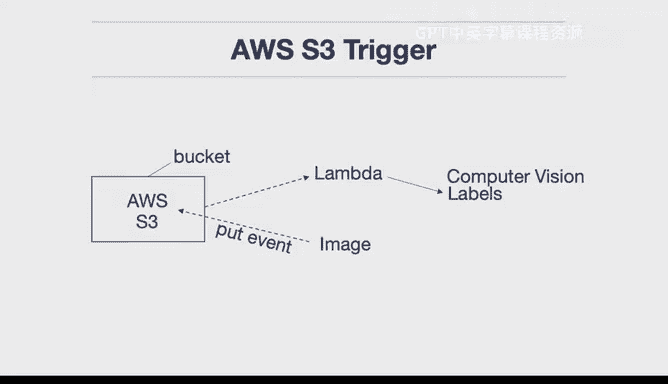

# 杜克大学《构建大规模云计算解决方案（基础、虚拟化，1-2课／共4课Building Cloud Computing Solutions at Scale》 - P110：43_03_06_构建AWS S3存储桶触发器.zh_en - GPT中英字幕课程资源 - BV1oT421k7YQ

Let's take a look at AWS S3 trigger， which is a common event driven workflow。 First up。

 we've got an S3 bucket here that I will put something inside。

 let's say an image and then every image that's placed inside will generate an event and this put event will then trigger a call of lambda。

 So it's a one to one for every image a lambda invocation occurs inside of there。

 we have a computer vision service called AWS recognition that will generate the label。

 So if it's a lion， it'll find a picture， a label called lion if it's a bear， it'll find a bear。

 So this is a very common。Computer vision workflow。

 So let's go ahead and take a look at how recognition works。 First up here。

 let's say that I have a bear right， it can it can go through here and figure out what it is。

 in this case， it looks like。 it's correctly identifying that if I go through and I put a line on here。

 we can see that it's successfully finds a lion So I'm able to look at those labels and then do something with them afterwards。

 So what we can do here is go over to S3 and look at the source code for how we would process that event。

 with lambda the way it works is that any kind of a trigger is processed inside of this payload in the lambmbda。

 So if it's an S3 event， it'll be processed in here。 So what I do is I write a label function。

 And what this does is it goes through and it uses recognition。

And it labels each of those items that's found inside of it and the API call is quite simple。

 it's just recognition detect labels and then I need to pass it in the bucket and then the name of the file in the bucket so how do I know about this well inside of here I say four record in events and I every time I get one of those files that's been updated I go through here and I call out this label function and I'm able to actually get back the response and then later what happens is that I'm able to process that event okay so let's go ahead and take a look at this in action so how do we trigger this well if we go to latest configuration here you can see that there's a trigger section and under this trigger we can see that in fact every time an object is created this S3 trigger is set up and so if you want to see how you do this yourself you just say add trigger go down here find whatever trigger you want to set up in this case it would be。

S three trigger and then put the name of the bucket， whatever bucket。

 and then decide what kind of an event in this case we want to do all creation events so we know that that trigger has been successful right SV trigger so what I can do is go to that bucket。

And here we go we have。CV trigger， let's just double check that that's the same bucket。

 So CV trigger 2020， great， that looks good。 So let's go ahead and put something inside of here。

 Let's go back to this。And inside of this bucket， we can upload another image。

 so I'll go ahead and upload a line image here， there we go and we can say upload and now what' will happen is if I go back to my Lambda function and I go to monitor。

We can look at the log files and observe in fact that that Lambda has been called so how do we do this if we go down to the logs。

 we can see that there's a timestamp and that timestamp will eventually populate and show us that there we go this bucket has been triggered。

This is the key okay what it defined and it found these labels so depending on what kind of application we're doing。

 we could do something further with with that particular workflow so in a nutshell here this is a very common workflow that's quite complex that AWS Lambda makes quite simple。

