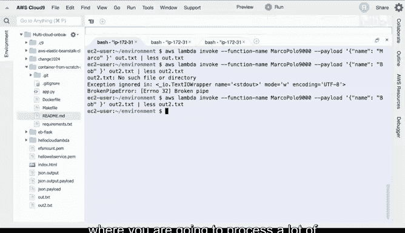

# 构建大规模云计算解决方案：P111：通过CLI触发Lambda函数 🚀

在本节课中，我们将学习如何通过命令行界面（CLI）来调用AWS Lambda函数。虽然控制台提供了便捷的测试方式，但通过CLI调用能赋予脚本和自动化流程更强大的能力。

## 概述

上一节我们介绍了在AWS控制台中测试Lambda函数。本节中，我们来看看如何通过AWS命令行工具实现相同的调用功能，并将其集成到自动化脚本中。

## 通过CLI调用Lambda函数

首先，我们回顾一下示例Lambda函数的功能。该函数接收一个包含`name`字段的事件对象。如果`name`的值是“Marco”，函数将返回“Polo”。

在控制台中，我们可以通过配置测试事件来验证此功能。

以下是测试事件的JSON结构示例：
```json
{
  "name": "Marco"
}
```
运行测试后，函数应返回“Polo”。

## 使用AWS CLI进行调用

现在，我们转向命令行界面执行相同的操作。在Cloud9等集成开发环境中，AWS命令行工具通常已预装，这为开发提供了便利。

以下是调用Lambda函数的AWS CLI命令基本格式：
```bash
aws lambda invoke \
  --function-name <你的函数名称> \
  --payload '<JSON格式的事件数据>' \
  output.txt
```

*   `--function-name`: 指定要调用的Lambda函数的名称。
*   `--payload`: 提供传递给函数的JSON格式事件数据。
*   `output.txt`: 指定一个文件名，命令会将函数的响应输出写入此文件。

为了立即查看结果，我们可以在命令后使用管道(`|`)和`cat`命令打印文件内容。

让我们看一个具体的调用示例。假设函数名为`MyTestFunction`。

使用“Marco”作为输入的调用命令如下：
```bash
aws lambda invoke --function-name MyTestFunction --payload '{"name":"Marco"}' output.txt && cat output.txt
```
执行后，终端应显示返回结果“Polo”。

接下来，我们尝试使用不同的输入值“Bob”进行调用：
```bash
aws lambda invoke --function-name MyTestFunction --payload '{"name":"Bob"}' output.txt && cat output.txt
```
根据函数逻辑，此次调用将不会返回“Polo”。通过对比不同输入的结果，我们可以验证函数的行为是否符合预期。

## 优势与应用场景

通过命令行调用Lambda函数的核心优势在于其可脚本化和自动化能力。

以下是几个典型的应用场景：
*   **批量处理**：在循环脚本中多次调用函数，处理大量数据。
*   **集成测试**：将Lambda调用作为持续集成/持续部署（CI/CD）流水线中的一个步骤。
*   **系统集成**：从其他命令行工具或脚本中触发Lambda函数，构建工作流。

## 总结




本节课中我们一起学习了通过AWS命令行界面调用Lambda函数的方法。我们回顾了函数逻辑，掌握了`aws lambda invoke`命令的基本用法，并通过不同输入验证了函数行为。最后，我们探讨了CLI调用方式在自动化脚本和分布式任务处理中的强大潜力。掌握此技能，能帮助你更灵活地将Lambda函数集成到各类自动化解决方案中。