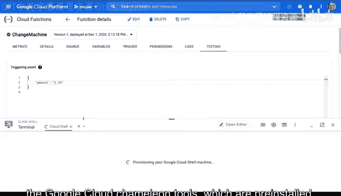
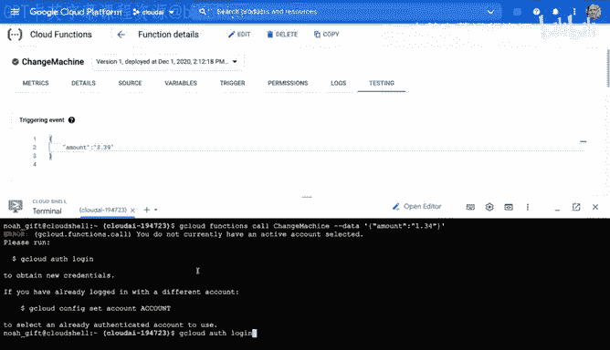
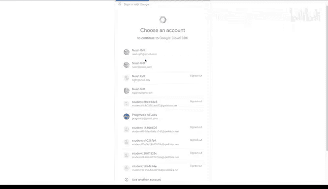
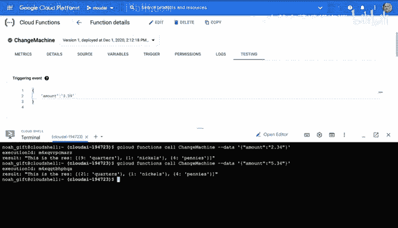
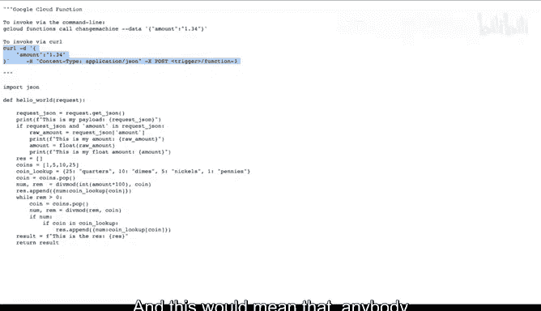
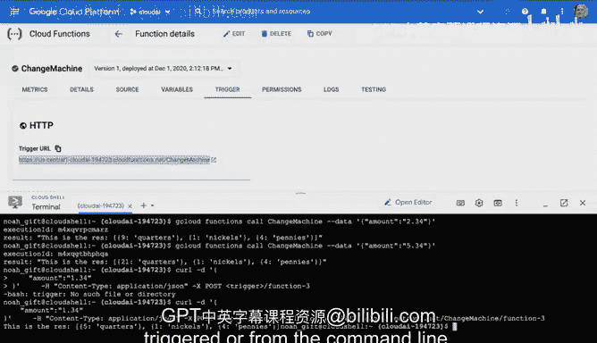

# 杜克大学《构建大规模云计算解决方案（基础、虚拟化，1-2课／共4课Building Cloud Computing Solutions at Scale》 - P112：45_03_10_Google Cloud Function变更实践.zh_en - GPT中英字幕课程资源 - BV1oT421k7YQ

Let's take a look at Google Cloud functions， which are a serverless technology that allows you to literally map a function to some logic and invoke it via a trigger and in this particular situation I'm inside the Google Cloud platform and I've selected Cate function notice here I can put the function name so I'll call this change machine。

And then I'll pick the region and then also I'll pick the type here and so in this particular situation what I'm doing is selecting an HTTP trigger and this allows me to invoke it via a web interface Now I'm going to also say allow unauthorized invocation so I want to use it as a regular un authenticated web service so I'll go ahead and say save and then next Now I'll also have the choice of selecting from many different kinds of runtime from donet so I could do C sharpp I could do go Java node or Python I'm going to go down here and select Python 38。

And notice that it gives you the inline editor， which is pretty handy and also allows me to install packages。

 so let's say I wanted to translate via the Google Translate API or do image recognition I could import that here or some other thirdparty library I'm going keep things really simple here and do a change machine and so I'm going to look at some source code that I have created earlier here and you can see here that what it does is find the correct amount of change by accepting a J payload that has the word a amount in it so if I put in amount $1。

34 it would go through and give me the largest change first and then return it back so I'm going to basically go through here and cut and paste this so I'll go to raw。

And grab this section of the code。And I'm going to replace this boilletp code they have here。

 Now notice that it gives you this entry point。 and so this would be the function that's going to get called when I invoke it。

 So this looks like it's correct。 I'm going to go ahead and say deploy。And once it's been deployed。

 I can actually go through here and test it out， so to test it out。

 what I would do is go to the testing section here。

And I could go through here and say this is my triggering event now we know that it's going to accept a payload so if I go through here I can say amounts like this and then I can say you know $1。

34 for example and then once this thing is fully deployed， I'll be able to test it out。

Okay now that this change machine has been deployed， I'm going to go ahead and test this function。

 and there we go。 We see that it was able to give me the correct amount of change。

 let's go ahead and kick the tires here a little bit more and put some new values inside Here we go。

 we test this function there we go。 So we know that this in fact has 13 quarters So I've been able to successfully test this。

 So this is a really powerful way to build logic in the cloud and it's also able to hook into events。

 So what I'm going to do next here， if we look at this code。

 you'll notice that there's a couple other ways I can call this。 And in particular。

 I can invoke it via the command line and I'm going go back to the cloud shellll here and activate it and what I'm going to do is invoke this exact function via the Google cloud command line tools which are preinstall。

 So if I go through here and I say paste here and I say call and I would just。

Need to put in the name of my。Google Cloud function。 and I'll say change machine。

 I can pass in this value here， right， which is the amount。 So it's go ahead and try that out。 Okay。

 so it's going to ask me to log in。 So let's go ahead and do that whenever you do a call from this cloud shell。

 they'll need to let you log in。

Pate this in here。And I'm good to go。There we go。 So you can see here that I'm now able to invoke this via the command line and what's great about this is that I now have this really powerful function that I can use in workflows or let's say it does something like preprocess data or does machine learning or does some kind of parallel operation。

 I can invoke it whenever I want via this highlevel command line tool so there's a lot of power in building these functions in the cloud and then later using the cloud shellll to invoke them。

 one other thing I can do that I'll point out is that because it's a triggered web service。

 I also can invoke it via accru command and this would mean that anybody could invoke it in the outside world。

😊。

And so if I go through here and I just paste this in and clean it up a little bit。

 let's change this trigger to the name of the URL， so I need to find the trigger and find this URL here。

 so let's go ahead and copy this。And I paste it inside。

I should also be able to invoke it via a post operation。There we go。

 so what's awesome about this is that there's lots of ways to use cloud functions responding to events triggering it from the command line or just a simple HTTP web service。

