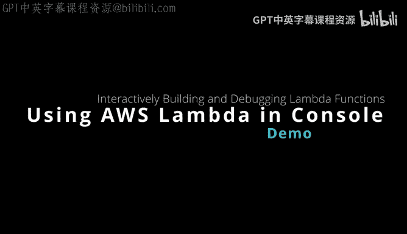
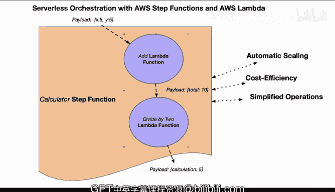

# 杜克大学《构建大规模云计算解决方案（基础、虚拟化，1-2课／共4课Building Cloud Computing Solutions at Scale》 - P113：46_03_13_使用AWS Lambda控制台.zh_en - GPT中英字幕课程资源 - BV1oT421k7YQ

Yeah。Here's a diagram of two lambda functions I'm going to build first is going to be an ad that accepts an x and a Y。

 and this will return a payload total that will be consumed by a second lambmbda function which will be dividing by2 and returning back the calculation and then later all combine it all in a step function。

 but for now we're going to build this in the console let's go ahead and get started here。

 First up if we go over to this console what we want to do is get into create function Now I would recommend that in this case if we want to save a little money actually a fun one to use as arm that's the cheapest one we can run and for runtime。

 let's go ahead and pick the latest supported which would be Python 311。

Now this one what we'll do is we'll just call this one add。

And we'll go ahead and say create function。One of the nice things about using Python for just prototyping。

 even if you later switch to rust is that you can see it in the console and play around with it。

 So that's probably how I would mostly use it。 I wouldn't necessarily use Python for long termm code。

 but I do like it as essentially a place to prototype things until I convert it to rust。

 So let's go in and say X is equal to event。We're going to accept a payload here that will be an X。

And then we'll do Y， which would be events。And then we'll do a Y here。 So again。

 this is what's kind of fun is that I can actually just prototype this really quickly in Python。

 and then we'll just say total is equal to x plus y。😊，And then for the return here。

 we can just do J dumps， and then we can just。Under the body here。We can put in。Another structure。

 which would be a dictionary。Which would be just like this。And then we'll just say， total。Here。

And total， so pretty straightforward to actually build this out and play around with it。

And looks like it's pretty good。 if we wanted to， we could also test test it if we wanted to and also even deploy it。

 So let's go ahead and deploy it。 And now to test it， let's configure a test event。

 we'll call this add。And for the payload， we just need an x and a y。

 So we'll do X here and we'll do the payload 10。And then for why。We'll do the payload 20。

Let's go ahead and save this。And let's go ahead and now test it。 And in fact。

 oh we have an error here in our code。 So one of the things that we need to do is fix this code so that it's returning back everything correctly Now this is one of the things that can be a little bit troublesome to play around with is you know do I have some kind of a bug etc cea in my code So what we could do is in our particular situation。

 redeploy it and then test it again there we go。 So a lot of times you'll get some kind of white space error that will be the issue。

Now， I've got that one working。 so let's go ahead and build a second one。

 So let's go ahead and go back to functions。 and now we'll do create a function。

 and we'll call this one divide by  two。Divide。Byuy2。And again， I'm going to save some money。

 I'm going to use arm。 I'm going to use Python 311， and we can just go ahead and create it out。

 So again， prototyping code inside of the console here is pretty fun and simple with Python。

 I think that's one of the advantages of a language like Python is to do these kind of rapid prototyping things。

 And since I've already got the code written I'm just going to paste it in this time just to make it simple。

 there we go。 So we've got a lambmbda here。 And then for the payload that we're actually going to return back。

I'm actually going to。Put something inside of a test function here， configure a test event。

 and we'll call this payload。And then we'll just paste this in， we'll save it。

 and then if I deploy it， we should be able to test this thing out。There we go。

 And we've got this calculation。 So really， it's now set up and ready to go if I wanted to then orchestrated further using this serverless orchestration and then have even a chie tool invoke both Lada functions and make them work together。

