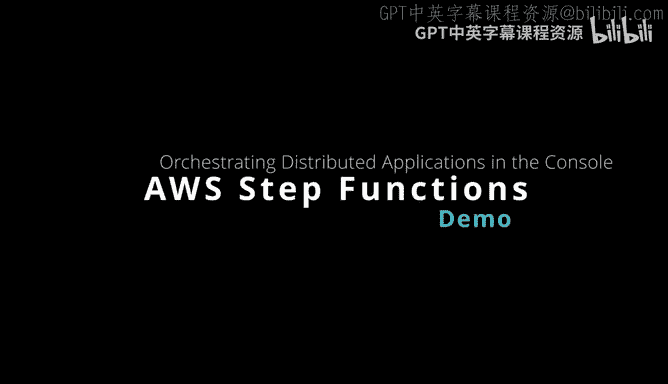
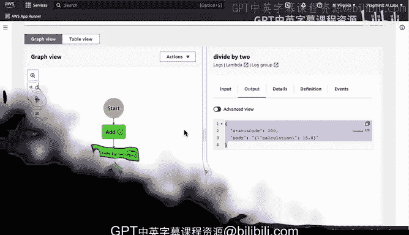

# 杜克大学《构建大规模云计算解决方案（基础、虚拟化，1-2课／共4课Building Cloud Computing Solutions at Scale》 - P114：47_03_14_使用Step Functions.zh_en - GPT中英字幕课程资源 - BV1oT421k7YQ

Here we have the serverless orchestration with AWS step functions and AWS Lambda here。

There are a couple of lambmbda functions that I want to build as a distributed application。

 So essentially coordinate the orchestration of these。 And I'm going to do it with a step function。

 So let's go ahead and take a look at how that would work。 First step here。

 we have the step functions interface。 I like to go to my Lambda and sort by last modified to find the two lambdas that I already built。

 So I have a divide by two and have an ad。 So next step， I go to create state machine。

 I think the visual workflow for prototyping is hard to beat。 So let's go ahead and do that。

 Now I know I have two lambdas， right， So I just go through here。 I drag the first one。

 and we want to call this thing something。 So I'll just call this one add。

And then we'll do again a second one and we'll go here and then we'll call this one。嗯。

Not a lamb to invoke， but we'll call this one divide by2。

So naming is great so that you know what's going on。 And then we， of course。

 have to put a lambda in there。 So where do we find the Lada？ Well。

 we just have to find the function name here。 So we， we know that add should be there。

 And that we go here， we know that divide by 2 should be there as well。There we go。 divide by two。

 So really， there's nothing that we need to do because we know that they can talk to each other because of the way they've been designed。

 And we can see that the state input is used as the payload。 So let's go ahead and say next。

 and we can see all of the state here， which is kind of nice。 And then we just go to next again。

 And we call this one add。And divide。Let's go ahead and。To create state machine perfect。 Now。

 all we have to do to run it is we could do it from the terminal， or we can do start execution。

 And so remember， this is an important component is we need to put an X and a y in there to trigger things。

 So we'll， we'll say x is 10。And then we'll do Y is 20。 Once we've got that。

 we can start the execution， and then we can see it step by step。 The input again is right here。 Awe。

 What is the output there There we go。 This is exactly what I designed earlier。 We have the total。

 Now， let's look at the second step function。 We look at the input。

That payload is passing from the first function to the second one。 We look at the output。

 There we go。 So you can chain together or orchestrate。

 however you want these lambda functions and put them into step functions。

 but what's really powerful about this is the fact that you get this debugging and the reproducibility and you actually can see exactly what's going in and out of systems that you build。

 So I think step functions in particular are some of the more powerful ways to really build next generation MLlos。

 as well as data engineering workflows， especially if you're using efficient and powerful and safe languages that support modern compilation like rust。

 and we're able to leverage these two existing functions quite easily and build orchestration using AWS step functions。

