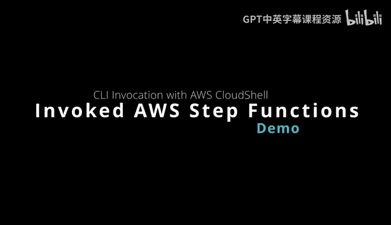
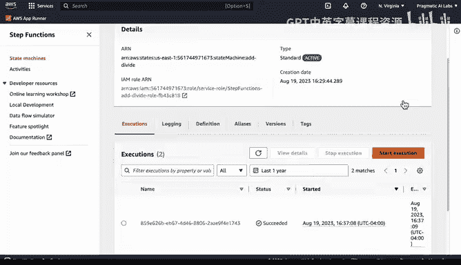
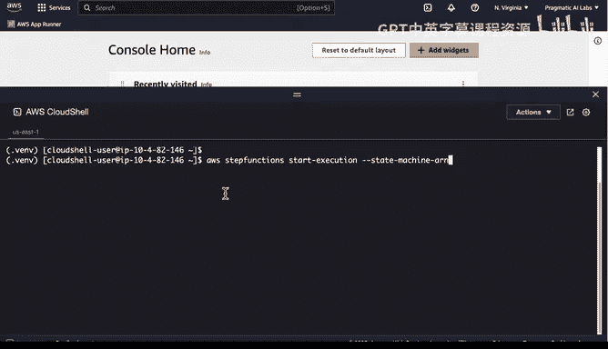
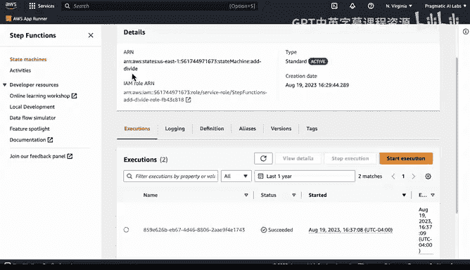
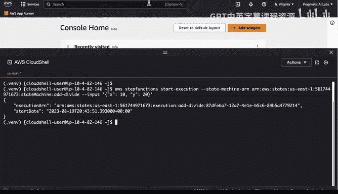
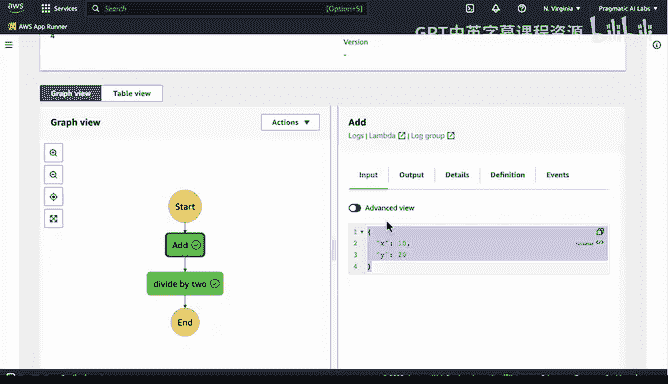
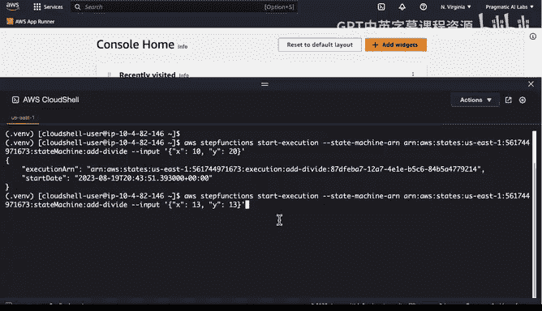
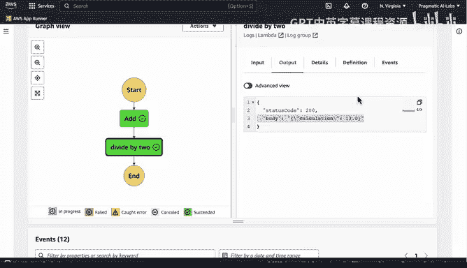

# 构建大规模云计算解决方案：1-2：通过CLI调用Step Functions 🚀



在本节课中，我们将学习如何通过AWS命令行界面（CLI）来调用和运行Step Functions状态机。这是一种实现程序化控制、测试工作流的高效方法。

上一节我们介绍了Step Functions的基本概念和图形化控制台操作。本节中我们来看看如何通过命令行实现更灵活的执行与控制。

## 启动AWS Cloud Shell

首先，我们需要一个可以执行AWS命令的环境。AWS Cloud Shell是一个便捷的在线终端。

以下是启动Cloud Shell的步骤：
1.  在AWS管理控制台中，找到并点击顶部导航栏的Cloud Shell图标。
2.  系统将自动为您启动一个预配置好AWS CLI的终端环境。



## 使用CLI命令执行状态机



在Cloud Shell中，我们可以使用`aws stepfunctions start-execution`命令来触发一个状态机的执行。



该命令的核心结构如下：
```bash
aws stepfunctions start-execution --state-machine-arn <您的状态机ARN> --input <您的输入JSON>
```
命令包含两个关键参数：
*   `--state-machine-arn`：用于指定要执行的状态机。其值是一个唯一标识资源的ARN。
*   `--input`：用于向状态机传递输入数据。其值是一个JSON格式的字符串。

## 实际操作演示



现在，让我们跟随操作步骤，实际执行一次状态机。

1.  **获取状态机ARN**：在Step Functions控制台中找到目标状态机，复制其ARN。
2.  **构造输入数据**：准备一个JSON字符串作为输入，例如 `{"value1": 10, "value2": 16}`。
3.  **执行命令**：在Cloud Shell中粘贴并运行组合好的命令。例如：
    ```bash
    aws stepfunctions start-execution --state-machine-arn arn:aws:states:us-east-1:123456789012:stateMachine:MyStateMachine --input '{"value1": 10, "value2": 16}'
    ```
4.  **验证执行结果**：命令执行成功后，会返回一个执行ARN。您可以回到Step Functions控制台刷新页面，查看新增的执行记录，并检查其输入、输出和每一步的执行详情。



## 进行迭代测试

CLI调用的优势在于便于快速进行迭代测试和修改。



例如，我们可以通过键盘的“上箭头”键调出刚才执行的命令，修改`--input`参数中的数值，然后再次运行命令。
```bash
# 修改输入值后再次执行
aws stepfunctions start-execution --state-machine-arn arn:aws:states:us-east-1:123456789012:stateMachine:MyStateMachine --input '{"value1": 13, "value2": 13}'
```
每次执行后，都可以在控制台中看到新的记录，从而形成一个“执行 -> 观察结果 -> 调整输入 -> 再次执行”的快速反馈循环。

## 方法优势总结

使用AWS CLI和Cloud Shell调用Step Functions，是一种非常高效的工作方式。

以下是其主要优点：
*   **程序化控制**：便于集成到脚本或自动化流程中。
*   **快速测试**：无需编写完整的SDK代码，即可快速验证工作流逻辑和输入输出。
*   **即时反馈**：结合控制台可视化界面，能立即查看每次执行的详细结果。




本节课中我们一起学习了如何通过AWS CLI在Cloud Shell中调用Step Functions状态机。我们掌握了获取ARN、构造命令、传递输入以及验证结果的全过程。这种方法为您提供了一种强大且灵活的方式来编排和测试您的无服务器应用程序工作流。