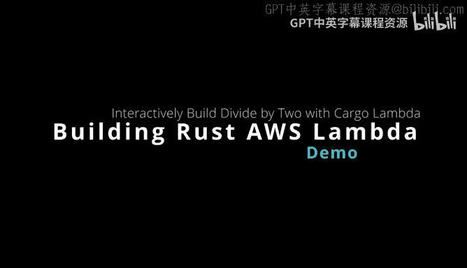
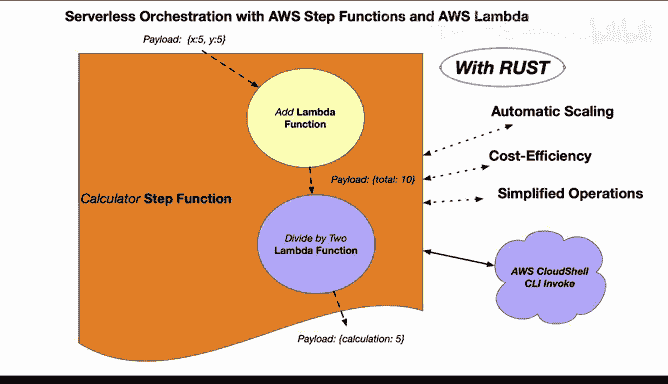
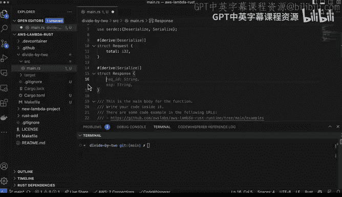

# 构建大规模云计算解决方案：1-2：构建Rust AWS Lambda除二函数 🦀



在本节课中，我们将学习如何使用Rust语言从头开始构建一个简单的AWS Lambda函数。这个函数的功能是接收一个数字载荷，并将其除以二后返回结果。

我们将从创建项目开始，逐步完成代码编写、本地测试、构建和部署到AWS的完整流程。

---



## 项目初始化

首先，我们需要创建一个新的Rust Lambda项目。我们将使用 `cargo-lambda` 工具来搭建项目基础结构。

以下是创建项目的命令：
```bash
cargo lambda new divide_by2
```
执行命令后，选择“否”以跳过模板中的额外配置，让项目开始初始化。

## 编写Makefile

为了简化后续的构建和部署流程，我们创建一个Makefile。这个文件将包含编译、测试和部署Lambda函数所需的常用命令。

## 定义函数逻辑

现在，我们进入代码部分。首先需要明确函数的意图：它接收一个名为 `total` 的数字，计算其一半，并返回计算结果。

我们需要修改Lambda函数的请求和响应结构体。将请求体中的字段改为 `total`，它是一个数字。将响应体中的字段改为 `calculation`，用于存放计算结果。



在主函数中，逻辑非常简单：从请求中提取 `total` 值，将其除以2，然后将结果赋值给响应体中的 `calculation` 字段。

核心计算代码如下：
```rust
let calculation = total / 2;
response.calculation = calculation;
```

## 本地测试

在部署之前，进行本地测试是一个好习惯。我们将使用 `cargo lambda watch` 命令来启动一个本地Lambda运行时环境，以便于测试。

为了测试，我们需要准备一个事件文件。创建一个JSON文件，其内容为 `{"total": 10}`，模拟一个输入事件。

然后，我们可以使用 `make invoke` 命令（该命令会调用 `cargo lambda invoke`）来本地调用我们的函数，并验证其返回 `{"calculation": 5}`。

## 构建与部署

测试通过后，就可以构建并部署函数了。我们将为ARM64架构构建，因为这是性价比较高的计算选项。

使用以下命令进行构建和部署：
```bash
make build
make deploy
```
部署命令会将我们的函数代码打包并发布到AWS Lambda。

## 远程调用验证

部署完成后，我们还可以进行远程调用测试，以确保函数在云环境中也能正常工作。我们可以使用AWS CLI或通过控制台来触发函数，并传入测试事件。

---

本节课中，我们一起学习了如何使用Rust从零开始构建、测试和部署一个AWS Lambda函数。我们完成了从项目初始化、代码编写、本地测试到最终云部署的完整流程。这个“除二函数”虽然简单，但涵盖了构建无服务器函数的核心步骤。