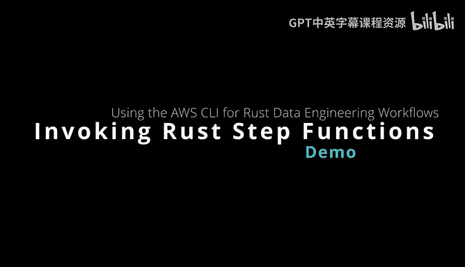
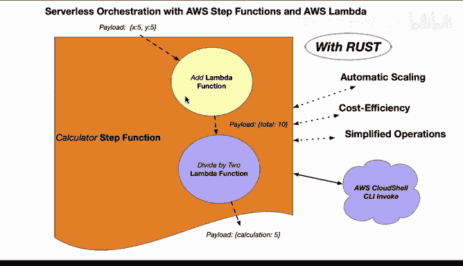
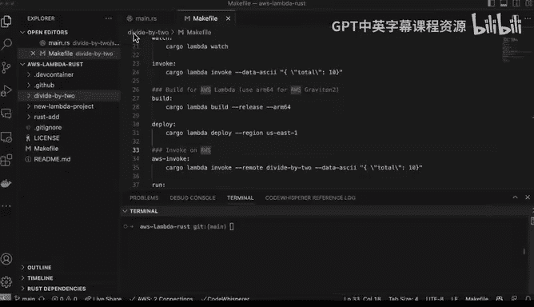
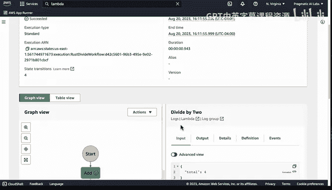
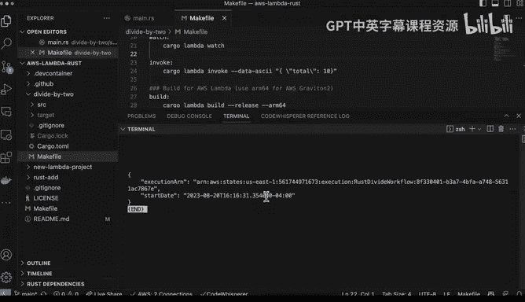
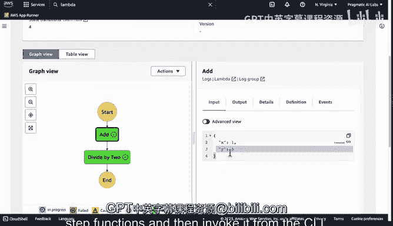

# 构建大规模云计算解决方案：1-2：通过CLI调用AWS Step Functions 🚀



在本节课中，我们将学习如何通过AWS命令行界面（CLI）来调用一个由Rust语言编写的AWS Step Functions工作流。我们将从确认已部署的Lambda函数开始，逐步创建并运行一个状态机，最后通过CLI执行它。

---

## 准备工作：确认Lambda函数 ✅

上一节我们介绍了AWS Step Functions的基本概念，本节中我们来看看如何实际操作。首先，我们需要确保用于构建工作流的Lambda函数已经成功部署。

以下是确认步骤：
1.  导航至AWS管理控制台的Lambda服务页面。
2.  在函数列表中，检查名为 `rustadd` 和 `divide_by_two` 的函数是否存在。
3.  确认这两个函数的运行时环境均为Rust。

完成确认后，我们就可以进入AWS Step Functions服务来创建状态机。



---



## 创建Step Functions状态机 🏗️

现在，我们将在AWS Step Functions中创建一个新的状态机。这个状态机将按顺序调用我们之前确认的两个Lambda函数。

以下是创建可视化工作流的步骤：
1.  在Step Functions控制台，点击“创建状态机”。
2.  选择“使用可视化工作流设计器”选项。
3.  为状态机命名，例如 `RustBasedWorkflow`。
4.  从左侧面板拖拽两个“任务”状态到设计画布中。
5.  配置第一个任务，将其命名为 `Add`，并关联到 `rustadd` Lambda函数。
6.  配置第二个任务，将其命名为 `DivideBy2`，并关联到 `divide_by_two` Lambda函数。
7.  按照执行顺序连接这两个任务。
8.  点击“下一步”，预览工作流定义，然后创建状态机。

创建成功后，我们可以立即开始执行。

---

## 首次执行与测试 🔄

状态机创建完毕后，我们将进行首次手动执行以测试工作流是否按预期运行。

执行过程如下：
1.  在新创建的状态机页面，点击“开始执行”。
2.  在输入框中，提供一个JSON格式的输入。例如，要计算 `(1+3)/2`，输入为：
    ```json
    {
      "x": 1,
      "y": 3
    }
    ```
3.  点击“开始执行”。工作流将首先调用 `rustadd` 函数计算 `x+y`，然后将结果传递给 `divide_by_two` 函数进行除以2的操作。
4.  在执行详情页面，可以查看每个步骤的输入和输出，最终输出结果应为 `2`。



测试成功，验证了我们的工作流逻辑正确。

---

## 通过AWS CLI调用工作流 💻

上一节我们在控制台手动执行了工作流，本节中我们来看看如何通过命令行实现自动化调用。这是集成到CI/CD管道或其他自动化脚本中的关键步骤。



操作步骤如下：
1.  首先，在终端中配置AWS CLI的输出格式为JSON，以便于解析结果：
    ```bash
    aws configure set output json
    ```
2.  使用 `aws stepfunctions start-execution` 命令来触发状态机。需要提供状态机的ARN和执行输入：
    ```bash
    aws stepfunctions start-execution --state-machine-arn <您的状态机ARN> --input "{\"x\": 5, \"y\": 3}"
    ```
    命令会返回一个包含执行ARN的响应。
3.  可以通过以下命令查看特定执行的详细信息：
    ```bash
    aws stepfunctions describe-execution --execution-arn <上一步返回的执行ARN>
    ```
4.  返回AWS Step Functions控制台，刷新执行列表，可以看到通过CLI触发的执行记录。检查其输入，确认与我们通过命令行传递的参数（例如 `x=5, y=3`）一致。

通过CLI调用，我们能够以编程方式、高效地驱动这个高性能、低成本的Rust计算工作流。

---

## 总结 📝



本节课中我们一起学习了通过AWS CLI调用Step Functions工作流的完整流程。我们首先确认了Rust Lambda函数的状态，然后创建了一个顺序执行“加法”和“除以2”任务的状态机。在手动测试成功后，我们最终使用AWS CLI命令实现了工作流的自动化执行，这为集成到更广泛的自动化体系中奠定了基础。