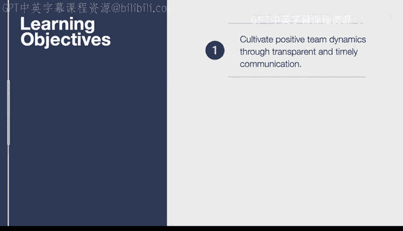

# 杜克大学《构建大规模云计算解决方案（基础、虚拟化，1-2课／共4课Building Cloud Computing Solutions at Scale》 - P11：11_02_02_高效技术团队协作介绍.zh_en - GPT中英字幕课程资源 - BV1oT421k7YQ

In this lesson we discuss how to develop effective technical teamwork in particular a checklist for effective teamwork is covered in detail。

 let's dive into the key learning objective。In this lesson we cover how to cultivate a positive dynamic through a transparent and timely communication。

 so the ideal scenario will involve a checklist where you can go through and check whether your team's functioning at the highest level。

 let's get started。

