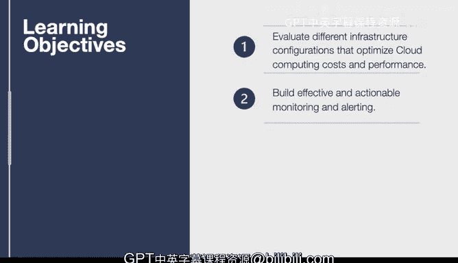

# 杜克大学《构建大规模云计算解决方案（基础、虚拟化，1-2课／共4课Building Cloud Computing Solutions at Scale》 - P121：54_04_02_监控与告警简介.zh_en - GPT中英字幕课程资源 - BV1oT421k7YQ

In this lesson， we cover monitoring and alerts。 one of the most critical functions of operations。

 First， we get into some of the alerting techniques that you can use to effectively make sure that you're doing the right thing and also taking care of business continuity。

 So let's talk about the learning objectives。 First up。

 we're going to evaluate the different infrastructure configurations that optimize cloud computing costs and performance。

 This is one of the key aspects of alerting and monitoring。

 and it's really essential for any business that is customer facing。😊。

We're also going to cover how to build an effective and actionable monitoring and learninging system。

 it's one thing to build something that generates a lot of noise。

 it's another thing to be able to act on that noise。

