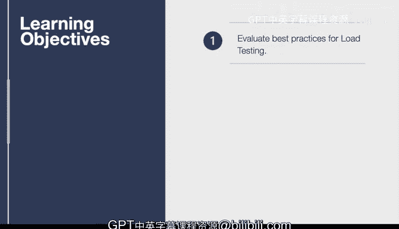

# 杜克大学《构建大规模云计算解决方案（基础、虚拟化，1-2课／共4课Building Cloud Computing Solutions at Scale》 - P126：59_04_02_负载测试入门.zh_en - GPT中英字幕课程资源 - BV1oT421k7YQ

In this lesson we dive into load testing load testing is one of the most critical things a software as a service or a game company or some consumer facing company can do and the reason why load testing is so important is that allows you to see what are the limits of your application Imagine building。

 let's say the Bay Bridge or the Golden G Bridge in San Francisco and not knowing what's going to happen when a certain amount of traffic happens it would be catastrophic loss of life that's really what load testing does is that make sure that your application is able to perform at its highest level。

Let's talk through some of the learning objectives here。

 so first up we're going to evaluate what are the best practices for load testing。

 including using a open source load test tool called Locus。

