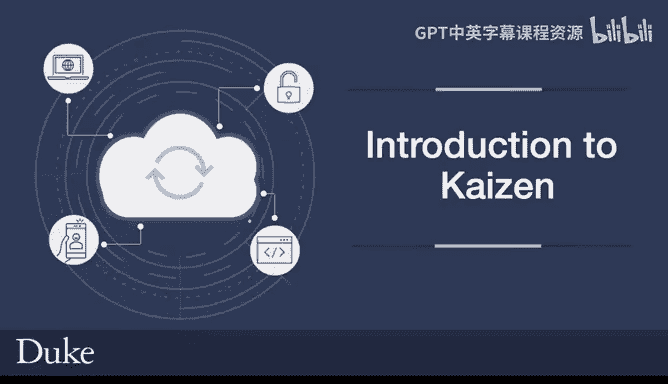
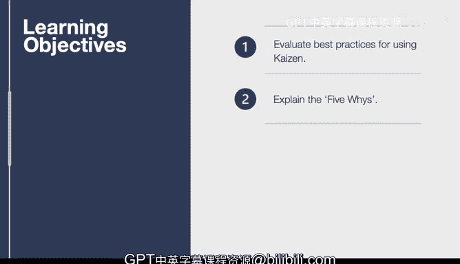

# 杜克大学《构建大规模云计算解决方案（基础、虚拟化，1-2课／共4课Building Cloud Computing Solutions at Scale》 - P131：64_04_02_持续改进理念简介.zh_en - GPT中英字幕课程资源 - BV1oT421k7YQ

In this lesson we cover Kaiszen， which is a Japanese term for continuous improvement。

 it literally means continuous improvement and it originated in the Japanese automobile industry as a way to improve how the quality of automobile would be done on a daily basis in a factory and it also fits into the agile software development methodology which is a common way of improving software by doing little pieces and making those little pieces better each time。

 let's go through the learning objectives for this lesson。First up。

 we're going to evaluate the best practices for Kaiszen and again Kaiszen is a best practice for many things including software development。

 we'll also get into something called the FiveYs， which is an iterative process related to Kayzen that helps you get to the root cause analysis。

