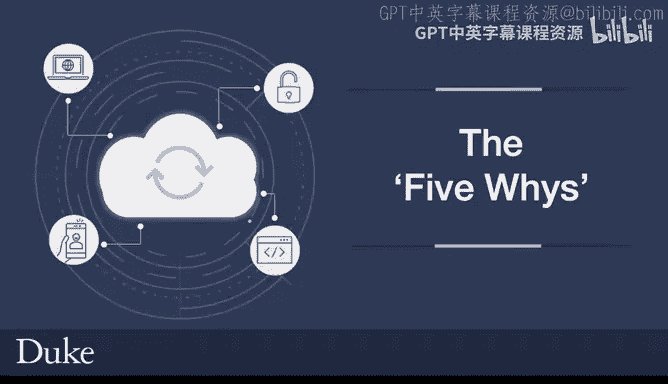

# 构建大规模云计算解决方案：1-2：五问法解析 🕵️

在本节课中，我们将学习一种名为“五问法”的根因分析技术。这是一种通过连续提问来探究问题根本原因的互动方法，它常与“改善”（Kaizen）理念结合使用，以推动持续改进。

## 概述

五问法是一种迭代式的分析技术，旨在系统地找出问题的根本原因。它起源于与“改善”理念相近的时期，是持续改进生命周期中常用的工具。

## 五问法详解

上一节我们介绍了五问法的基本概念，本节中我们通过一个假设场景来具体看看它的应用过程。

假设你的组织总是延期交付产品。例如，你的移动应用发布不断被延迟。

以下是运用五问法进行分析的步骤：

1.  **第一问：为什么移动应用发布总是延迟？**
    回答：因为本周有一个新功能被临时加入了发布周期，导致了延迟。

2.  **第二问：为什么会有新功能被临时加入发布周期？**
    回答：通常我们执行两周的冲刺计划，但CEO临时要求必须立即加入这个功能。

3.  **第三问：为什么CEO会临时要求立即加入这个功能？**
    回答：因为CEO找不到项目经理，而项目经理当时正忙于和产品经理沟通。

4.  **第四问：为什么项目经理和产品经理无法妥善处理这个功能请求？**
    回答：他们未能就如何在合理时间内、通过正确规划来交付该功能达成一致。

5.  **第五问：为什么会出现这种沟通不畅的情况？**
    回答：根本原因在于存在轻微的沟通脱节。CEO不知道存在其他正式的功能请求途径。如果CEO知道直接联系开发人员会导致应用延迟，他就不会那么做。

这类细微的沟通错位问题时常发生。通过五问法，你可以触及问题根源，并找到永久性的解决方案。这种方法不仅适用于功能延期，也适用于分析软件缺陷、信息错误等任何你试图解决的问题。

## 总结

本节课中我们一起学习了五问法。**五问法**是“改善”理念的重要组成部分，其核心在于通过连续追问“为什么”来追溯问题根源。它是坚持正确做事并持续改进的关键方法，建议你在自己的环境中考虑使用它。