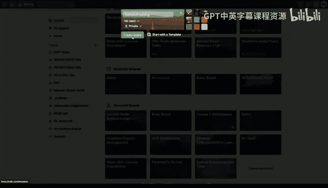

# 构建大规模云计算解决方案：1-2：使用Trello进行工单跟踪 📋

在本节课中，我们将学习如何使用一个极简的工单跟踪系统来构建一个工具，以跟踪课程或组织内的项目进度。我们将以Trello为例，介绍其核心概念和基本操作流程。

---

## 创建看板与列表

首先，我们需要在Trello中创建一个看板。点击界面上的加号图标，选择“创建看板”。接着，你可以选择是否将其关联到某个团队，并设置看板的可见性（公开或私有）。这里我们创建一个名为“工单跟踪”的公开看板。

创建看板后，我们需要建立几个核心列表来代表任务的不同阶段。这是一种非常直观的流程设计，能帮助组织清晰地了解项目动态，从而减少不必要的会议。

以下是创建列表的步骤：
*   **待办**：用于存放所有已达成共识、等待开始的任务。
*   **进行中**：用于存放当前正在处理的任务。
*   **已完成**：用于存放已经完成的任务。

---

## 创建与管理工单卡片

上一节我们创建了任务流程的框架，本节中我们来看看如何向列表中添加具体的任务。

在“待办”列表中，我们可以创建代表具体任务的卡片。例如，我们可以创建名为“设置持续交付（CD）流水线”的卡片。在卡片内部，我们可以添加更多详细信息。

以下是管理工单卡片的关键操作：
*   **添加备注**：你可以在卡片内添加备注，例如预估完成时间“计划在本周末完成”。
*   **使用标签**：可以创建并使用标签对任务进行分类。例如，创建一个绿色的“DevOps”标签，并将其添加到相关卡片上。
*   **使用Markdown**：你可以在描述或备注中使用Markdown语法来格式化文本，例如添加代码块或加粗重点。
*   **设置截止日期**：为卡片设置一个明确的截止日期，以帮助跟踪进度。
*   **分配成员**：将卡片分配给特定的团队成员，明确责任人。

当任务状态发生变化时，只需将对应的卡片拖拽到相应的列表（如从“待办”拖到“进行中”），整个团队就能直观地看到进度更新。

---

## 最佳实践与总结

我们介绍了如何使用Trello创建看板和管理工单。最后，我们来探讨一下使用此类工具的最佳实践，以确保其长期有效。

一个常见的误区是过度复杂化工单系统。无论是Trello还是其他极简跟踪工具（GitHub的Projects也是一个好选择），其核心价值在于保持简单。你应该让看板一目了然，仅通过一次浏览就能掌握所有关键信息。

以下是使用Trello的核心建议：
*   **保持简单**：避免创建过多的列表、标签或自定义字段，以免系统变得难以维护。
*   **及时归档**：当任务移动到“已完成”列表并确认后，可以考虑将其归档，以保持看板的整洁和聚焦。
*   **可视化沟通**：利用看板的状态可视化特性，进行异步沟通，减少同步会议的需求。

本节课中，我们一起学习了如何使用Trello建立一个极简但高效的工单跟踪系统。关键步骤包括创建看板、设置“待办-进行中-已完成”的任务流程列表，以及通过创建卡片、添加标签、设置截止日期和分配成员来管理具体任务。记住，此类工具的成功秘诀在于**保持简单**和**可视化状态**，这能有效提升团队协作效率，减少不必要的会议。