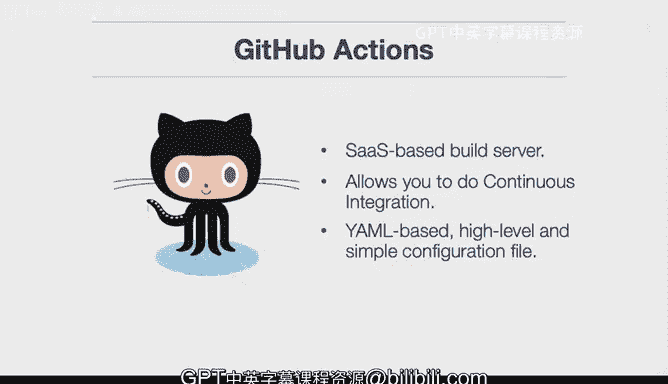

# 构建大规模云计算解决方案：1-2：AWS云开发环境搭建 🚀

在本节课中，我们将学习如何创建一个AWS云开发环境。我们将从理解持续集成的概念开始，逐步搭建一个基于AWS Cloud9的持续集成环境，并构建一个符合最佳实践的Python项目脚手架。

---

## 概述

我们将首先介绍持续集成的概念及其重要性。接着，我们会从零开始在AWS Cloud9上搭建一个持续集成环境。然后，我们将构建一个包含核心组件的Python项目脚手架，例如Makefile、测试、代码检查工具和依赖管理文件。最后，我们将探讨如何为AWS项目开发GitHub Actions测试。

---

## 理解核心概念

在开始动手之前，让我们先了解几个关键术语，确保你理解它们。

### Makefile

**Makefile** 是构建软件的“配方”。它确保你的应用程序在任何环境中都能以相同的方式运行，并简化软件项目的构建步骤。本质上，它是一个在所有Linux系统上都可用的“配方”，你可以利用它来管理项目。

**示例**：
```makefile
# 一个简单的Makefile示例
install:
    pip install -r requirements.txt

test:
    pytest

lint:
    flake8
```

### 测试

测试的主要目的是确保你的软件正常工作。测试有多种类型：

*   **功能测试**：测试命令行工具或Web应用程序等，确保其基本功能正常。
*   **集成测试**：确保不同软件组件（例如Web前端和后端）能够协同工作。
*   **负载测试**：确保你的应用能够承受一定数量的用户（例如10，000名用户）同时访问。在云环境中进行负载测试至关重要。

总而言之，测试不是浪费时间，尤其是自动化测试，它实际上能为你节省大量时间，这是需要记住的关键点。

### 代码检查

**代码检查** 是Python等所有项目都应遵循的最佳实践。它可以检查不良语法，例如，如果你忘记为变量赋值，它能在代码部署到生产环境之前发现问题。

简而言之，代码检查的目的是在错误发生之前就捕获它们，并且可以自动执行。它还能增强自动化能力，当你在GitHub Actions或构建服务器上运行代码时，代码检查步骤能确保代码达到一定的质量标准。

### Python虚拟环境

Python虚拟环境经常被误解，既然本节课会涉及，我们来简单讨论一下。

它们将Python隔离到一个特定的目录中。这允许Python解释器和相关库被安装在一个独立的目录里。以下是如何创建和使用虚拟环境的示例：

**创建虚拟环境**：
```bash
python3 -m venv ~/.your-project-venv
```
这条命令使用Python 3的`venv`模块，在你的主目录下创建一个名为`.your-project-venv`的隐藏目录（以点开头）。

**激活虚拟环境**：
```bash
source ~/.your-project-venv/bin/activate
```
`activate`脚本是一个Shell脚本，它告诉你的项目使用该目录下的Python环境。你将把所有代码和依赖安装在这个隔离的环境中，这能避免很多问题。

总而言之，使用Python虚拟环境是最佳实践，它能为你避免许多麻烦。虽然有很多复杂的理由推荐使用它，但总的来说，使用虚拟环境可以在问题出现之前就消除它们。

---

## GitHub Actions简介

接下来，我们谈谈**GitHub Actions**。它是GitHub提供的一个基于SaaS的构建服务器，允许你进行持续集成。持续集成是一种自动化测试形式，当你提交代码时，这个基于SaaS的构建服务器会自动测试你的代码。如果你已经在使用GitHub，这将非常方便。

它基于YAML配置。YAML代表“YAML Ain‘t Markup Language”，它是一种高级、简单的配置文件格式，看起来非常易于人类阅读。你可以在其中定义一系列步骤，例如检查代码、测试代码、部署代码等。

简而言之，GitHub Actions是一个基于SaaS的持续集成服务器，我们将在课程后续部分深入探讨。

---

## 总结




本节课我们一起学习了搭建AWS云开发环境的基础。我们介绍了持续集成的概念，并解释了Makefile、自动化测试、代码检查以及Python虚拟环境等核心工具和最佳实践。我们还初步了解了GitHub Actions作为自动化构建和测试平台的作用。掌握这些概念是构建可靠、可扩展云解决方案的重要第一步。