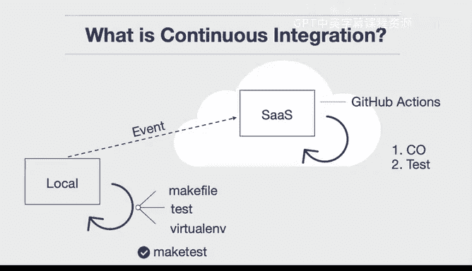

# 构建大规模云计算解决方案：1-2：持续集成介绍 🚀

在本节课中，我们将要学习持续集成（Continuous Integration， CI）的概念、重要性以及其基本工作原理。我们将通过类比和简单的技术流程，帮助你理解为什么CI是现代软件开发中不可或缺的一环。

---

## 什么是持续集成及其重要性

什么是持续集成，以及为什么你需要关心它？这是一个非常重要的问题。

在我教授学生构建软件或与公司进行咨询项目时，这个问题经常出现。很多时候，人们对此存在误解。他们认为进行自动化测试或编写测试是在浪费大量时间，但实际上，它能为你节省大量时间。

让我举几个例子。例如，为什么你的房子里要安装烟雾报警器？显然，你不想因为缺氧而在睡梦中无声无息地死去。所以，它是一种确保你生存的自动化方式。同样地，我们为什么要测试新药以确保其有效性？我们想确保为某种医疗状况提供的药物确实有益而非有害。再比如，你为什么要系安全带？安全带能确保在发生碰撞等突发事件时，防止你被抛出车外。

这些都是自动化测试和安全机制的形式，它们实际上拯救了你的生命。软件测试也是如此。持续集成是一种始终确保你的软件处于已知状态的方法，并且它实际上为你节省了时间。因此，关于持续集成，可能有两个重要的事情需要记住：你的软件状态始终是可知的（你知道它是正常工作还是出了问题），并且它实际上为你节省了时间，而不是耗费时间。

一旦你理解了这些概念，它就能真正让你以更快的速度开发软件。就像汽车的安全带类比一样，你知道有东西在保护你，因此可以随心所欲地加速。

---

## 持续集成的技术细节

上一节我们介绍了持续集成的核心价值，本节中我们来看看其技术实现细节。

很多时候，当你开始使用持续集成时，最好的步骤是从本地环境开始工作。

假设这是一个本地环境，它可以是Cloud9环境、台式机、笔记本电脑，或者任何你想要的机器。

以下是开始的基本步骤：

1.  **创建本地脚手架**：你可以在这里创建一个Makefile，将测试文件放在你的项目中，或许还可以创建一个虚拟环境。
2.  **本地运行测试**：然后，你可以执行例如 `make test` 的命令，以确保代码正常工作。这会在本地得到一个表示成功的对勾标记。

一旦本地设置完成，下一步就是确保你的SaaS构建服务器（如GitHub Actions）已准备好自动测试你的代码。

我们假设这里是GitHub Actions。其内部发生的情况是，每次你对这个环境进行更改时，都会触发一个事件。这个事件本质上会检出（check out）你的代码，然后运行测试。就是这样。

所以，它实际上是一种将本地操作复制到云端SaaS构建服务器的方式。我们可以把这个服务器想象成云中的一个节点。

总而言之，所有持续集成所做的，就是以可重复的方式，自动化完成那些你手动重复执行的操作。在现实世界中，你可以看到很多这样的例子。例如，你不会想每次制造汽车时都手工打造，这就是为什么他们用工厂来制造。所以，持续集成就是一个自动测试你的代码并重复此过程的“测试工厂”，让你知道你的代码始终处于已知状态，并且它将为你节省时间。

---

## 核心概念与流程总结

本节课中我们一起学习了持续集成的核心概念。让我们用简单的公式和图示来总结其核心流程：

**核心公式**：
`持续集成 (CI) = 本地自动化测试 + 云端自动验证`

**基本流程**：
1.  开发者在本地编写代码并运行测试（例如使用 `make test`）。
2.  将代码提交到版本控制系统（如Git）。
3.  提交操作触发云端CI服务器（如GitHub Actions）自动执行任务。
4.  CI服务器检出代码，运行与本地相同的测试套件。
5.  根据测试结果，反馈构建状态（成功或失败）。

这个过程确保了软件质量的持续可控，正如我们之前讨论的，它像安全带和烟雾报警器一样，是一种重要的安全与效率保障机制。