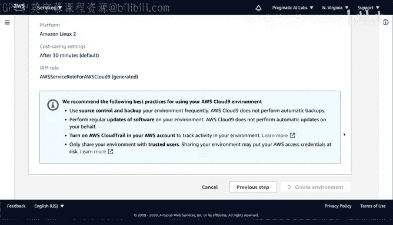
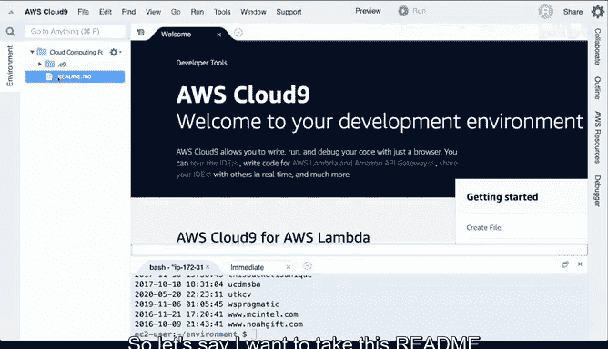
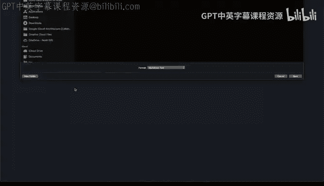
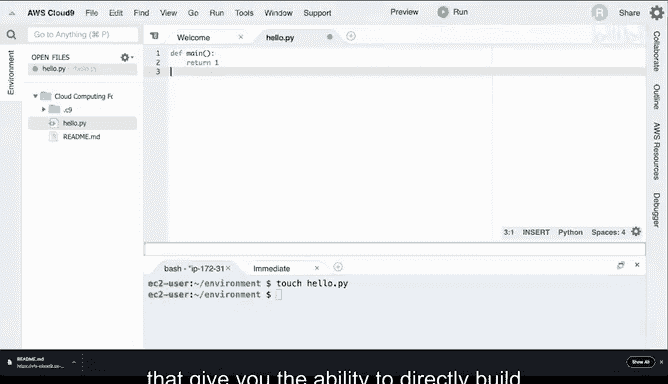

# 构建大规模云计算解决方案：1-2：使用AWS Cloud9进行云开发 🚀

## 概述
在本节课中，我们将学习AWS Cloud9，一个基于云的集成开发环境。我们将了解它如何解决云开发中的常见问题，并逐步演示如何创建和配置一个Cloud9环境，以及探索其核心功能。

---

## 什么是AWS Cloud9？ ☁️

AWS Cloud9是一个基于云的集成开发环境。它解决了在云环境中开发时出现的许多问题。Azure云和GCP云也有类似的环境，它们都旨在解决同一个核心问题：你可以在代码将要运行的环境内部进行开发。

对于Cloud9而言，其工作原理是在AWS内部配置一台虚拟机。这台虚拟机相比你的个人笔记本电脑有几个优势。

---

## Cloud9的优势

上一节我们介绍了Cloud9的基本概念，本节中我们来看看它具体解决了哪些开发痛点。

以下是使用Cloud9的几个主要优势：

1.  **权限管理**：你可以为它分配基于角色的权限。这意味着你可以直接与AWS API通信，与其他服务交互，而无需管理访问密钥。从安全角度来看，这解决了许多问题。
2.  **网络性能**：网络通信速度更快，因为你本质上是在实际的数据中心内部打开了一个终端。如果你的笔记本电脑连接着不稳定的无线网络，通信会遇到很多问题。但如果你在工作的实际环境中启动一个实例，你就能在数据所在的位置直接与其通信。
3.  **深度集成**：这是Cloud9等工具的另一个关键方面，即能够与云服务深度集成。例如，你可以与无服务器计算服务AWS Lambda环境深度集成。你也可以深度集成命令行工具。

总而言之，如果你在为云环境进行开发，使用像AWS Cloud9这样的原生工具很可能会带来更好的体验。接下来，让我们实际操作一下。

---

## 创建Cloud9环境 🛠️

要开始使用AWS Cloud9，你需要登录你的AWS账户。

现在我们进入了AWS管理控制台，我将找到名为Cloud9的服务。我输入“cloud 9”，自动补全会给出结果。从这里，我可以创建一个新的Cloud9环境，所以我选择“Create environment”。

通常，给它起一个有意义的名称是个好主意。在这个例子中，我们将其命名为“cloud computing demo”。然后我会添加一个描述，例如“This is a demo environment”。点击下一步。

这里有几个关键点需要指出：对于大多数情况，尤其是学生用户，默认设置通常就足够了。尽管如此，我还是会指出几个关键功能。

这个部分显示“Create a new EC2 instance”，这允许你启动一个新的虚拟环境。这里还有一些其他高级选项，比如实例类型。

大多数时候，符合免费套餐资格的`t2.micro`实例类型是一个不错的选择，适合进行开发和完成教育项目。但Cloud9一个非常棒的功能是，如果我在这里选择“Other instance type”，我可以决定使用一台非常强大的机器。

例如，假设我想用一台72核、144GB内存的机器测试一些并行计算。大多数人没有机会接触这种硬件，但你可以实际启动一台，并且只按使用时长付费，从而测试一些计算密集型的操作。这也是Cloud9的一个关键特性：能够将你的实例扩展到多种不同的规格。

再次说明，我这里将选择默认设置。

关于平台，在大多数情况下保留默认设置可能是个好主意。有Amazon Linux、Amazon Linux 2可选，未来可能还会有Amazon Linux 3或Ubuntu Server。很多时候，默认设置会为你的项目开发提供最佳体验。在这个例子中，我将选择Amazon Linux 2，因为它包含的Python版本稍新一些。

另一个需要指出的点是“Cost-saving settings”。默认设置很好，因为如果你离开机器并关闭网页浏览器，它会自动休眠，保存所有设置，并且你不会被收取这些服务的费用。这也是一个很棒的功能。

这里还有一个关键点需要指出，就是“IAM role”。正如我之前提到的，使用AWS Cloud9的一个优势是，无论你登录哪个账户，相关角色都会自动关联。这样，你就不需要管理API调用的密钥，可以直接与S3等服务通信，来回拷贝数据。这是Cloud9环境免费提供的一个关键特性。



完成这些设置后，我点击“Next”。启动过程大约需要30到45秒。


---

## 探索Cloud9核心功能 🔍

现在AWS Cloud9已经启动，让我们来体验一下它的核心功能。

首先要注意的是左侧的“Environment”选项卡。如果你注意到它显示“~/environment”，这意味着如果我执行`ls`命令，这里只有一个`README.md`文件，这是驱动器的根目录。如果我输入`pwd`（打印工作目录）命令，你可以看到我的工作目录是`/home/ec2-user/environment`。

接下来，让我展示它已经预装了AWS命令行工具。例如，如果我输入`aws s3 ls`，我可以列出我账户中的所有存储桶。这非常有用。如果我还想拷贝数据，我可以直接在这里执行`aws s3 cp`命令。这确实是一个令人难以置信的功能：你免费获得了这个命令行工具，可以用它来与AWS的其他服务通信。





这里另一个需要注意的功能是，我也可以上传和下载文件。假设我想下载这里的`README.md`文件，我可以右键点击并选择“Download”，这允许我将其下载到本地机器。这是一个关键且非常有用的功能，可以让我在这个环境中处理数据。同样地，如果我想上传文件，比如一个CSV文件或一个想在此环境中运行的二进制文件，我也可以上传本地文件。


接下来，我要展示的另一个功能是，如果你点击右侧的这个选项卡，有几个非常有趣的功能。第一个是“Collaborate”（协作）。它的作用是允许你邀请其他人加入你的项目，并且你们可以实时聊天，进行结对编程。这对于课堂小组或公司里的团队合作非常有效。要做到这一点，你只需点击“Share”，然后邀请某人加入你的特定账户。这是一个非常棒的功能，我以前曾用它来调试生产环境中的问题。

如果我们接下来看“AWS Resources”选项卡，这是另一个令人难以置信的功能：我可以直接在Cloud9内部原生地创建AWS Lambda函数。如果我点击“Create a new Lambda function”，它允许我创建一个新函数，比如命名为“newLambda”或其他任何名称。点击“Next”，然后我可以从几个预装在此应用环境中的运行时中选择，例如Node.js、Python 3.6。从这里，我实际上可以选择不同的蓝图，然后配置应用程序。正如我之前谈到的，这种深度集成是Cloud9的关键特性之一。通常，从这里开始比从你的本地笔记本电脑开始更好。

另一个需要指出的点是，它有一个功能丰富的调试器，你可以设置断点并调试你的代码。

我们还将稍微了解另一个方面：假设我想在这里创建一个名为`hello.py`的基本Python文件，我可以使用`touch`命令，它会创建一个空文件。

```bash
touch hello.py
```

好的，让我们编辑这个`hello.py`文件。你可以看到它有语法高亮显示。我可以输入一些语句，比如`def main(): return 1`或其他任何我想做的，它会自动识别Python的正确语法。这里包含了许多非常强大的功能，使你能够直接构建云原生的应用程序，这就是Cloud9环境的关键优势。




---

## 总结 📝


本节课中，我们一起学习了AWS Cloud9云开发环境。我们了解了它如何通过提供基于角色的安全权限、优化的网络性能以及与AWS服务的深度集成来提升云开发体验。我们逐步演示了如何创建和配置一个Cloud9环境，并探索了其核心功能，包括内置的AWS命令行工具、文件上传下载、团队协作功能、原生Lambda函数创建以及强大的代码编辑器。掌握Cloud9将帮助你在云端更高效、更安全地进行开发和测试。