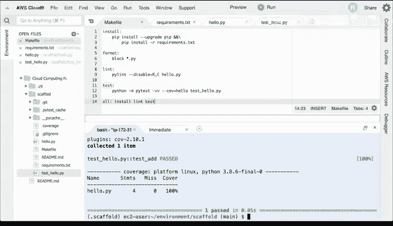

# 构建大规模云计算解决方案：P21：构建Python项目脚手架 🏗️

在本节课中，我们将学习如何为一个Python项目创建标准化的脚手架。这是一个可重复的流程，适用于你创建的每一个新项目。我们将从设置Git仓库开始，逐步创建项目所需的核心文件，并最终将其推送到GitHub。

---

## 创建Git仓库

首先，我们需要为项目创建一个新的Git仓库。这是管理代码版本和协作的基础。

以下是创建Git仓库的步骤：
1.  访问GitHub网站。
2.  点击“New repository”按钮创建一个新仓库。
3.  将仓库命名为 `scaffold`。
4.  添加描述，例如“This is a project scaffold for Python”。
5.  务必勾选“Add a README file”选项。
6.  在添加.gitignore文件的选项中，选择“Python”模板。这可以确保像 `.pyc` 或 `.egg` 这类无关文件不会进入你的代码仓库。
7.  点击“Create repository”完成创建。

---

## 配置SSH密钥并克隆仓库

上一节我们创建了远程Git仓库，本节中我们来看看如何在本地环境（如AWS Cloud9）中安全地连接并克隆它。我们将使用SSH密钥进行加密通信。

首先，我们需要生成SSH密钥对，并将公钥添加到GitHub账户。

以下是配置SSH连接的步骤：
1.  在终端中运行命令生成RSA密钥对：`ssh-keygen -t rsa`。
2.  密钥对将默认保存在用户主目录的 `.ssh` 文件夹中。
3.  使用 `cat` 命令打印出公钥文件（通常是 `~/.ssh/id_rsa.pub`）的内容：`cat ~/.ssh/id_rsa.pub`。
4.  复制输出的整个公钥字符串。
5.  登录GitHub，进入“Settings” -> “SSH and GPG Keys”。
6.  点击“New SSH key”，将复制的公钥粘贴进去，并为其命名（例如“scaffold”）。
7.  保存后，即可在终端中使用SSH地址克隆仓库：`git clone git@github.com:你的用户名/scaffold.git`。

---

## 创建项目基础文件

成功克隆仓库后，我们现在进入项目目录，开始创建脚手架所需的核心文件。

以下是需要创建的基础文件列表：
*   **Makefile**：用于定义项目构建、测试、格式化等自动化任务。
*   **hello.py**：项目的主脚本文件。
*   **test_hello.py**：用于测试主脚本的测试文件。
*   **requirements.txt**：列出项目所依赖的Python包。

在终端中，可以使用 `touch` 命令快速创建这些空文件：
```bash
touch Makefile hello.py test_hello.py requirements.txt
```

---

## 设置Python虚拟环境

为了隔离项目依赖，避免包冲突，最佳实践是使用Python虚拟环境。我们将创建一个与项目同名的虚拟环境。

运行以下命令创建虚拟环境：
```bash
python3 -m venv ~/.scaffold
```
此命令使用 `venv` 模块，在用户主目录下创建了一个名为 `.scaffold` 的隐藏虚拟环境。

创建后，需要激活它才能使用：
```bash
source ~/.scaffold/bin/activate
```
激活后，使用 `which python` 命令可以验证当前使用的Python解释器已指向虚拟环境内的路径。

---

## 编写Makefile

Makefile是项目的自动化指挥中心。我们将创建一个包含安装、代码检查、格式化和测试等任务的Makefile。

一个基础的Makefile内容如下，请注意，Makefile中的缩进必须使用**制表符（Tab）**，而非空格：
```makefile
install:
    pip install --upgrade pip
    pip install -r requirements.txt

format:
    black hello.py

lint:
    pylint --disable=R,C hello.py

test:
    python -m pytest -vv --cov=hello test_hello.py

all: install lint test
```
*   **`install`**：升级pip并安装 `requirements.txt` 中列出的所有依赖包。
*   **`format`**：使用 `black` 工具自动格式化 `hello.py` 代码。
*   **`lint`**：使用 `pylint` 对 `hello.py` 进行代码风格和错误检查（此处禁用了部分冗余警告）。
*   **`test`**：使用 `pytest` 运行测试，并输出详细结果和代码覆盖率。
*   **`all`**：一个组合任务，可依次执行安装、代码检查和测试。

---

## 配置项目依赖

现在，我们来定义项目所需的第三方库。这些依赖将被记录在 `requirements.txt` 文件中。

以下是几个在Python项目中常用的工具库：
*   **pylint**：代码静态分析工具，用于检查错误和代码风格。
*   **pytest**：强大的测试框架。
*   **click**：用于创建命令行界面的工具包。
*   **black**：代码格式化工具，可自动调整代码格式。
*   **pytest-cov**：生成测试覆盖率报告。

将这些库名称写入 `requirements.txt` 文件：
```
pylint
pytest
click
black
pytest-cov
```
你可以根据需要指定版本号，例如 `pytest==7.0.0`。首次搭建时，可以不固定版本以获取最新版。

保存文件后，即可运行 `make install` 来安装所有依赖。

---

## 编写示例代码与测试

脚手架搭建好后，我们开始编写实际的代码和对应的测试。这是验证我们设置是否正确的关键一步。

首先，在 `hello.py` 中编写一个简单的加法函数：
```python
def add(x, y):
    return x + y

if __name__ == "__main__":
    result = add(1, 2)
    print(f"This is the sum 1 and 2: {result}")
```
接着，在 `test_hello.py` 中为这个函数编写测试：
```python
from hello import add

def test_add():
    assert add(1, 2) == 3
```
现在，可以运行 `make test` 来执行测试。如果一切正常，你将看到测试通过和覆盖率报告。

---

## 代码质量检查与格式化

在提交代码之前，我们使用Makefile中定义的工具来保证代码质量。首先运行代码检查：
```bash
make lint
```
如果 `pylint` 提示有变量重定义等问题（例如在全局作用域定义了 `x`, `y`），你需要根据建议修改代码。例如，将 `hello.py` 中的直接赋值改为在函数调用中传入字面量值。

然后，运行代码格式化工具，让代码风格保持一致：
```bash
make format
```
`black` 工具会自动调整 `hello.py` 的格式（如缩进、空格），使其更规范、易读。

---

## 提交代码到GitHub



所有工作完成后，最后一步是将本地代码推送到远程GitHub仓库，为后续的持续集成做好准备。

以下是提交和推送代码的步骤：
1.  使用 `git status` 查看有哪些文件被修改或新增。
2.  使用 `git add .` 或 `git add *` 将所有变更添加到暂存区。
3.  使用 `git commit -m “添加初始项目结构”` 提交更改到本地仓库。首次提交时，Git可能会提示你配置用户名和邮箱。
4.  使用 `git push` 将本地提交推送到远程GitHub仓库。
5.  刷新你的GitHub仓库页面，确认所有文件都已成功上传。

---

## 总结


本节课中我们一起学习了如何从零开始构建一个标准的Python项目脚手架。我们完成了从创建Git仓库、配置SSH、建立项目目录结构、设置虚拟环境，到编写自动化构建脚本（Makefile）、管理依赖、编写代码与测试，最后进行代码质量检查并推送到GitHub的完整流程。这个可重复的脚手架为后续实现持续集成和持续交付奠定了坚实的基础。