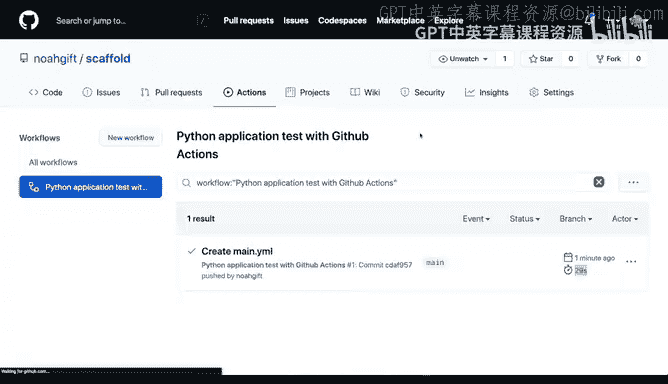
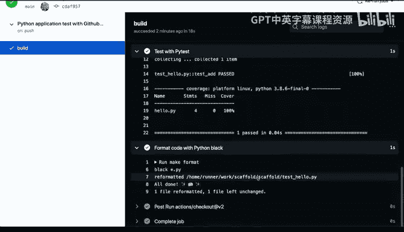
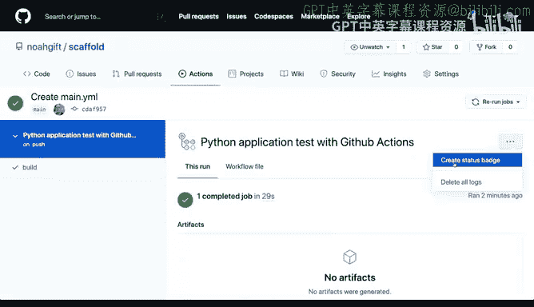
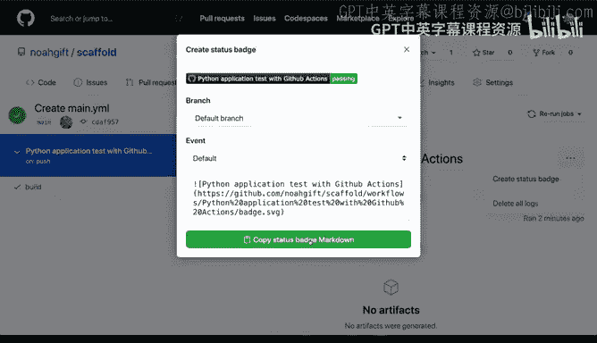
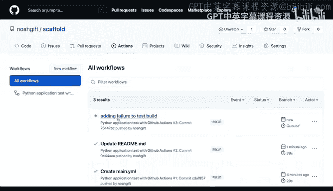
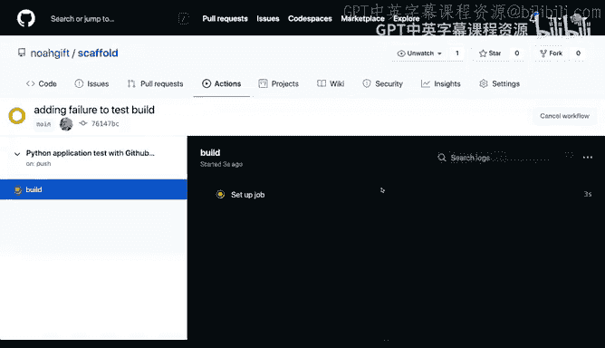
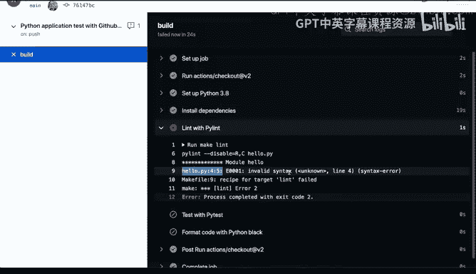
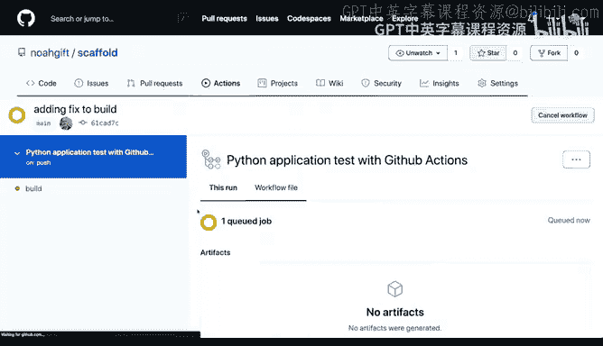
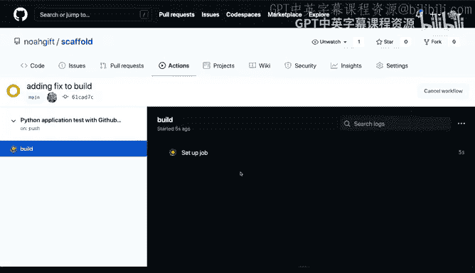
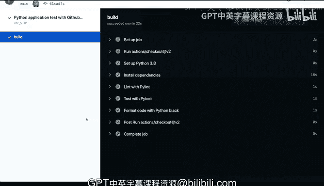

# 杜克大学《构建大规模云计算解决方案（基础、虚拟化，1-2课／共4课Building Cloud Computing Solutions at Scale》 - P22：22_03_07_GitHub Actions介绍.zh_en - GPT中英字幕课程资源 - BV1oT421k7YQ

Now that we have a scaffolding setup for our project， let's go to the final step。

 which is to set GitHub actions。And here I'm going to select this actions icon。

And when I select actions， you'll notice that not only are there some defaults here where you could go through and look at things like deploying node applications。

 deploying containers， deploying to the Google cloud and their Kubernetes service。

 but you also can set it up from scratch So that's what we're gonna do。

 We're going set up a default workflow here and you'll notice that it'll give you this Yaml format file。

 So it's called main do yaml and it'll say this is a basic workflow， and in a nutshell。

 the best way to think about this is that you're telling it when you push something to the master branch or the main branch that it'll do a series of actions and if you've already got a make file setup。

 then it really becomes trivial So that's what I'm going to do。

 I'm going to use this default and swap it out with a make file that I've already got set up。

So let's go ahead and delete that and then I'm going to go through here and put a default GiHub actions that I've used in the past here and let's take a look at some of the parameters。

 So first I say Python application test with Github actions and on every push or every event that makes a change I'll go ahead and run this and I'll run it on this particular container which is the latest version of Abutu I'll also go through here and install Python 38。

And then after that I will do the series of steps that I set up earlier so I'll run and make installs。

 this will install the dependencies so this actually tests whether I have the correct dependencies in my project next I'll link the code so I'll go through and make sure that the syntax of my project is correct and what's beautiful about this is that every single time I make a change it'll validate that my project works then I'll go through and I'll make a test and then finally I'll format the code。

Let's go ahead and start this。You'll notice that it checks it into this directory do Github workflows and the file is called mean doyml you can have as many of these files as you want and what this means is that for every single file that runs。

 it'll exactly do what you say so for example， if we want to later set up Google based deployment。

 we can set that up if we want to set up an Azure based testing project we can go ahead and set that up。

Now how do we actually see where it runs well， if you go back to actions here？

And you look at this icon， it'll show you the results of a run that happened and notice that it says one minute ago。

It took about 29 seconds。 So let's go ahead and take a look at this so you can see that it was able to build this and I can look at every single step。

 So each of those lines in the Yaml file directly corresponds with each one of these lines。

 So first we say setup job。 and then it goes through here and it downloads the correct virtual environment。

 which is a botu 1804。

Next we go through here and we set up Python 38 so it goes through here and it installs the C Python version 3。

86 I then go through and install appendencies and this makes it really is very easy because I have the make file set up and all I have to do is say make install and then I go to the next step which is I go in I link the code and then this goes through here and it says make Lint and then finally we can go through here and we can finish a test。

Great， and that's a make test command and then it'll go through and it'll format the code And on all this does is show me if I needed to make a change。

 I could later look at this output and say， oh， I need to make a change to my file。

 So what we can do next here to add the final finishing touches is if I go to this icon over by the main part of the build。

 you'll notice that it says create status badge this is always a good idea if I go through here and I say copy the status bag markdown it'll actually allow me to give a badge inside of this readme file。

 So if we go through here and I put this inside。

It'll'll let me see what the output is of every single operation so if Ive made a change it'll show me whether the change is passing or if it's failing so this is a really useful aspect of a SASbased continuous integration system so let's actually test this out though so I saw it we're able to see this working but let's actually test out what happens when it fail so how can we do this well what we could do is go back to a project here and do a get pull to pull the latest changes。

And then what I'm going to do is I'm going to go to this hello file here。

 I'm going to add some bad code， so I'm going to add an empty variable right that's not complete。

 you'll notice it even says look there's a problem。

 so I'm going to go through here and see that if I do alych the Ly won't work right because we know it it's got a failure so just to test it out I'm going to add this failure adding failure。

To test build。Great， and then I'll do a gi addd here。

Of the hello and then run that line again and then now do a Gi push When I do this push。

 it'll automatically trigger the GiHub actions build again and we can click on this icon and notice that it's in orange here because it's running this again so it's queued up I can select it and in fact even look at the logs as they're being run and it'll tell me step by step what's happening it's install dependencies great when it gets to the li it's going to fail。

Allright， that looks good。 scroll down here， scroll down and。Once it's done installing。

 it'll run the next step here， which is oh oh we see that there's an issue。

 And so it won't even go to the final steps。 notice how there's a slash here。

 It'll it'll tell you that it failed at this step， which is really useful in debugging。

 So if I go through here and I say hello， it'll say that line4 character 5。 There's invalid syntax。

 right， So it's actually really helpful in letting me debug the code。 So how do we fix this。 Well。

 let's go back here and just comment this out。

And then if I go and I say get， I can actually test it locally， make sure it works great， it works。

 let's go ahead and do a get out of the low again。And then I can say put a fix here and we'll say adding fix。

To build。And then we'll commit this and then it'll go through it and run it again and then fix this failure。

 So you can see here how this build step really adds a lot of value in terms of automatically checking to make sure your project works and then even giving you verbose output。

 And so I think this is probably the biggest takeaway， I would say is that。

It's one of the most common mistakes that newcomers to Python， newcomers to data science。

 newcomers to programming make is that they don't do this automated testing because they think it's more work or they don't want to get involved with doing something where they don't see the value。

 but really this is something that just like a Python virtual environment setting up continuous integration is only going to help you have more highquality code。

 go faster and in fact this will speed things up， so this is a required best practice for any software project involving Python。

