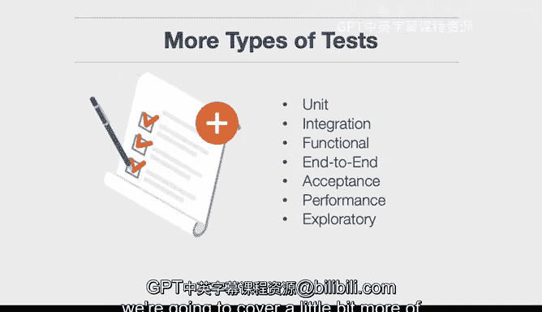

# 杜克大学《构建大规模云计算解决方案（基础、虚拟化，1-2课／共4课Building Cloud Computing Solutions at Scale》 - P25：25_03_02_Azure云开发介绍.zh_en - GPT中英字幕课程资源 - BV1oT421k7YQ

In this lesson， we're going to create an Azure cloud development environment。

Let's go ahead and look at the learning objectives。First。

 we'll evaluate the benefits of testing and Linting software。

 so we'll go into a little bit more detail。Next， we'll construct Azure Cloud Shell continuous integration from Ze。

So this will build out a full environment inside of Azure and set up continuous integration and testing。

Finally， we'll develop GiHub action testing for Azure。

 so we'll get the full pipeline working end to end Before we get to that let's talk about the testing that we'll cover in this lesson。

There are many different types of tests。 We've talked a little bit about it。

 but let's talk about them in a more comprehensive manner。 There are unit tests， which are low level。

 There's integration tests， which verify that different modules or services work well together。

 There's functional tests， which are really verifying that the business requirements of an application。

 say a web service returns the right status code。There's end to end testing which is a way of mimicking users so this could be a game company that mimics the way a game is played。

 there's acceptance testing， which is a formalized way of verifying that let's say a payroll application sends out the payments and then there's performance testing or load testing which is going to test how the app will perform under load and then there's also basic sanity testing and what this does is verifyifies that if you also do some exploratory data analysis that you can ensure that things are working properly so in nutshell there's lots of different types of testing including unit integration。

Expllororatory sanity， and we're going to cover a little bit more of this when we get into the details next。

