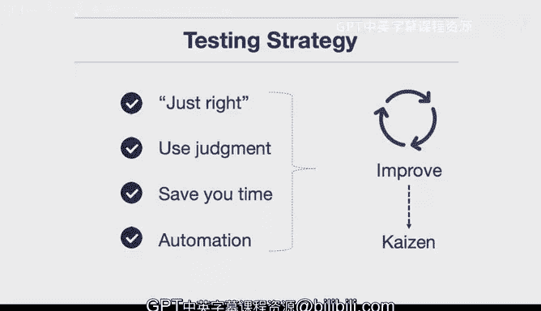

# 构建大规模云计算解决方案：1-2：测试介绍 🧪

在本节课中，我们将要学习软件测试的核心概念、重要性以及如何制定一个“恰到好处”的测试策略。我们将通过一个真实的故事来理解测试如何帮助解决重大危机，并探讨测试的实践原则。

## 什么是测试？如何用它摆脱困境？

测试是什么？你如何利用它让自己摆脱大麻烦？我想分享一个职业生涯中期的故事。当时我在一家电影公司工作，我们遇到了一个非常严重的问题。事实上，整个价值数亿美元、拥有数百名员工的设施陷入了停滞，无法继续工作，而我们有一个不可更改的截止日期。一部电影将在圣诞节上映，海报已经贴出，迪士尼是背后的支持者。除了深入挖掘并找出解决方法，我们别无他法。

我们采取的第一步是：在一个模拟环境中让某种测试运行起来。这可能是你摆脱大麻烦可以做的第一件事：我能否将生产环境复制到某个地方？即使你没有设置持续交付类型的环境，通常也可以通过在某处运行模拟来摆脱困境。一旦你至少能运行它，你就可以验证某些事情是否按预期进行。

## 制定你的测试策略

上一节我们介绍了测试在危机中的作用，本节中我们来看看如何制定一个有效的日常测试策略。

正如之前提到的，“恰到好处”的策略是思考测试的重要方式。你既不想做得太多，也不想做得太少。你希望有足够的测试来确保你的工作有效。另一个需要牢记的是判断力。如果你怀疑应用程序的某个部分可能有问题，那就为此编写一个测试。这是你应对潜在麻烦的一种方式。

测试能为你节省时间，它们不是时间的浪费者。我认为这可能是最常见的初学者错误：人们因为忙于调试代码而不编写任何测试。但测试的本质是，它是你已经调试过的代码，并且你无需再次调试相同的东西。为什么你要日复一日、年复一年地反复添加打印语句并将变量传入函数，而不是直接编写一个测试来验证你的代码是否工作呢？我认为这是我看到的最常见的错误之一。

最后是自动化。一旦你的测试开始运行，你必须将其自动化，以便构建服务器（或在 GitHub Actions 的情况下）能够自动运行测试。这真正为你提供了持续改进的机会。你可以不断地、每日甚至多日地确保你的代码正在变得更好，你了解正在发生的事情，并且它处于一种持续改进的状态。有一个词可以形容这个概念：**改善**。因此，**改善**或持续改进是测试的目标，也应该是你的策略。

总而言之，你希望的是“恰到好处”的策略。这里只需要一点，但不要太多。

---

**本节课总结**

本节课中我们一起学习了测试的核心价值。我们通过一个真实案例看到，在模拟环境中建立测试是解决重大生产问题的第一步。我们探讨了制定测试策略的关键：追求“恰到好处”的平衡，运用判断力针对怀疑点编写测试，理解测试是节省时间的调试代码，以及实现自动化以实现持续改进。最终，测试的目标是支持**改善**这一理念。