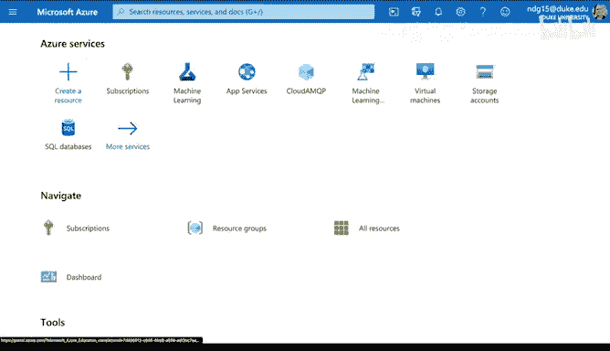
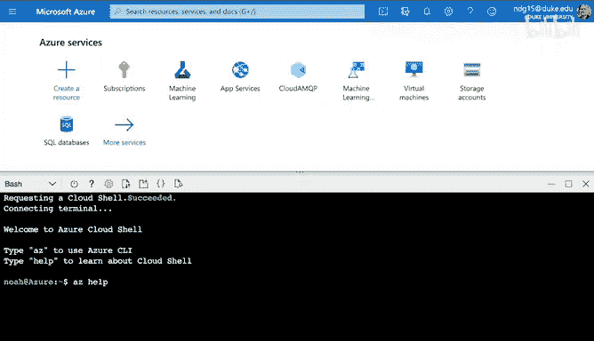
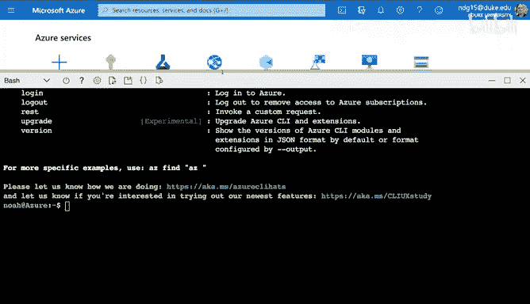
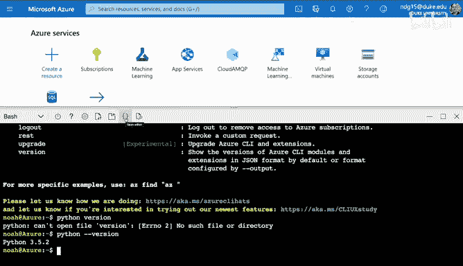
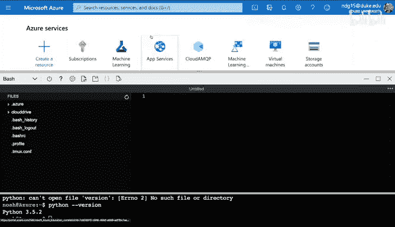
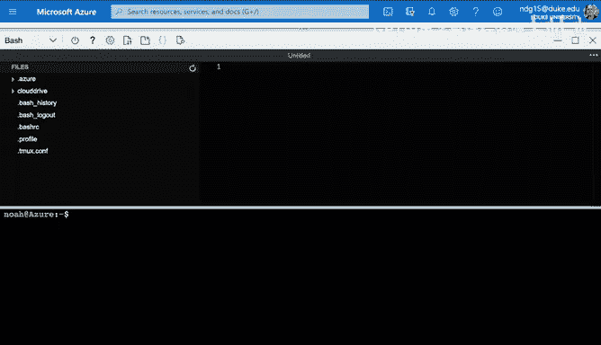
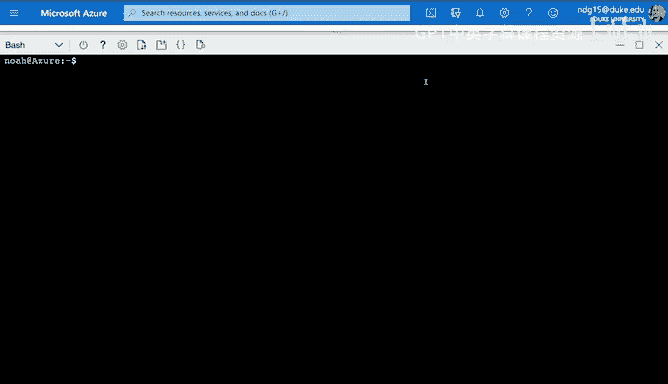
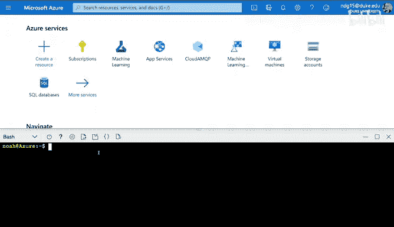

# 杜克大学《构建大规模云计算解决方案（基础、虚拟化，1-2课／共4课Building Cloud Computing Solutions at Scale》 - P27：27_03_05_使用Azure Cloud Shell进行云开发.zh_en - GPT中英字幕课程资源 - BV1oT421k7YQ

Let's talk about the Azure Cloud shell environment like mini clouds。

 It's the default place that I would recommend you start your development work。

 And the main reason is that this is where the cloud is。 So we can say this is Azure itself。

 And inside of here， we've got these highly connected data centers and we have network connections that are fast and the ideal scenario here is you spin up a shell environment where you have access to the proper roles。

 you have access to storage。 you can actually deploy things like platform as a service application。

 all from this shell。 So really this is the main place that you can go to control everything and orchestrate it。

 So my recommendation is when you're on the cloud use that cloudbased development environment。

 And that way you don't have to go through and use things like for example。

 a spotty wireless connection and copy data back and forth。 you can go。

Right into that cloud environment， develop your application。

 and let's go through and show some of those features in this next section。

Let's dive into this Azure Cloud shellll environment here to get started。

 you would need to go over to this icon for Cloud shellll。 And if I select it。

 it'll launch a cloud environment that is a ba shell。 Now I'm skipping past one part。

 which is if you first created your account， you'll need to create a subscription and also a storage location but that's pretty straightforward。

 So the next step that I'm going to do here is show you some of the features of this environment。

 The first thing to point out is that you can actually use builtin commands here with the Azure Ci。

 So if I type in Az。

This will give me help and I can go through and see different kinds of commands that I could run and you can notice if we go a little bit bigger here。

 you've got different things like configure upgrade I can manage web applications like for example。

 platform as a service flask apps I can do all kinds of different things in here and it's all available via that command line interface。

 So that's one of the key advantages of this environment Another thing to point out is that if I wanted to run Python I can do that as well。

 So if I type in Python version you can see actually will' do Python version that it's running Python 352。

 so we've got a good version of Python here and also a couple other things to point out are that if I select this icon。

 it'll open up a fullfledged editor that will allow me to edit project So let's go ahead and select that。

Notice I can bring it up and make it a little bit bigger and then I can actually go side by side here and get this terminal below and then the code above。

 Now， if I want to do some kind of an editing here it will actually interact with that environment and as well what I can do is I can actually close it by selecting this menu here。

 So if I go through here and I say close editor， this gets me back to normal and then I can drag this back down。

 So it's got a lot of the functionality that you would need if you're going to develop a fullfledged project。

 you also can use these other icons like you know moving an uploading a downloading data。

 making new files or opening a new session there's lots of different capabilities here and even you can switch between bash and Powerhell。

 So the main takeaway here is that it's a fullfledged native environment for doing cloudbased development。

 and it's my recommendation for when you first start out。

The place that you should initially do your configurations and your development。

