# 杜克大学《构建大规模云计算解决方案（基础、虚拟化，1-2课／共4课Building Cloud Computing Solutions at Scale》 - P28：28_03_06_Azure Cloud Shell从零开始持续集成.zh_en - GPT中英字幕课程资源 - BV1oT421k7YQ

Now that we've got Azure Cloudhell set， let's go through and set up a Python project。

And get it tested locally and then get it tested in GiHub actions。

 So the first step here would be to create a Python virtual environment。

 I'm going to use that same scaffolding project， so I'll go through and name the virtual environment after that scaffolding project。

 so type in Python3 M V E and V so use the virtual environment module。And in my home directory。

 create a virtual environment called scaffold。Here we go。Next。

 I'll source it so I can actually activate that version of Python。

So I'll copy the first part here and then type in bin。And then I'll do activate。

 Now one little trick that I'll show you is that it's oftentimes a good idea to use the tab key to automatically complete something。

 So so I'll type in AC。Tab and it will complete the rest of it。

 and this actually saves me time and it makes it so it's less likely I'll do a mistake。

 so this is a really good practice to be involved in。

Next I'll type in which Python and notice that it tells me that' it's the Python that's in my virtual environment great。

 so now what I'll need to do is create SSH keys because this is a new environment。

 so I'll go through and do that so we'll type in SSH。Keygenin T RSA， and press return a few times。

And from here， I'll move this up a little bit so I can find where that path is。

And I'll print this out to my screen。I'll run the cat command。And I'll get those keys。All right。

 now that I've got that， I'll go through and go to my get repo here and look at the profile settings。

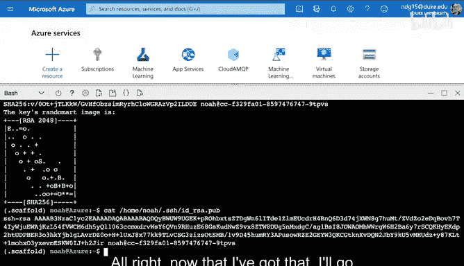

And find my SSH and GPG keys。And we'll call this Azure scaffold。And then I'll paste this in。

It lasts for password。 and then I'm good to go。 so I can go back here and type in scaffold and get to this section。

 perfect。 Now I'm going to go ahead and select code。

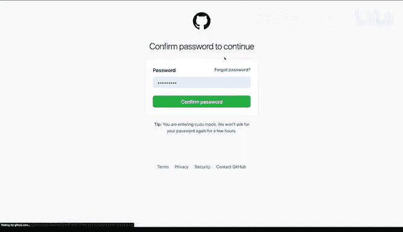

And make sure it says SSH and copy this。'llGo back to this shell environment and type in gett clone。

And pacee in that path。Here we go。We're ready to go。 So we've got this checked out。

 Now I'm going to show you this really neat feature here。

 which is that if I select this icon with the parentheses， it'll open up a full fledged editor。

 which is pretty useful because I can split my time here and actually look at this repo and see if there's anything that could potentially be a problem well。

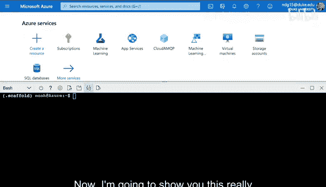

One thing that could be a problem is that this project may have some issues with a particular requirements file I know that Python 35 may not be able to run for example。

 this this version of the code and so what I might want to do is create a new requirements file here so I'm going to go through and say touch requirements。

Azure。 Txt。And then I'm going to slightly tweak it。

 So I'm going to say that I'm going to go through here and。Add a little bit here， Actually。

 I'm going to move this into the directory where I checked out my code， which is in scaffold。

 and then I'm going to see D into there。And then I'm going to look inside of this file here。

Refresh this。 and I'm going to just slightly tweak this。

 I know that this version of the the black tool will not work on Python 3 so I can take that out。

And then if I look at the code itself。One of the things that's a problem is that Python 35 doesn't support this version of F strings。

 and so I'll need to take that out as well， so I'll go ahead and change this What I could do first though to just verify is I could go to this make file here。

And I could say。At a step that says。For example， install Azure。

And then do the same thing except for putting in this Azure file。

 and this will allow me to test a couple different flavors of Python。

 which which is a nice strategy to deal with so we can say here that if I go through here and I say requirements hyphen Azure。

This will install the Azure versions of the packages。 So let's go ahead and do that。

 We'll type in make install Azure。And this will install hopefully everything successfully。

And notice here that its said Python 35 is old， which is what I expected。And if I run a Li。

 it should have some problems because Python 35 doesn't support， in fact， F strings。 and so again。

 if I look at this file here， we know that this will be a problem。

 so let's go ahead and test that out if I type in make Lnt。In fact， it does have that problem。

 it says F strings are only supported in Python 36。

 so what I can do here is make this code backwards compatible， so I'll take out the F strings。

And then I'll change this to。The prints format。So I can go through here and say percent S percent result there we go。

 so it's a pretty easy change here and if I go through and I run make Li。

Everything's back to normal so there's only a couple changes I needed to make to get this to work in Azure because it's running an older version of Python So what I'll do here is also run the test to make sure that works。

And looks like the test work as well。 So we're pretty much good to go here。

 And I'm going to go ahead and push this up to Github。 So we'll say Gi status and we'll say。😊。

We want to add these three files here， so I'll type in get add star。There we go。

 and I'll say get commit。Adding Azure version。Okay。

 and then it's going to ask me to do the same thing that I've had to do in the AWS environment。

 which is I'll configure this to have my credentials。And again。

 all this does is help me keep track of my own commits， it's like an analytics fix here。

 I like analytics， so I'll go ahead and do this。We'll go through here and say my name。All right。

 and then we can go through。I think we're pretty much good to go here， I can say， Git。

Push and this should。Go through and push those changes。And let's just double check yeah， oh。

 actually get commit。And then get push， there you go。Perfect， all right， so we're good to go here。

 and if I go back to this， you should see those changes。

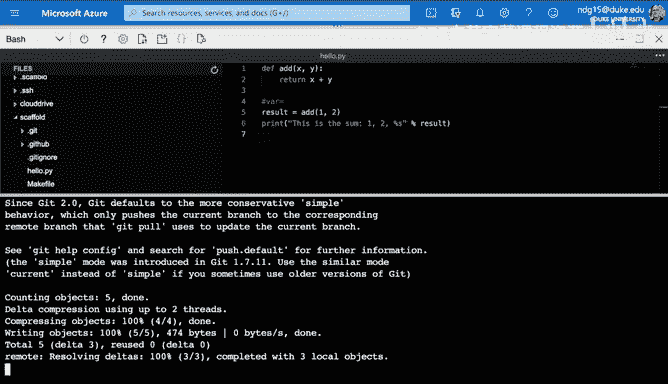

And we can see that， in fact， things were changed changed。

 But one thing that will make this a lot better is that I should also test both versions of the code right。

 so if I'm going to be using the Azure cloud and the AWs cloud。

 it would be nice if Github actions could test both versions of Python。 Well， fortunately。

 it can do that， let's first just verify that， in fact， this new version works。

 which is really important， and you can see that it passed。

 So what can I do to make this a little bit more powerful， well， the fix is actually pretty easy。

 if I go back to this project。I can add a new Github actions。

 so I'll go through here and say add file， and I'll call this Azure。 yaml。

And I'll paste in a version that will support that particular version of Python。

 so we know that there's two things that are different。

 One is that it won't work with a formatting tool that's only works on Python 36 or higher and it also doesn't like F strings and it needs Python 35。

 so I'm going to go ahead and test it with Python 3510 here。

let's go ahead and test this out and what we'll see is that it'll now run two versions。

 it'll run the old version and it'll also run a Pythonons in parallel a Python 3 via version so this will test very similar the environment that I would have on Azure So this is a really good way to kind of test things out here Now notice one problem is that I forgot to tell it to install。

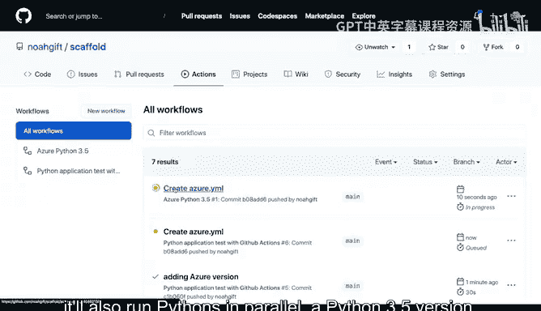

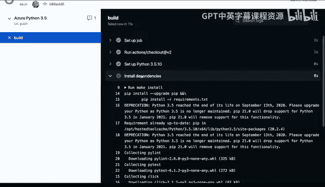

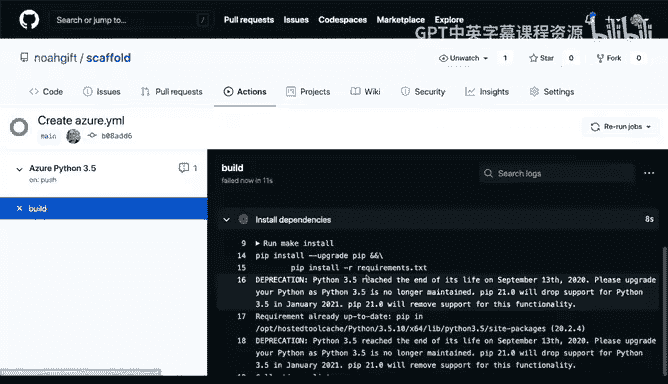

The the right requirements file， so I'm going to need to go back to my code and fix that so if I go here。

 let's tell it to install from the right requirements file。And you can see here under install。

 I want to say， in fact， install。Let's just double check what I wanted to say we want to do。

If I go to scaffold here。We want to install this file， the requirements Azure file。

 so I'll go ahead and copy that。Go back to code and put that in there。

 and this should fix that error。So it's not magic， you have to explicitly tell it the right version。

 and I think I told it。Oh actually， we need to look at the make file， so not the the the。

Not the actual name of the requirements file， we have a specific command called install Azure。

 that's the one I need to run。And then I can go back here and change that in the workflows。Perfect。

 so again， we， we tell it exactly what to do。 It doesn't guess。 in this case。

 it was installing from the wrong。Requirements file in this case， it'll say make。Install Azure。

 which will tell it to use the proper。Requirements file for a version of Python 35。

 let's go ahead and commit this and we can even put a comment that says updating the Github actions。

To support Python 35。There we go， let's go ahead and commit with that change。

If everything is successful， we should be able to watch it work in action。

And let's see which bill this is， this is。

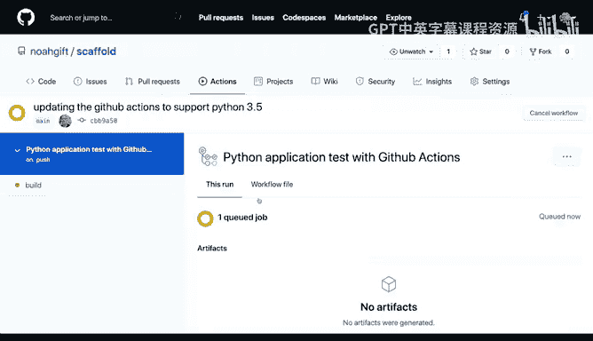

I believey oh that's the Python38 version， so you'll see there's actually two versions running。

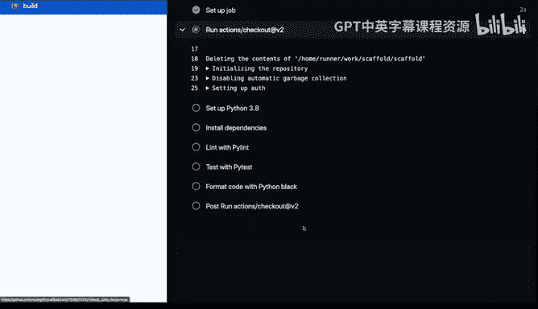

And this one is Azure。Python 3，5。That's the second build so there's two parallel builds running at the same time。

 one Python 38 and one Python 35 and so this one's going to slightly install different packages great。

 that looks like it worked Lint work test work so what's really fun about this is that I can actually have these two parallel builds of Python 38 and a Python 35 and in fact if I want to make it a little bit cleaner to look at what I could do is go into GitHub actions here。

 go to that mean file。

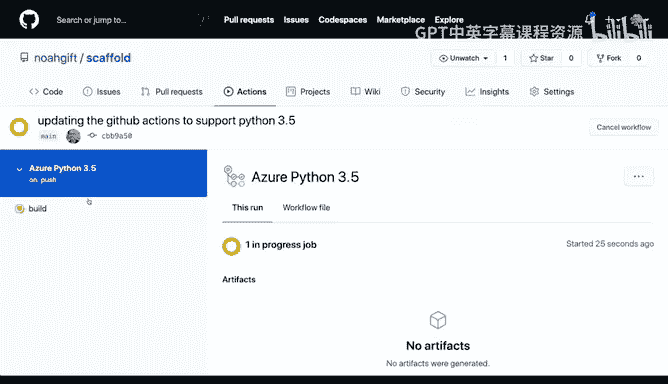

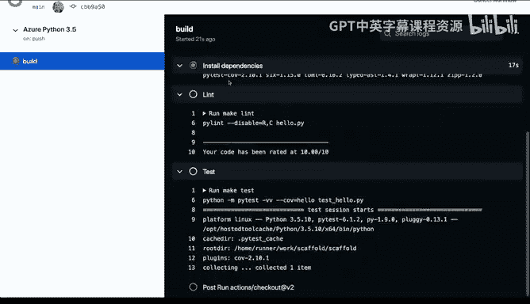

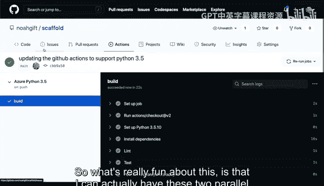

And I can actually， instead of saying Python application test， I can call this Python 38。

So that way it's a little more clear which version is running。

But this really does show the power of using something like GitHub actions is that I can test multiple versions on my project1 Python 381 Azure and then later when we get into the Google Cloud I can also run a specific version for the Google Cloud so in a nutshell the GiHub actions plus Azure is a potent combo。

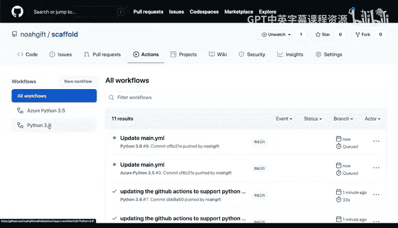

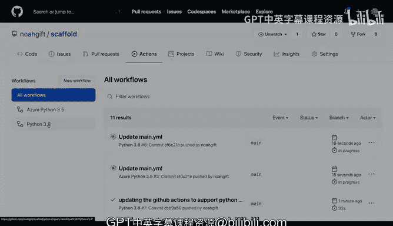