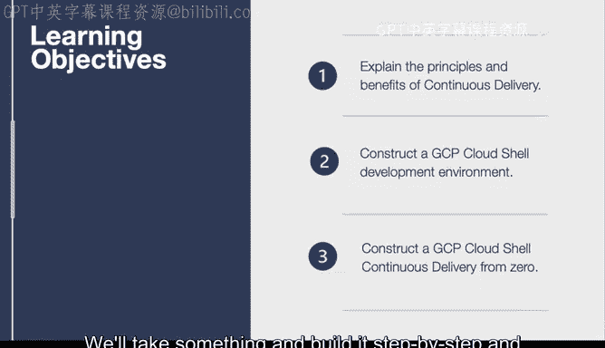
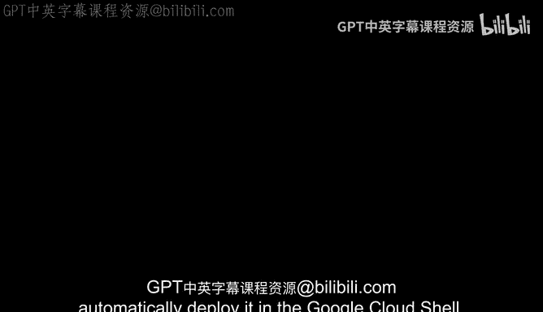

# 杜克大学《构建大规模云计算解决方案（基础、虚拟化，1-2课／共4课Building Cloud Computing Solutions at Scale》 - P29：29_03_02_GCP云开发介绍.zh_en - GPT中英字幕课程资源 - BV1oT421k7YQ

In this lesson， we create a Google cloud development environment。

 We look at some of the key components of developing in a cloud shellll。😊，First。

 let's talk about the learning objectives。 We'll explain what continuous delivery is。

 This is a core concept that we'll cover in this lesson with GCP itself or Google Cloud。

We'll also get into how to do a Cloud shellll development environment it has a lot of similarity to other Cloud shellll environments and we'll cover the differences for the Google Cloud Shell in particular。

 and then we'll construct a continuous delivery pipeline from zero so we'll take something and build it step by step and automatically deploy it in the Google Cloud She。

