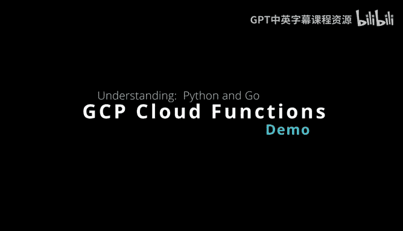
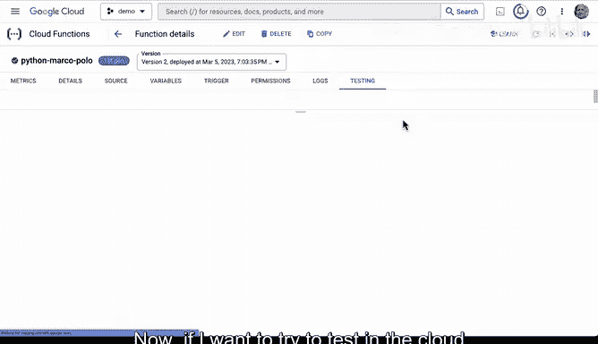
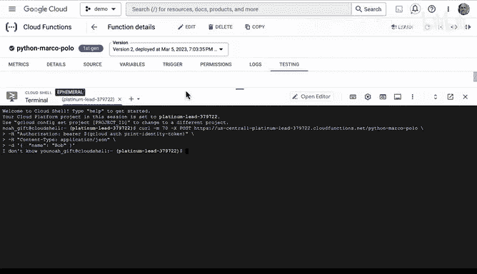
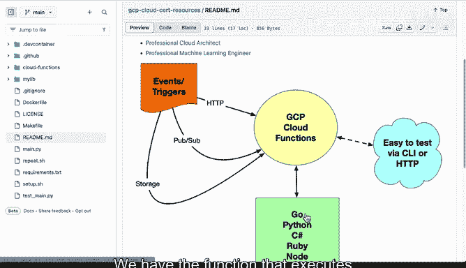

# 杜克大学《构建大规模云计算解决方案（基础、虚拟化，1-2课／共4课Building Cloud Computing Solutions at Scale》 - P35：35_03_09_使用Google Cloud Functions.zh_en - GPT中英字幕课程资源 - BV1oT421k7YQ

Let's take a look at the Google Cloud functions architecture。

 It's one of the best ways to understand how compute works on the Google Cloud platform。 First step。

 we have event triggers。 What this means is that inside of the trigger system。

 you could listen to something like a storage event where you put an image file or a text file into storage。

 and then it sends an invocation to the cloud function。 Likewise， you could set up a pub subsystem。

 Maybe you're getting messages as streaming data is coming in。

 and that could also invoke the cloud function。 and then one of the more simple ones is a HP invocation。

 So you go to a post request， put in an adjacent payload and then invoke the function。

 What's really nice about Google Cloud functions。 is they have support for go Pythons C sharp ruby node。

 really any language。That you can think of that's modern language is supported here。

 and it's easy to test via the Ci or via HDP。 All right， so that's the architecture。

 But let's go into the details now。 So I'm going go over to Google cloud functions here and show you the interface to create a cloud function。

 So to start with we go here。 we say create cloud function。

 Now notice there's a couple different iterations。 We have first gen。 we have second gen。

 and really the big difference here is with second gen。 there's more triggers， more events。

 a little bit more powerful， but it's still in a preliminary stage。

 I'm going to go ahead and stay with the first gen here。

And then it's up to you to create a name for it。 And you could just say， you know。

 hellello world here。 And now we we decide what kind of trigger we want。 In this case。

 there's a H TTP trigger。 And that's probably a good place to start。

 But you could configure these other triggers as well。 Again， pub sub storage， fire store。

All kinds of other places as well， like databases。And notice this is probably a good default as well。

 which is make sure that people are authenticating illness。

 you know for sure you're going to create a public service or a API and then you could actually have this selected。

The next thing that you can do is go to next here and then it's up to you to select the language that you want to develop in again。

 tons of options here， we have donet go， we have Java， you know PhP， Python， Ruby。

 lots of different choices here。Let's go ahead and select Python 311 and let's take a look at what they give you as well with all languages inside of cloud functions。

 they give you a package management capability so that you can install dependencies so this is actually pretty straightforward if I wanted to install a dependency I would just put it in right here and it would automatically do it for me and then here's the entry point and you can see here the name hellello world matches the function entry point here and what happens is that you parse a request in this case you would say if the message appears inside of the request then just return it back and that's all you have to do to build out a function here。

 now now let's say I wanted to tweak this a little bit and make it a little bit fancier。

 what I could do here is paste in some code I've got and notice the same thing We have a request I Jason I look inside and I look for the name inside of the J payload and then what I do is I grab it and I。

into a variable and I say if the name dot lower is equal to Marco。

 so basically except either uppercase Marco or lowercase Marco return back polo。

 otherwise return back I don't know， and if I don't get anything。

 then I tell tell the person that's invoking this to put this request into the body。

All I have to do now to deploy it is just go ahead and select， deploy。 Now。

 since I've already deployed it in another function here， I won't wait for it to deploy。

 I can go back to this section where I show all of the functions。

 And I'm going to go to this Python Markco polo here。 And what we can do is go over to testing。

 So let's go ahead and select that button。 This is really nice is it gives you two ways to test。

 So you can test inside of the cloud shell itself right here， which is pretty nice。

 or I can just put in the J payload right here。 So we know that it's going to look for the word name。

😊，And if I put in Marco。We can go here and it says， in fact， polo， right。

 So it was able to successfully test it。 And if I put in， I du't know。

 like Bob here and we go ahead and test it， it's going to say， I don't know you， right。

 And that's exactly what we expected。 Now， if I want to try to test in the cloud shell。

 I also can select that option， it'll take the payload right there。

And it'll paste it right into the cloud shell。 There we go。

 So really a very useful way to build out functions。

 Let's go ahead and take a look at a go version as well。 So if we go over to go here。

 I have a function set up same thing。 We have the function and we have the modules right here。

 inside of the function。 I have some imports and then I have a nice hello world here。

 that first sets up a struct， which is a name that's going to be detected。

 we have some error handling here in case the payload is incorrect。

 And then what I do is really similar to Python， I just say look inside of that struct here。

 we want to look for the word Marco。 and if I find it， then go ahead and print out polo。

 Otherwise we just print out。 I need another name。 So similarly， it's a very straightforward process。

 We go to testing。 We just go through here。

And we put in the word name。And we put in the word Marco， go ahead and test it。There we go。

 Polo right So a pretty straightforward way to develop code。 There's some other things here。

 you can look at metrics like how many invocations a second。 you could also re-edit your function。

 this is kind of nice if I want to change it， I just click on edit go to next and I can just tweak the code and then redeploy it Also another thing to be aware of is that I can also go through here and look at the logs。

 and this is really helpful if I want to see the different logs and invocations and debug things So there's really a complete compute environment that's available with this particular environment And again。

 really the idea here is events we have the function that executes it。

 We have multiple languages and it's easy to test via CI or HdB。

